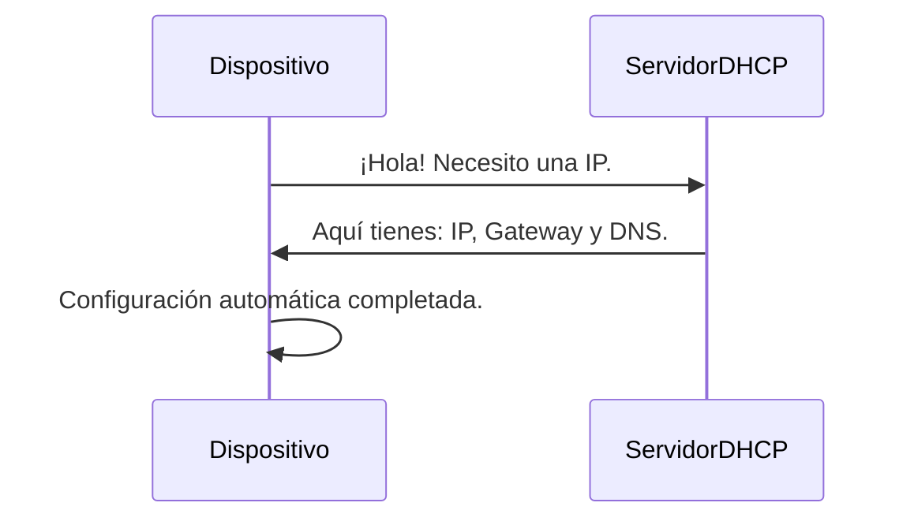

### **¿Qué es DHCP?**

DHCP (Protocolo de Configuración Dinámica de Host) es un protocolo que **asigna automáticamente direcciones IP y otros parámetros de red** a los dispositivos que se conectan a una red. Básicamente, es como un "asistente de configuración" para dispositivos en una red.

---

### **¿Para qué sirve?**

Imagina que cada vez que te conectas a una red (en tu casa, trabajo o café), tuvieras que configurar manualmente tu dirección IP, la puerta de enlace, el DNS, etc. ¡Sería un lío! DHCP hace todo eso por ti de forma automática.

---

### **¿Cómo funciona?**

1. **El dispositivo pide una IP**:  
   Cuando un dispositivo (como tu celular o laptop) se conecta a la red, envía un mensaje diciendo: *"¡Hola! Necesito una dirección IP para conectarme."*

2. **El servidor DHCP responde**:  
   El servidor DHCP (que suele estar en el router) responde: *"¡Claro! Aquí tienes una dirección IP, la puerta de enlace y el DNS que necesitas."*

3. **El dispositivo se configura**:  
   El dispositivo usa la información proporcionada por el servidor DHCP para conectarse a la red sin que tú hagas nada.

---

### **Ejemplo Práctico**

- **Escenario**: Llegas a un café y te conectas al Wi-Fi.
- **Proceso**:
  1. Tu celular envía una solicitud DHCP al router del café.
  2. El router responde con una dirección IP (por ejemplo, `192.168.1.10`), la puerta de enlace (`192.168.1.1`) y el DNS (`8.8.8.8`).
  3. Tu celular se configura automáticamente y ya puedes navegar por Internet.

---

### **¿Qué información asigna DHCP?**

- **Dirección IP**: La "dirección" única que identifica a tu dispositivo en la red.
- **Máscara de subred**: Define el rango de la red.
- **Puerta de enlace (Gateway)**: La dirección del router que conecta tu red con Internet.
- **Servidores DNS**: Traducen nombres de dominio (como `google.com`) a direcciones IP.

---

### **Ventajas de DHCP**

4. **Automático**: No necesitas configurar nada manualmente.
5. **Centralizado**: El servidor DHCP controla todas las asignaciones de IP.
6. **Evita conflictos**: Asegura que no haya dos dispositivos con la misma IP.

### **Desventajas de DHCP**

7. **Dependencia del servidor**: Si el servidor DHCP falla, los dispositivos no pueden conectarse.
8. **Seguridad**: Un atacante podría configurar un servidor DHCP falso para redirigir el tráfico (ataque de "DHCP spoofing").

---

### **Resumen**

- **DHCP**: Es un protocolo que asigna automáticamente direcciones IP y otros parámetros de red a los dispositivos.
- **¿Para qué sirve?**: Para que no tengas que configurar manualmente tu conexión a la red.
- **¿Cómo funciona?**: El dispositivo pide una IP, el servidor DHCP se la asigna, y listo.

---

### **Diagrama de DHCP**

---

### **Consejo Final**

Si alguna vez tienes problemas de conexión, reinicia tu router o verifica que el servidor DHCP esté funcionando correctamente. ¡Es el "asistente" que mantiene tu red en orden!

[[glosario]]