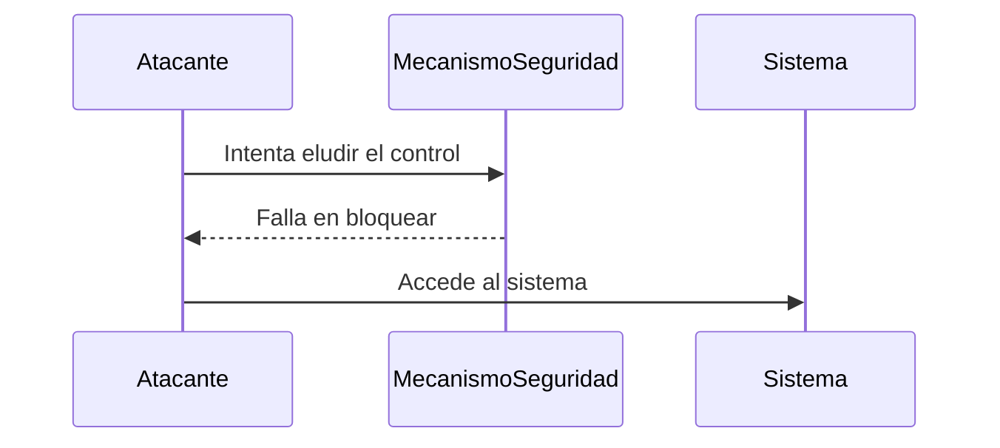

### **¿Qué es un Bypass?**

El término **Bypass** se refiere a la acción de **eludir** o **evadir** un mecanismo de seguridad, control o restricción en un sistema. En el contexto de la seguridad informática, un bypass permite a un atacante o usuario **saltarse** medidas de protección como firewalls, autenticaciones, filtros de contenido, o cualquier otra barrera de seguridad.

---

### **¿Cómo se Realiza un Bypass?**

1. **Explotación de Vulnerabilidades**:  
   Un atacante puede aprovechar fallos en el diseño o implementación de un sistema para eludir las medidas de seguridad.

2. **Manipulación de Entradas**:  
   Alterar las entradas de datos (como parámetros de URL, formularios, o cabeceras HTTP) para engañar al sistema y evitar controles de seguridad.

3. **Uso de Herramientas Especializadas**:  
   Emplear herramientas o técnicas específicas para evadir detecciones, como el uso de proxies, VPNs, o técnicas de ofuscación.

4. **Ingeniería Social**:  
   Engañar a usuarios o administradores para que realicen acciones que permitan eludir las medidas de seguridad.

---

### **Ejemplos Comunes de Bypass**

1. **Bypass de Autenticación**:  
   Eludir el proceso de login para acceder a un sistema sin credenciales válidas.
   - Ejemplo: Usar SQL Injection para evitar la validación de credenciales.

2. **Bypass de Firewalls**:  
   Evadir las reglas de un firewall para acceder a recursos bloqueados.
   - Ejemplo: Usar técnicas de tunneling para ocultar el tráfico malicioso.

3. **Bypass de Filtros de Contenido**:  
   Saltarse filtros que bloquean ciertos tipos de contenido o sitios web.
   - Ejemplo: Usar codificación URL o proxies para acceder a sitios bloqueados.

4. **Bypass de WAF (Web Application Firewall)**:  
   Evadir las reglas de un WAF para explotar vulnerabilidades en una aplicación web.
   - Ejemplo: Usar técnicas de ofuscación para evitar la detección de inyecciones SQL.

---

### **¿Por qué es Peligroso un Bypass?**

- **Acceso No Autorizado**: Permite a los atacantes acceder a sistemas o datos sin autorización.
- **Evita Detección**: Puede permitir que actividades maliciosas pasen desapercibidas.
- **Compromiso de Seguridad**: Debilita las medidas de seguridad, exponiendo el sistema a otros ataques.

---

### **Prevención de Bypass**

1. **Actualizaciones y Parches**:  
   Mantén todos los sistemas y software actualizados para corregir vulnerabilidades conocidas.

2. **Validación de Entradas**:  
   Implementa una validación robusta de todas las entradas de usuario para evitar manipulaciones.

3. **Monitoreo y Detección**:  
   Usa herramientas de monitoreo y detección de intrusiones para identificar actividades sospechosas.

4. **Configuración Segura**:  
   Asegúrate de que todas las medidas de seguridad estén correctamente configuradas y sean difíciles de eludir.

5. **Educación y Concienciación**:  
   Capacita a los usuarios y administradores para reconocer y evitar técnicas de ingeniería social.

---

### **Resumen**

- **Bypass**: Elusión o evasión de mecanismos de seguridad o controles.
- **Técnicas comunes**: Explotación de vulnerabilidades, manipulación de entradas, uso de herramientas, ingeniería social.
- **Impacto**: Acceso no autorizado, evasión de detección, compromiso de seguridad.
- **Prevención**: Actualizaciones, validación de entradas, monitoreo, configuración segura, educación.

---

### **Diagrama de Bypass**

---

### **Consejo Final**

Nunca subestimes la importancia de una configuración segura y una validación robusta de entradas. Un bypass puede ser la puerta de entrada a un ataque más grande.

[[glosario]]