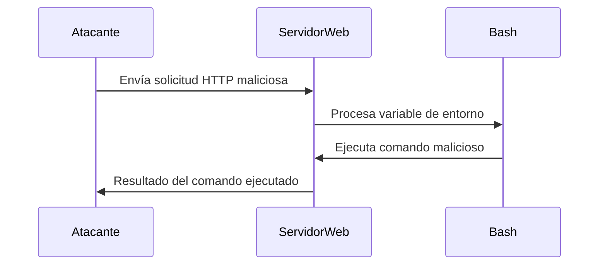

### **¿Qué es el Ataque ShellShock?**

**ShellShock** es una vulnerabilidad crítica que afecta a la **GNU Bash** (Bourne Again Shell), un intérprete de comandos ampliamente utilizado en sistemas Unix y Linux. La vulnerabilidad, identificada en 2014, permite a un atacante **ejecutar comandos arbitrarios** en un sistema vulnerable, lo que puede llevar a la **toma completa del sistema**.

> Normalmente, si encuentro un `/cgi-bin/` puede ser factible testear un ***ShellShock*** y buscar archivos con extensiones pl,sh,cgi


---

### **¿Cómo Funciona?**

1. **Vulnerabilidad en Bash**:  
   La vulnerabilidad se debe a un error en la forma en que Bash procesa las variables de entorno. Un atacante puede inyectar comandos maliciosos en una variable de entorno, que Bash ejecutará al ser interpretada.

2. **Explotación**:  
   El atacante envía una solicitud maliciosa a un servicio que utiliza Bash para procesar variables de entorno, como un servidor web que ejecuta scripts CGI.

3. **Impacto**:  
   Si el sistema es vulnerable, el atacante puede ejecutar comandos con los mismos privilegios que el servicio afectado, lo que puede llevar a la toma completa del sistema.

---

### **Ejemplo Práctico**

- **Escenario**: Un servidor web ejecuta un script CGI que utiliza Bash.
- **Ataque**: El atacante envía una solicitud HTTP con una cabecera maliciosa:
```http
  GET /cgi-bin/vulnerable-script HTTP/1.1
  Host: example.com
  User-Agent: () { :; }; /bin/bash -c 'comando_malicioso'
```
  - Aquí, `() { :; };` es una definición de función en Bash, y `/bin/bash -c 'comando_malicioso'` es el comando que el atacante quiere ejecutar.

- **Resultado**: Si el servidor es vulnerable, el comando malicioso se ejecutará en el servidor.

---

### **¿Por qué es Peligroso?**

- **Ejecución de Comandos Arbitrarios**: El atacante puede ejecutar cualquier comando en el sistema.
- **Toma Completa del Sistema**: Dependiendo de los privilegios del servicio afectado, el atacante puede tomar el control completo del sistema.
- **Amplia Dispersión**: Bash es un componente fundamental en muchos sistemas Unix y Linux, lo que hace que la vulnerabilidad sea muy extendida.

---

### **¿Cómo Prevenir el Ataque ShellShock?**

1. **Actualización**:  
   Asegúrate de que todas las instancias de Bash estén actualizadas a una versión que parchee la vulnerabilidad.

2. **Parches de Seguridad**:  
   Aplica los parches de seguridad proporcionados por tu distribución de Linux.

3. **Minimizar el Uso de Bash**:  
   Limita el uso de Bash en servicios expuestos a Internet, como scripts CGI.

4. **Configuración Segura**:  
   Configura los servicios para que no utilicen Bash para procesar variables de entorno.

5. **Monitoreo y Detección**:  
   Monitorea los logs del sistema y utiliza herramientas de detección de intrusiones para identificar actividades sospechosas.

---

### **Resumen**

- **ShellShock**: Vulnerabilidad crítica en GNU Bash que permite la ejecución de comandos arbitrarios.
- **Impacto**: Ejecución de comandos, toma completa del sistema, amplia dispersión.
- **Prevención**: Actualización, parches de seguridad, minimizar el uso de Bash, configuración segura, monitoreo.

---

### **Diagrama de Ataque ShellShock**



---

### **Consejo Final**

Mantén todos tus sistemas actualizados y aplica los parches de seguridad tan pronto como estén disponibles. La prevención es la mejor defensa contra vulnerabilidades como ShellShock.

[[OWASP]]