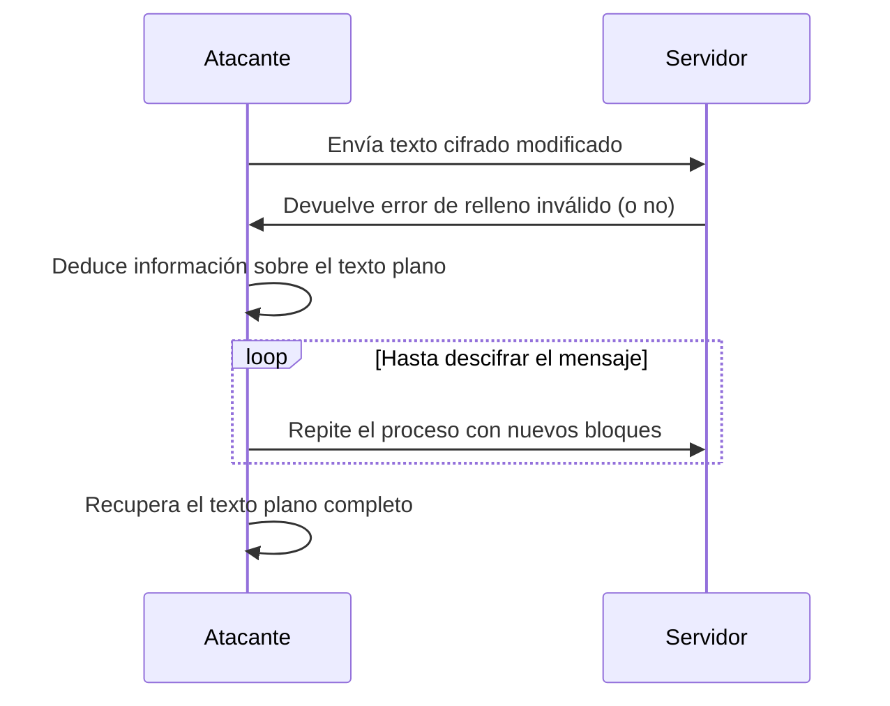

### **¿Qué es un Ataque de Oráculo de Relleno?**

Es un tipo de ataque criptográfico que explota la forma en que algunos sistemas manejan el **relleno (padding)** en cifrados de bloque (como AES en modo CBC). El atacante usa respuestas de error del servidor (el "oráculo") para descifrar datos cifrados sin tener la clave.

---

### **¿Cómo funciona?**

1. **Cifrado por Bloques con Relleno**:  
   En cifrados como AES-CBC, los datos se dividen en bloques de tamaño fijo. Si los datos no caben exactamente en los bloques, se añade **relleno** (padding) para completarlos.

2. **El Oráculo**:  
   El servidor devuelve mensajes de error específicos cuando el **relleno es inválido**. Esto le da al atacante una pista sobre si el relleno es correcto o no.

3. **Ataque**:  
   El atacante modifica el texto cifrado y observa las respuestas del servidor. Usando estos "oráculos", puede deducir el texto plano original bloque por bloque.

---

### **Ejemplo Práctico**

- **Escenario**: Un servidor cifra mensajes usando AES-CBC y devuelve un error específico si el relleno es inválido.
- **Ataque**:
  1. El atacante envía un texto cifrado modificado al servidor.
  2. Si el servidor responde con un error de "relleno inválido", el atacante sabe que su modificación no funcionó.
  3. Si el servidor no devuelve un error, el atacante deduce información sobre el texto plano.
  4. Repitiendo este proceso, el atacante puede descifrar el mensaje completo.

---

### **¿Por qué es peligroso?**

- **Descifrado sin clave**: El atacante puede recuperar el texto plano sin conocer la clave de cifrado.
- **Manipulación de datos**: El atacante puede modificar el texto cifrado para alterar el texto plano.
- **Aplicaciones vulnerables**: Afecta a sistemas que usan cifrado CBC y devuelven errores específicos sobre el relleno.

---

### **¿Cómo prevenir el Ataque de Oráculo de Relleno?**

4. **Evitar Oráculos de Relleno**:  
   No devuelvas mensajes de error específicos sobre el relleno. Usa respuestas genéricas para todos los errores.

5. **Usar Modos de Cifrado Seguros**:  
   Emplea modos de cifrado autenticados, como **AES-GCM** (Galois/Counter Mode), que incluyen autenticación y evitan este tipo de ataques.

6. **Validar el MAC antes del Relleno**:  
   Si usas CBC, asegúrate de verificar la autenticidad del mensaje (con un MAC) antes de comprobar el relleno.

7. **Implementar Relleno Constante**:  
   Usa técnicas como **PKCS#7** con manejo de errores que no revelen información sobre el relleno.

---

### **Resumen**

- **Padding Oracle Attack**: Ataque que explota errores de relleno en cifrados de bloque (como AES-CBC) para descifrar datos sin la clave.
- **Prevención**: Evita oráculos de relleno, usa cifrados autenticados (como AES-GCM) y valida la autenticidad del mensaje antes de comprobar el relleno.

---

### **Diagrama del Ataque**

---

### **Consejo Final**

Nunca confíes en el cifrado sin autenticación. Siempre usa modos de cifrado autenticados (como AES-GCM) y maneja los errores de manera genérica para evitar fugas de información.

[[OWASP]]
[[Cifrado CBC (Cipher Block Chaining)]]
