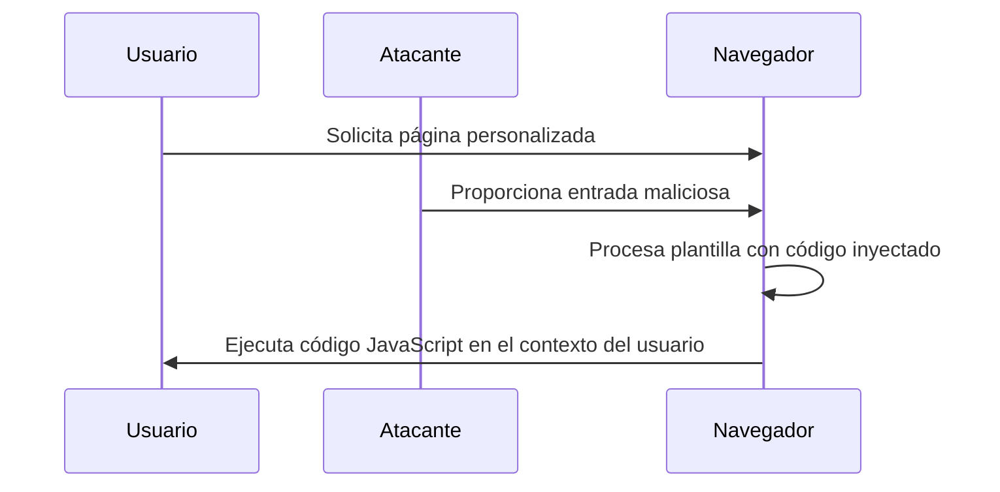

### **¿Qué es CSTI?**

CSTI (Inyección de Plantillas del Lado del Cliente) es un tipo de ataque en el que un atacante inyecta código malicioso en una plantilla que se procesa en el navegador del usuario, lo que puede permitir la ejecución de código JavaScript arbitrario.

---

### **¿Cómo funciona?**

1. **El navegador usa plantillas**: La aplicación web utiliza plantillas del lado del cliente (por ejemplo, AngularJS, Handlebars, etc.) para generar HTML dinámicamente.
2. **El atacante inyecta código**: El atacante proporciona una entrada maliciosa que se interpreta como parte de la plantilla.
3. **El navegador ejecuta el código**: El navegador procesa la plantilla y ejecuta el código JavaScript inyectado, lo que puede llevar a la ejecución de acciones maliciosas en el contexto del usuario.

---

### **Ejemplo Práctico**

- **Escenario**: Una aplicación web permite a los usuarios personalizar un mensaje de bienvenida usando una plantilla del lado del cliente.
- **Ataque**: El atacante ingresa un código malicioso en lugar de un mensaje legítimo:
  ```javascript
  {{ 7 * 7 }}
  ```
- **Resultado**: El navegador procesa la plantilla y devuelve `49`, mostrando que el código fue ejecutado.

Si el atacante inyecta un código más peligroso, como:
  ```javascript
  {{ constructor.constructor("alert('XSS')")() }}
  ```
- **Resultado**: El navegador ejecuta el código JavaScript, mostrando una alerta con el mensaje 'XSS'.

---

### **¿Por qué es peligroso?**

- **Ejecución de código arbitrario**: El atacante puede ejecutar código JavaScript en el contexto del usuario, lo que puede llevar a robo de cookies, redirecciones maliciosas, etc.
- **Manipulación del DOM**: El atacante puede modificar el contenido de la página, engañando al usuario o mostrando información falsa.
- **Ataques de phishing**: El atacante puede crear formularios falsos para robar credenciales u otra información sensible.

---

### **¿Cómo prevenir CSTI?**

4. **Validación de Entradas**:
   - Asegúrate de que las entradas de los usuarios sean válidas y estén sanitizadas antes de ser procesadas por las plantillas.

5. **Uso de Contextos Seguros**:
   - Utiliza contextos seguros para la interpolación de datos en las plantillas, evitando la evaluación de código dinámico.

6. **Escape de Datos**:
   - Asegúrate de que los datos proporcionados por los usuarios sean escapados correctamente para evitar que se interpreten como código.

7. **Actualizaciones y Parches**:
   - Mantén tus bibliotecas de plantillas y frameworks actualizados para evitar vulnerabilidades conocidas.

---

### **Resumen**

- **CSTI**: Ataque donde el atacante inyecta código malicioso en una plantilla del lado del cliente, lo que puede llevar a la ejecución de código JavaScript arbitrario.
- **Prevención**: Valida entradas, usa contextos seguros, escapa datos y mantén tus sistemas actualizados.

---

### **Diagrama de CSTI**



---

### **Consejo Final**

Implementa medidas de seguridad como la validación de entradas y el escape de datos para proteger tus aplicaciones contra ataques CSTI.
