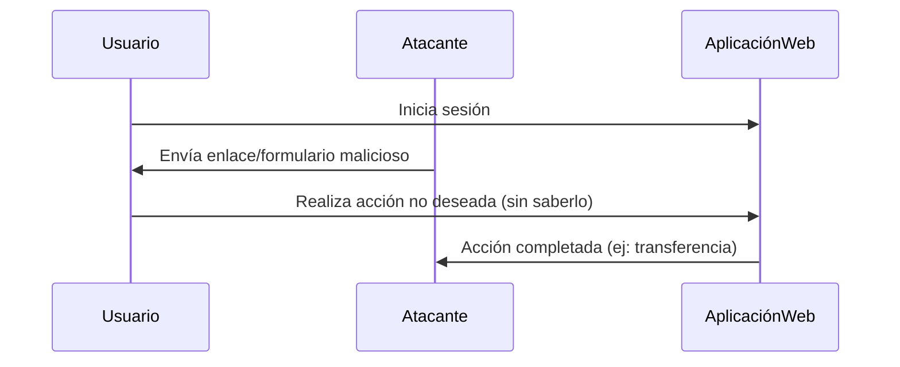

### **¿Qué es CSRF?**

CSRF (Falsificación de Solicitud en Sitios Cruzados) es un tipo de ataque en el que un atacante engaña a un usuario para que realice acciones no deseadas en una aplicación web en la que ya está autenticado.

---

### **¿Cómo funciona?**

1. **El usuario está autenticado**: El usuario ha iniciado sesión en una aplicación web (por ejemplo, su banco).
2. **El atacante engaña al usuario**: El atacante crea un enlace o un formulario malicioso y lo envía al usuario (por ejemplo, a través de un correo electrónico o un sitio web).
3. **El usuario realiza la acción sin saberlo**: Si el usuario hace clic en el enlace o visita el sitio malicioso, se envía una solicitud a la aplicación web en su nombre, sin su consentimiento.

---

### **Ejemplo Práctico**

- **Escenario**: El usuario está autenticado en su banco.
- **Ataque**: El atacante envía un enlace malicioso que parece inofensivo:
  ```html
  <a href="https://tubanco.com/transferir?monto=1000&destinatario=atacante">¡Gana un premio!</a>
  ```
- **Resultado**: Si el usuario hace clic, se realiza una transferencia de $1000 a la cuenta del atacante.

---

### **¿Por qué es peligroso?**

- **Acciones no autorizadas**: El atacante puede realizar acciones en nombre del usuario, como transferencias, cambios de contraseña, etc.
- **Invisible para el usuario**: El usuario no se da cuenta de que se ha realizado una acción en su nombre.

---

### **¿Cómo prevenir CSRF?**

4. **Tokens CSRF**:
   - La aplicación web genera un token único para cada sesión.
   - Este token se incluye en los formularios y se verifica en el servidor antes de procesar la solicitud.

5. **SameSite Cookies**:
   - Configura las cookies con el atributo `SameSite` para evitar que se envíen en solicitudes cruzadas.

6. **Verificación del Origen**:
   - Asegúrate de que las solicitudes provengan del mismo sitio web.

---

### **Resumen**

- **CSRF**: Ataque donde el usuario realiza acciones no deseadas en una aplicación web autenticada.
- **Prevención**: Usa tokens CSRF, cookies `SameSite` y verifica el origen de las solicitudes.

---

### **Diagrama de CSRF**



---

[[OWASP]]