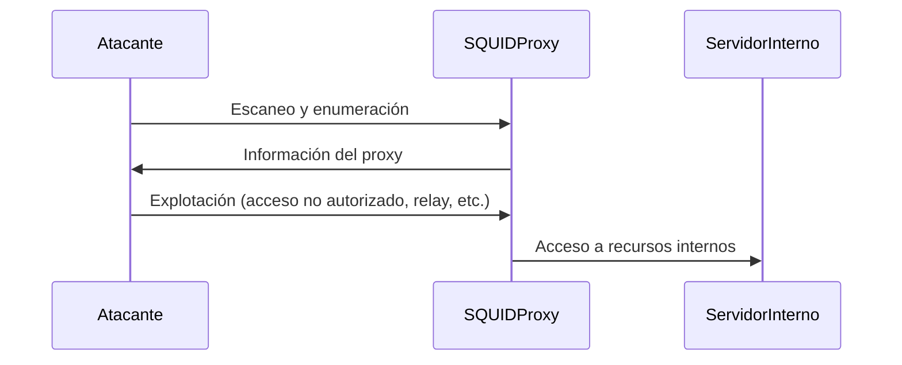

### **¿Qué es la Enumeración y Explotación de SQUID Proxies?**

La **enumeración** consiste en identificar y recopilar información sobre servidores SQUID Proxy, mientras que la **explotación** implica aprovechar configuraciones incorrectas o vulnerabilidades para obtener acceso no autorizado o realizar acciones maliciosas.

---

### **Enumeración de SQUID Proxies**

1. **Escaneo de Puertos**:  
   Usa herramientas como `nmap` para identificar servidores SQUID Proxy escaneando el puerto predeterminado (3128).
   ```bash
   nmap -p 3128 <IP>
   ```

2. **Detección de Servicios**:  
   Verifica si el servicio SQUID está en ejecución y su versión.
   ```bash
   nmap -sV -p 3128 <IP>
   ```

3. **Pruebas de Conexión**:  
   Intenta conectarte al proxy usando herramientas como `curl` o `proxychains`.
   ```bash
   curl -x http://<IP>:3128 http://example.com
   ```

---

### **Explotación de SQUID Proxies**

1. **Acceso No Autorizado**:  
   Si el proxy está mal configurado, puede permitir el acceso a redes internas o a Internet sin autenticación.
   - **Ejemplo**: Usar el proxy para acceder a recursos internos.
     ```bash
     curl -x http://<IP>:3128 http://internal-site.com
     ```

2. **Ataques de Relay**:  
   Un proxy mal configurado puede ser usado como relay para ataques de phishing o spam.
   - **Ejemplo**: Enviar correos electrónicos maliciosos a través del proxy.

3. **Exposición de Información**:  
   Si el proxy no está correctamente asegurado, puede exponer información sensible, como logs de acceso o configuraciones.

4. **Ataques de Denegación de Servicio (DoS)**:  
   Un atacante puede sobrecargar el proxy con solicitudes, causando una denegación de servicio.

---

### **Prevención y Mitigación**

1. **Configuración Segura**:  
   Asegúrate de que el proxy esté configurado para restringir el acceso no autorizado.

2. **Autenticación**:  
   Implementa autenticación para controlar quién puede usar el proxy.

3. **Actualizaciones**:  
   Mantén el software SQUID actualizado para evitar vulnerabilidades conocidas.

4. **Monitoreo**:  
   Monitorea el tráfico del proxy para detectar actividades sospechosas.

---

### **Resumen**

- **Enumeración**: Identificación de servidores SQUID Proxy y recopilación de información.
- **Explotación**: Aprovechamiento de configuraciones incorrectas o vulnerabilidades para acceder a recursos no autorizados.
- **Prevención**: Configuración segura, autenticación, actualizaciones, monitoreo.

---

### **Diagrama de Enumeración y Explotación de SQUID Proxies**



---

### **Consejo Final**

Asegúrate de que tus servidores SQUID Proxy estén correctamente configurados y protegidos para evitar que sean explotados por atacantes.

[[OWASP]]
[[SQUID proxy]]