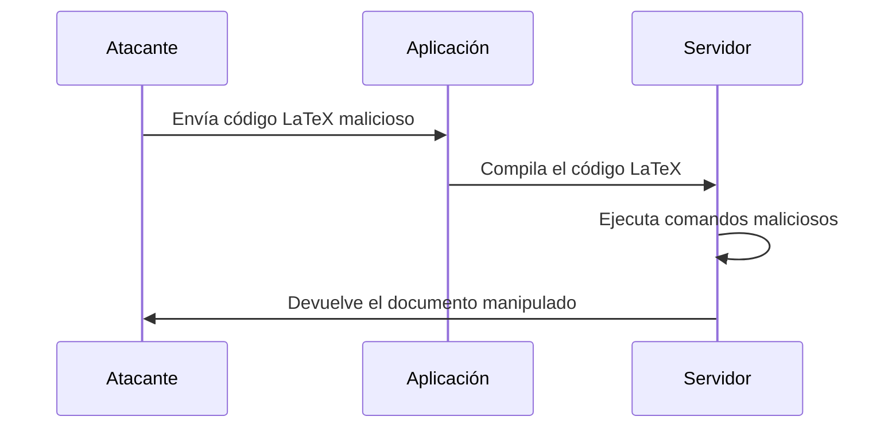

### **¿Qué es una Inyección LaTeX?**

Es un tipo de ataque en el que un atacante **inyecta código LaTeX malicioso** en una aplicación que genera documentos PDF o imágenes a partir de entradas de usuario. Esto puede permitir al atacante **ejecutar comandos en el servidor**, **robar datos** o **manipular el documento generado**.

---

### **¿Cómo funciona?**

1. **Entrada de usuario**:  
   La aplicación permite que los usuarios ingresen texto que se procesará en un documento LaTeX.

2. **Inyección**:  
   El atacante ingresa código LaTeX malicioso en lugar de texto normal. Por ejemplo:
   ```latex
   \input{/etc/passwd}
   ```

3. **Procesamiento**:  
   El servidor compila el código LaTeX y genera un documento PDF o imagen. Si no se valida la entrada, el código malicioso se ejecuta.

---

### **Ejemplo Práctico**

- **Escenario**: Una aplicación web que genera certificados en PDF a partir de entradas de usuario.
- **Código vulnerable**:
  ```latex
  \documentclass{article}
  \begin{document}
  Nombre: \textbf{Usuario}
  \end{document}
  ```
- **Ataque**:  
  El atacante ingresa el siguiente texto en el campo "Nombre":
  ```latex
  }\input{/etc/passwd}\textbf{
  ```
  - El código LaTeX resultante sería:
    ```latex
    \documentclass{article}
    \begin{document}
    Nombre: \textbf{}\input{/etc/passwd}\textbf{}
    \end{document}
    ```
  - Al compilar, el servidor incluye el contenido del archivo `/etc/passwd` en el PDF.

---

### **¿Por qué es peligroso?**

- **Ejecución de comandos**: El atacante puede ejecutar comandos en el servidor usando paquetes como `\write18`.
- **Exfiltración de datos**: Puede leer archivos sensibles del servidor.
- **Manipulación de documentos**: Puede alterar el contenido del documento generado.

---

### **¿Cómo prevenir Inyecciones LaTeX?**

1. **Validar Entradas**:  
   Asegúrate de que las entradas del usuario sean válidas y estén sanitizadas. Por ejemplo, elimina o escapa caracteres especiales como `\`, `{`, `}`.

2. **Usar Modo Seguro**:  
   Compila LaTeX en modo seguro para deshabilitar comandos peligrosos como `\input` y `\write18`.

3. **Limitar Permisos**:  
   Ejecuta el compilador LaTeX con permisos mínimos necesarios para reducir el impacto de un ataque.

4. **Usar Alternativas**:  
   Considera usar bibliotecas que generen PDFs directamente sin pasar por LaTeX, como `PDFKit` o `WeasyPrint`.

---

### **Resumen**

- **Inyección LaTeX**: Ataque donde el atacante inyecta código LaTeX malicioso para ejecutar comandos o robar datos.
- **Prevención**: Valida entradas, usa modo seguro y limita permisos.

---

### **Diagrama de Inyección LaTeX**



---

### **Consejo Final**

Nunca confíes en las entradas del usuario. Siempre valida y sanitiza los datos antes de usarlos en la generación de documentos.

[[OWASP]]