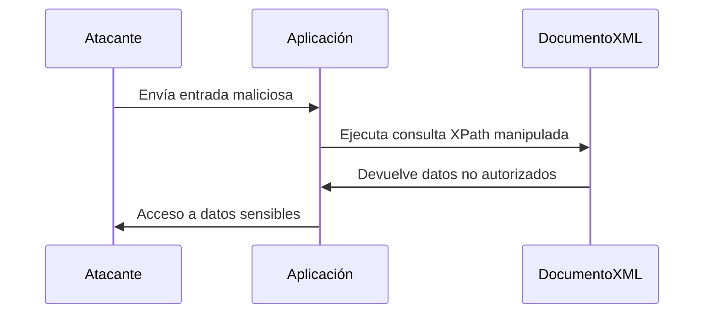

¡Excelente idea! A partir de ahora, incluiré un subtítulo **"Cómo Identificar la Vulnerabilidad"** en cada apunte para que tengas una guía clara sobre cómo detectar cada tipo de vulnerabilidad. Aquí tienes el apunte sobre **Inyecciones XPath** actualizado con este nuevo subtítulo:

---

# **Inyecciones XPath**

---

### **¿Qué es una Inyección XPath?**

Una **Inyección XPath** es un tipo de ataque en el que un atacante **manipula una consulta XPath** para acceder o modificar datos en un documento XML sin autorización. XPath es un lenguaje utilizado para navegar y consultar documentos XML, y si una aplicación no valida correctamente las entradas del usuario, un atacante puede inyectar código XPath malicioso.

---

### **Cómo Identificar la Vulnerabilidad**

1. **Entradas No Validadas**:  
   Si la aplicación utiliza entradas del usuario directamente en consultas XPath sin validación o sanitización, es vulnerable.

2. **Comportamiento Inesperado**:  
   Si al ingresar caracteres especiales (como `'`, `"`, `=`, `or`, `and`) en campos de entrada, la aplicación devuelve resultados inesperados o errores, podría ser vulnerable.

3. **Mensajes de Error**:  
   Si la aplicación muestra mensajes de error detallados que incluyen partes de la consulta XPath, es una señal de posible vulnerabilidad.

4. **Pruebas de Inyección**:  
   Introduce cadenas como `' or '1'='1` en campos de entrada y observa si la aplicación devuelve datos no autorizados o comportamientos anómalos.

---

### **¿Cómo Funciona?**

1. **Consulta XPath**:  
   Las aplicaciones web a menudo usan XPath para consultar datos en documentos XML. Por ejemplo, para autenticar usuarios:
   ```xpath
   //user[username='admin' and password='password123']
   ```

2. **Inyección**:  
   Un atacante puede manipular la entrada para modificar la consulta XPath. Por ejemplo, si la aplicación no valida la entrada, el atacante puede inyectar:
   ```xpath
   ' or '1'='1
   ```
   - La consulta resultante sería:
     ```xpath
     //user[username='admin' and password='' or '1'='1']
     ```
   - Esto siempre devuelve `true`, permitiendo al atacante eludir la autenticación.

---

### **Ejemplo Práctico**

- **Escenario**: Una aplicación web usa XPath para autenticar usuarios.
- **Código Vulnerable**:
  ```xpath
  //user[username='$username' and password='$password']
  ```
- **Ataque**:  
  El atacante ingresa:
  - **Usuario**: `admin`
  - **Contraseña**: `' or '1'='1`
  - La consulta resultante:
    ```xpath
    //user[username='admin' and password='' or '1'='1']
    ```
  - Esto devuelve todos los usuarios, permitiendo al atacante eludir la autenticación.

---

### **¿Por qué es Peligroso?**

- **Acceso No Autorizado**: El atacante puede acceder a datos sensibles sin credenciales válidas.
- **Manipulación de Datos**: Puede modificar o eliminar datos en el documento XML.
- **Exposición de Información**: Puede extraer información confidencial del documento XML.

---

### **¿Cómo Prevenir Inyecciones XPath?**

1. **Validación de Entradas**:  
   Valida y sanitiza todas las entradas del usuario antes de usarlas en consultas XPath.

2. **Uso de Consultas Parametrizadas**:  
   Usa consultas parametrizadas para evitar la inyección de código malicioso.

3. **Limitación de Privilegios**:  
   Asegúrate de que las consultas XPath se ejecuten con los mínimos privilegios necesarios.

4. **Escapado de Caracteres Especiales**:  
   Escapa caracteres especiales en las entradas del usuario para evitar su interpretación como parte de la consulta.

5. **Monitoreo y Logging**:  
   Monitorea y registra las consultas XPath para detectar actividades sospechosas.

---

### **Resumen**

- **Inyección XPath**: Ataque que manipula consultas XPath para acceder o modificar datos en documentos XML.
- **Impacto**: Acceso no autorizado, manipulación de datos, exposición de información.
- **Prevención**: Validación de entradas, consultas parametrizadas, limitación de privilegios, escapado de caracteres, monitoreo.

---

### **Diagrama de Inyección XPath**



---

### **Consejo Final**

Nunca confíes en las entradas del usuario. Siempre valida y sanitiza las entradas antes de usarlas en consultas XPath para proteger tus aplicaciones de inyecciones.

[[OWASP]]