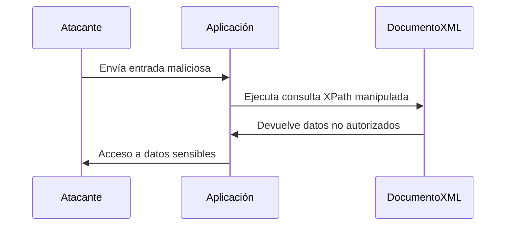

[HackTricks - XPath](https://book.hacktricks.wiki/en/pentesting-web/xpath-injection.html)

---
### **¿Qué es una Inyección XPath?**

Una **Inyección XPath** es un tipo de ataque en el que un atacante **manipula una consulta XPath** para acceder o modificar datos en un documento XML sin autorización. XPath es un lenguaje utilizado para navegar y consultar documentos XML, y si una aplicación no valida correctamente las entradas del usuario, un atacante puede inyectar código XPath malicioso.

### **Cómo Identificar la Vulnerabilidad**

1. **Entradas No Validadas**:  
   Si la aplicación utiliza entradas del usuario directamente en consultas XPath sin validación o sanitización, es vulnerable.

2. **Comportamiento Inesperado**:  
   Si al ingresar caracteres especiales (como `'`, `"`, `=`, `or`, `and`) en campos de entrada, la aplicación devuelve resultados inesperados o errores, podría ser vulnerable.

3. **Mensajes de Error**:  
   Si la aplicación muestra mensajes de error detallados que incluyen partes de la consulta XPath, es una señal de posible vulnerabilidad.

4. **Pruebas de Inyección**:  
   Introduce cadenas como `' or '1'='1` en campos de entrada y observa si la aplicación devuelve datos no autorizados o comportamientos anómalos.

### **¿Cómo Funciona?**

1. **Consulta XPath**:  
   Las aplicaciones web a menudo usan XPath para consultar datos en documentos XML. Por ejemplo, para autenticar usuarios:
   ```xpath
   //user[username='admin' and password='password123']
   ```

2. **Inyección**:  
   Un atacante puede manipular la entrada para modificar la consulta XPath. Por ejemplo, si la aplicación no valida la entrada, el atacante puede inyectar:
   ```xpath
   ' or '1'='1
   ```
   - La consulta resultante sería:
     ```xpath
     //user[username='admin' and password='' or '1'='1']
     ```
   - Esto siempre devuelve `true`, permitiendo al atacante eludir la autenticación.


---
## Enumeracion de Etiquetas

#### Etiquetas raiz primaria

Seria aquiella etiqueta que englobe a las demas. Para eso puedes efectuar esta query 
> Suponiendo que el input encierra la query entre **'   '**

```xpath
1' and count(/*)='1
```
aquí le dices que  el valor del input es 1 y que la etiqueta raíz primaria es solo una, por ejemplo:

```xml
<Coffees>
	<Coffee ID="1">
		<ID>1</ID>
		<Name>Affogato</Name>
		<Desc>
			An affogato (Italian, "drowned") is a coffee-based beverage. It usually takes the form of a scoop of vanilla gelato or ice cream topped with a shot of hot espresso. Some variations also include a shot of Amaretto or other liqueur.
		</Desc>
		<Price>$4.69</Price>
	</Coffee>
	
	<Coffee ID="2">
		<ID>2</ID>
		<Name>Americano</Name>
		<Desc>
			An Americano is an espresso-based drink designed to resemble coffee brewed in a drip filter, considered popular in the United States of America. This drink consists of a single or double-shot of espresso combined with up to four or five ounces of hot water in a two-demitasse cup.
		</Desc>
		<Price>$5.00</Price>
	</Coffee>
</Coffees>
```

La eiqueta raiz primaria seria solo una, por lo tanto la query seria verdadera.

### Nombre de la etiqueta

como no sabemos el nombre completo debido a la cantidad descomunal de posibilidades que puede tener se puede jugar con validaciones de caracter por caracter, es decir, podriamos evaular si por ejemplo **la primera letra de la etiqueta es igual a "C"** en este caso. Despues se armara un script para evaluar cada posicion y asi obtener el nombre mucho mas rapido

```
1' and substring(name(/*[1]),1,1)='C
```

- `name` es para ver el nombre de la etiqueta especificada.
- La sintaxis `/*[1]` -> hace referencia al numero de etiqueta, en este caso la etiqueta 1.

> de `substrings` -> el primer 1 es el iterable para el script, y bueno la C es el segundo que vamos a iterar


---

### **Ejemplo Práctico**

- **Escenario**: Una aplicación web usa XPath para autenticar usuarios.
- **Código Vulnerable**:
  ```xpath
  //user[username='$username' and password='$password']
  ```
- **Ataque**:  
  El atacante ingresa:
  - **Usuario**: `admin`
  - **Contraseña**: `' or '1'='1`
  - La consulta resultante:
    ```xpath
    //user[username='admin' and password='' or '1'='1']
    ```
  - Esto devuelve todos los usuarios, permitiendo al atacante eludir la autenticación.

---

### **¿Por qué es Peligroso?**

- **Acceso No Autorizado**: El atacante puede acceder a datos sensibles sin credenciales válidas.
- **Manipulación de Datos**: Puede modificar o eliminar datos en el documento XML.
- **Exposición de Información**: Puede extraer información confidencial del documento XML.

### **¿Cómo Prevenir Inyecciones XPath?**

1. **Validación de Entradas**:  
   Valida y sanitiza todas las entradas del usuario antes de usarlas en consultas XPath.

2. **Uso de Consultas Parametrizadas**:  
   Usa consultas parametrizadas para evitar la inyección de código malicioso.

3. **Limitación de Privilegios**:  
   Asegúrate de que las consultas XPath se ejecuten con los mínimos privilegios necesarios.

4. **Escapado de Caracteres Especiales**:  
   Escapa caracteres especiales en las entradas del usuario para evitar su interpretación como parte de la consulta.

5. **Monitoreo y Logging**:  
   Monitorea y registra las consultas XPath para detectar actividades sospechosas.

---

### **Resumen**

- **Inyección XPath**: Ataque que manipula consultas XPath para acceder o modificar datos en documentos XML.
- **Impacto**: Acceso no autorizado, manipulación de datos, exposición de información.
- **Prevención**: Validación de entradas, consultas parametrizadas, limitación de privilegios, escapado de caracteres, monitoreo.

---

### **Diagrama de Inyección XPath**



---

### **Consejo Final**

Nunca confíes en las entradas del usuario. Siempre valida y sanitiza las entradas antes de usarlas en consultas XPath para proteger tus aplicaciones de inyecciones.

[[OWASP]]