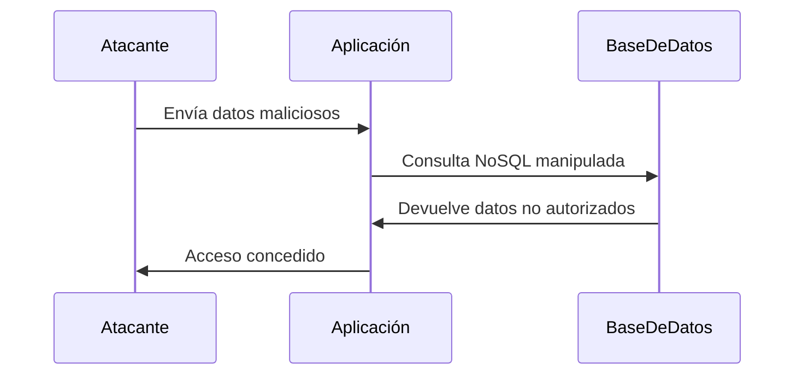

### **¿Qué es una Inyección NoSQL?**

Es un tipo de ataque en el que un atacante **inyecta código malicioso** en consultas a bases de datos NoSQL (como MongoDB, CouchDB, etc.). Esto puede permitir al atacante **bypassear autenticaciones**, **robar datos** o **manipular la base de datos**.

---

### **¿Cómo funciona?**

1. **Consulta NoSQL**:  
   Las bases de datos NoSQL usan consultas basadas en objetos JSON o similares, en lugar de SQL. Por ejemplo:
   ```json
   db.users.find({ username: "admin", password: "1234" })
   ```

2. **Inyección**:  
   Si la aplicación no valida correctamente las entradas del usuario, un atacante puede manipular la consulta. Por ejemplo:
   ```json
   db.users.find({ username: "admin", password: { "$ne": "" } })
   ```
   - Aquí, `"$ne": ""` significa "no igual a vacío", lo que podría devolver todos los usuarios.

---

### **Operadores Comunes en Inyecciones NoSQL**

1. **`$ne` (Not Equal)**:  
   Busca valores que no sean iguales a un valor específico.  
   - Ejemplo: `{ password: { "$ne": "" } }` devuelve todos los usuarios con contraseña no vacía.

2. **`$regex`**:  
   Permite usar expresiones regulares en las consultas.  
   - Ejemplo: `{ username: { "$regex": ".*admin.*" } }` devuelve usuarios cuyo nombre contenga "admin".

3. **`.{longitud}`**:  
   En expresiones regulares, `.` coincide con cualquier carácter y `{n}` especifica la longitud exacta.  
   - Ejemplo: `{ password: { "$regex": ".{8}" } }` devuelve usuarios con contraseñas de 8 caracteres.

4. **`' || 1==1`**:  
   En bases de datos NoSQL que permiten ejecutar código JavaScript (como MongoDB con `$where`), este tipo de inyección puede forzar una condición siempre verdadera.  
   - Ejemplo:  
     ```javascript
     db.users.find({ $where: "this.username == 'admin' || 1==1" })
     ```
     Esto devuelve todos los usuarios porque `1==1` siempre es verdadero.

---

### **Ejemplo Práctico**

- **Escenario**: Un formulario de login que usa MongoDB.
- **Código vulnerable**:
  ```javascript
  const user = db.users.findOne({
      username: req.body.username,
      password: req.body.password
  });
  ```
- **Ataque con `$regex`**:  
  El atacante envía el siguiente JSON en el campo `username`:
  ```json
  { "$regex": ".*" }
  ```
  - La consulta resultante sería:
    ```json
    db.users.findOne({ username: { "$regex": ".*" }, password: "1234" })
    ```
  - Esto devuelve el primer usuario que coincida con cualquier nombre.

- **Ataque con `' || 1==1`**:  
  Si la aplicación permite ejecutar código JavaScript:
  ```javascript
  db.users.find({ $where: "this.username == 'admin' || 1==1" })
  ```
  - Esto devuelve todos los usuarios porque `1==1` siempre es verdadero.

---

### **¿Por qué es peligroso?**

- **Bypass de autenticación**: El atacante puede iniciar sesión sin credenciales válidas.
- **Exfiltración de datos**: Puede acceder a información sensible de la base de datos.
- **Manipulación de datos**: Puede modificar o eliminar registros.

---

### **¿Cómo prevenir Inyecciones NoSQL?**

1. **Validar Entradas**:  
   Asegúrate de que las entradas del usuario sean válidas y estén sanitizadas.

2. **Usar Consultas Parametrizadas**:  
   Utiliza métodos seguros para construir consultas, como `findOne` con parámetros explícitos.

3. **Escape de Caracteres Especiales**:  
   Escapa caracteres como `$`, `.`, `[]` y `||` que tienen significado especial en NoSQL.

4. **Limitar Permisos**:  
   Asegúrate de que la aplicación use una cuenta de base de datos con permisos mínimos necesarios.

5. **Deshabilitar Ejecución de Código**:  
   Evita el uso de funciones como `$where` que permiten ejecutar código JavaScript.

---

### **Resumen**

- **Inyección NoSQL**: Ataque donde el atacante manipula consultas NoSQL para bypassear autenticaciones o robar datos.
- **Operadores comunes**: `$ne`, `$regex`, `.{longitud}`, `' || 1==1`.
- **Prevención**: Valida entradas, usa consultas parametrizadas y escapa caracteres especiales.

---

### **Diagrama de Inyección NoSQL**



---

### **Consejo Final**

Nunca confíes en las entradas del usuario. Siempre valida y sanitiza los datos antes de usarlos en consultas a la base de datos.

[[OWASP]]