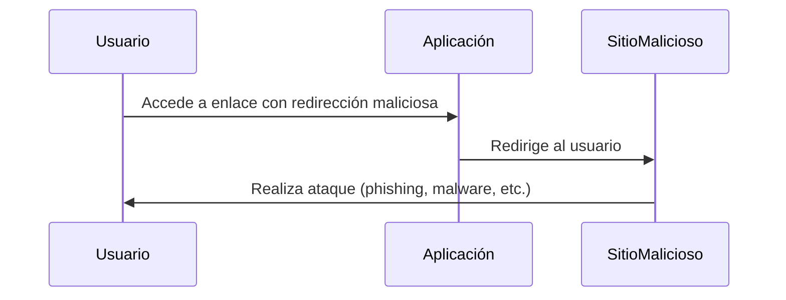

### **¿Qué es un Open Redirect?**

Un **Open Redirect** es una vulnerabilidad que ocurre cuando una aplicación web redirige a los usuarios a una URL especificada por el atacante sin validar adecuadamente la URL de destino. Esto puede ser explotado para **engañar a los usuarios** y redirigirlos a sitios maliciosos.

---

### **¿Cómo Funciona?**

1. **Redirección No Validada**:  
   La aplicación web permite que los usuarios sean redirigidos a una URL especificada en un parámetro, como `redirect_url`.

2. **Manipulación de la URL**:  
   El atacante modifica el parámetro de redirección para apuntar a un sitio malicioso.

3. **Impacto**:  
   Los usuarios son redirigidos a un sitio malicioso, donde pueden ser víctimas de phishing, malware, o robo de credenciales.

---

### **Ejemplo Práctico**

- **Escenario**: Una aplicación web tiene un parámetro `redirect_url` en la URL:
  ```
  https://example.com/login?redirect_url=https://example.com/dashboard
  ```

- **Ataque**:  
  El atacante modifica el parámetro `redirect_url` para apuntar a un sitio malicioso:
  ```
  https://example.com/login?redirect_url=https://malicioso.com
  ```

- **Resultado**:  
  Los usuarios que hagan clic en el enlace serán redirigidos a `https://malicioso.com`.

---

### **¿Por qué es Peligroso?**

- **Phishing**: Los usuarios pueden ser engañados para que ingresen sus credenciales en un sitio falso.
- **Malware**: Los usuarios pueden ser redirigidos a sitios que descargan malware en sus dispositivos.
- **Pérdida de Confianza**: Los usuarios pueden perder la confianza en la aplicación legítima.

---

### **¿Cómo Prevenir Open Redirects?**

1. **Validación de URLs**:  
   Asegúrate de que las URLs de redirección estén validadas y sean seguras. Por ejemplo, solo permitir redirecciones a dominios específicos.

2. **Listas Blancas**:  
   Define una lista de URLs permitidas para redirecciones.

3. **Codificación de URLs**:  
   Codifica las URLs de redirección para evitar la inyección de caracteres maliciosos.

4. **Notificación al Usuario**:  
   Informa a los usuarios antes de redirigirlos a una URL externa.

5. **Uso de Tokens**:  
   Usa tokens únicos para validar las redirecciones y asegurarte de que no han sido manipuladas.

---

### **Resumen**

- **Open Redirect**: Vulnerabilidad que permite redirigir a los usuarios a sitios maliciosos.
- **Impacto**: Phishing, malware, pérdida de confianza.
- **Prevención**: Validación de URLs, listas blancas, codificación de URLs, notificación al usuario, uso de tokens.

---

### **Diagrama de Ataque de Open Redirect**



---

### **Consejo Final**

Nunca confíes en las URLs proporcionadas por los usuarios. Siempre valida y sanitiza las URLs de redirección para proteger a tus usuarios de ataques de phishing y malware.

[[OWASP]]