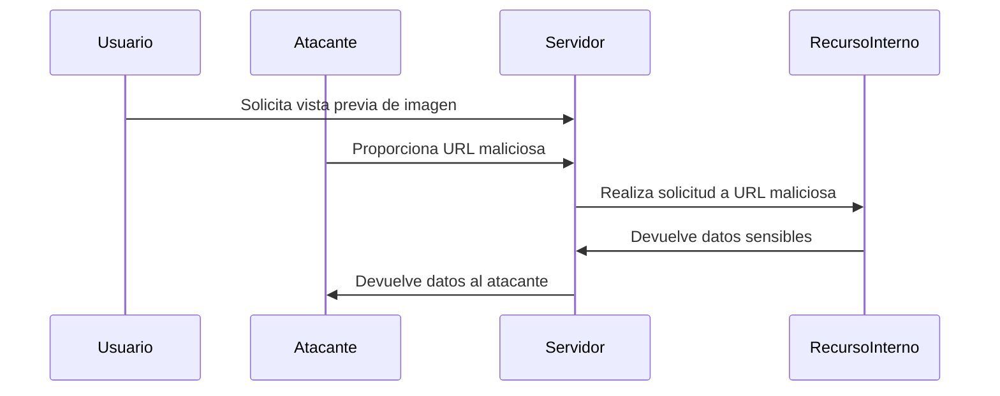

### **¿Qué es SSRF?**

SSRF (Falsificación de Solicitud del Lado del Servidor) es un tipo de ataque en el que un atacante engaña a un servidor para que realice solicitudes a recursos internos o externos en su nombre.

---

### **¿Cómo funciona?**

1. **El servidor realiza solicitudes**: La aplicación web tiene una funcionalidad que permite al servidor hacer solicitudes a otras URLs (por ejemplo, para obtener datos de una API).
2. **El atacante manipula la solicitud**: El atacante proporciona una URL maliciosa en lugar de una legítima.
3. **El servidor accede a recursos internos**: El servidor realiza la solicitud a la URL maliciosa, lo que puede permitir al atacante acceder a recursos internos o externos no autorizados.

---

### **Ejemplo Práctico**

- **Escenario**: Una aplicación web permite a los usuarios ingresar una URL para obtener una vista previa de una imagen.
- **Ataque**: El atacante ingresa una URL maliciosa que apunta a un recurso interno:
  ```
  http://localhost/admin
  ```
- **Resultado**: El servidor realiza la solicitud a `http://localhost/admin` y el atacante obtiene acceso a la interfaz de administración interna.

---

### **¿Por qué es peligroso?**

- **Acceso a recursos internos**: El atacante puede acceder a servicios internos que no deberían ser accesibles desde el exterior.
- **Exfiltración de datos**: El atacante puede robar datos sensibles almacenados en servidores internos.
- **Ataques a otros sistemas**: El atacante puede usar el servidor para atacar otros sistemas en la red interna.

---

### **¿Cómo prevenir SSRF?**

4. **Validación de Entradas**:
   - Asegúrate de que las URLs proporcionadas por los usuarios sean válidas y estén permitidas.
   - Usa listas blancas de dominios permitidos.

5. **Restricción de Acceso**:
   - Limita el acceso del servidor a recursos internos.
   - Usa firewalls y listas de control de acceso (ACLs) para restringir el tráfico de red.

6. **Deshabilitar Protocolos Peligrosos**:
   - Deshabilita protocolos como `file://`, `ftp://`, y `gopher://` que pueden ser explotados en ataques SSRF.

7. **Monitoreo y Logging**:
   - Monitorea y registra todas las solicitudes salientes del servidor para detectar actividades sospechosas.

---

### **Resumen**

- **SSRF**: Ataque donde el servidor realiza solicitudes a recursos internos o externos en nombre del atacante.
- **Prevención**: Valida entradas, restringe acceso, deshabilita protocolos peligrosos y monitorea solicitudes.

---

### **Diagrama de SSRF**



---

### **Consejo Final**

Implementa medidas de seguridad como la validación de entradas y la restricción de acceso para proteger tus servidores contra ataques SSRF.

[[OWASP]]