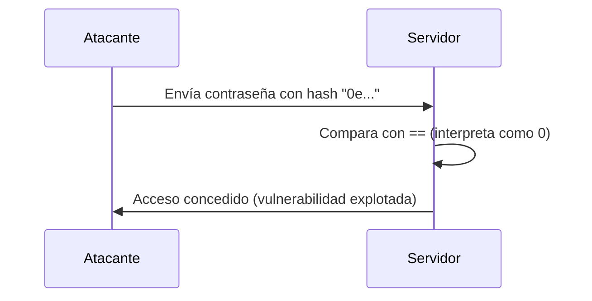

### **¿Qué es Type Juggling?**

Type Juggling (o "malabarismo de tipos") es una característica de PHP que convierte automáticamente los tipos de datos durante las comparaciones o operaciones. Esto puede llevar a vulnerabilidades si no se maneja correctamente, especialmente cuando se usa el operador de comparación débil (`==`).

---

### **¿Por qué es peligroso?**

El operador `==` en PHP no solo compara valores, sino que también intenta **convertir los tipos de datos** para que coincidan. Esto puede causar comportamientos inesperados, como que dos valores aparentemente diferentes sean considerados iguales.

---

### **Ejemplo de Type Juggling**

En el código que proporcionaste, hay una vulnerabilidad de Type Juggling en la comparación de la contraseña:

```php
$PASSWORD = 0e1231345134654654; // Esto es interpretado como 0 en notación científica
$contrasenia = md5($_POST['password']); // El hash MD5 de la contraseña

if ($contrasenia == $PASSWORD) { // Comparación débil (==)
    echo "Bienvenido admin";
}
```

#### **¿Qué pasa aquí?**

1. **`0e1231345134654654`**: En PHP, cualquier string que comience con `0e` seguido de números es interpretado como **0 en notación científica**. Esto significa que `0e1231345134654654` es igual a `0`.

2. **Hash MD5**: Si el hash MD5 de la contraseña también comienza con `0e` (por ejemplo, `0e462097431906509019562988736854`), PHP lo interpretará como `0`.

3. **Comparación débil (`==`)**: Como ambos valores son interpretados como `0`, la comparación `$contrasenia == $PASSWORD` será **verdadera**, incluso si las contraseñas no coinciden.

---

### **¿Cómo explotar esto?**

Un atacante puede enviar una contraseña cuyo hash MD5 comience con `0e`, como:

- Contraseña: `240610708`
- Hash MD5: `0e462097431906509019562988736854`

Cuando el servidor compara `0e462097431906509019562988736854` con `0e1231345134654654`, ambos son interpretados como `0`, y el atacante obtiene acceso.

---

### **¿Cómo prevenir Type Juggling?**

4. **Usar comparación estricta (`===`)**:  
   El operador `===` compara tanto el valor como el tipo de dato, evitando conversiones automáticas.

   ```php
   if ($contrasenia === $PASSWORD) { // Comparación estricta
       echo "Bienvenido admin";
   }
   ```

5. **Validar tipos de datos**:  
   Asegúrate de que los datos sean del tipo esperado antes de compararlos.

6. **Evitar hashes que comiencen con `0e`**:  
   Almacena contraseñas de manera segura usando funciones como `password_hash()` y `password_verify()`.

---

### **Código Corregido**

Aquí está el código corregido para evitar la vulnerabilidad de Type Juggling:

```php
<?php
    $USER = "admin";
    $PASSWORD = "contraseña_segura"; // Usa una contraseña segura y no un hash vulnerable

    if (isset($_POST['usuario']) && isset($_POST['password'])) {
        if ($_POST['usuario'] === $USER) { // Comparación estricta
            if (password_verify($_POST['password'], $PASSWORD)) { // Verificación segura
                echo "Bienvenido admin";
            } else {
                echo "ERROR: Password invalida";
            }
        } else {
            echo "ERROR: usuario invalido";
        }
    }
?>
```

---

### **Resumen**

- **Type Juggling**: PHP convierte automáticamente los tipos de datos durante comparaciones, lo que puede llevar a vulnerabilidades.
- **Vulnerabilidad**: Usar `==` para comparar valores puede permitir que un atacante explote hashes que comienzan con `0e`.
- **Prevención**: Usa `===` para comparaciones estrictas y funciones seguras como `password_hash()` y `password_verify()`.

---

### **Diagrama de Type Juggling**



---

### **Consejo Final**

Nunca uses comparaciones débiles (`==`) para valores sensibles como contraseñas. Siempre usa comparaciones estrictas (`===`) y funciones de hashing seguras.

[[OWASP]]
