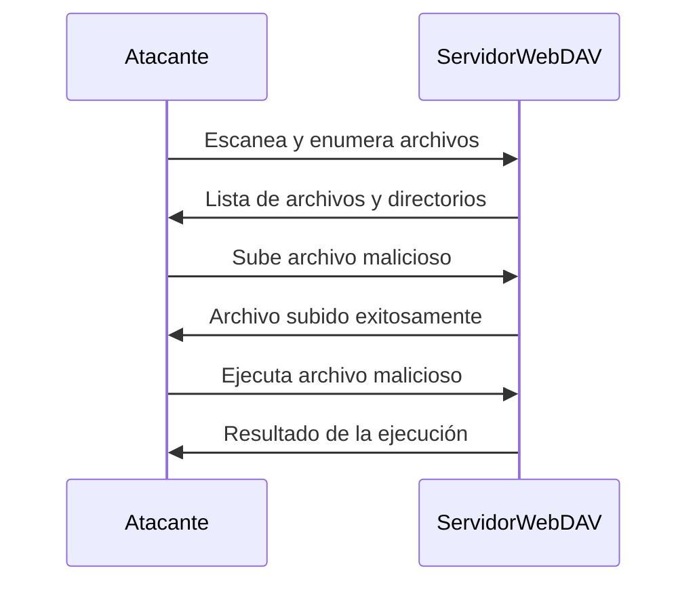

### **¿Qué es WebDAV?**

**WebDAV** (Web Distributed Authoring and Versioning) es una extensión del protocolo HTTP que permite a los usuarios **editar y gestionar archivos** en servidores web de manera remota. Es comúnmente utilizado para compartir archivos y colaborar en documentos.

---

### **¿Por qué es Importante en Seguridad?**

WebDAV puede ser vulnerable a varios tipos de ataques si no está configurado correctamente. Los atacantes pueden **enumerar archivos**, **subir archivos maliciosos**, o **explotar configuraciones incorrectas** para comprometer el servidor.

---

### **Enumeración de WebDAV**

#### **1. Identificar si WebDAV está Habilitado**
   - Usa herramientas como `nmap` para escanear el servidor y detectar si WebDAV está habilitado.
     ```bash
     nmap -p 80 --script http-webdav-scan <IP>
     ```

#### **2. Enumerar Archivos y Directorios**
   - Usa `davtest` para enumerar archivos y directorios accesibles a través de WebDAV.
     ```bash
     davtest -url http://<IP>/webdav
     ```

#### **3. Usar `cadaver` para Explorar WebDAV**
   - `cadaver` es una herramienta de línea de comandos para interactuar con servidores WebDAV.
     ```bash
     cadaver http://<IP>/webdav
     ```

---

### **Explotación de WebDAV**

#### **1. Subida de Archivos Maliciosos**
   - Si WebDAV permite la subida de archivos, un atacante puede subir un archivo malicioso (por ejemplo, un shell PHP).
     ```bash
     cadaver http://<IP>/webdav
     put shell.php
     ```

#### **2. Ejecución de Archivos Subidos**
   - Si el servidor permite la ejecución de scripts, el atacante puede ejecutar el archivo malicioso subido.
     ```bash
     curl http://<IP>/webdav/shell.php
     ```

#### **3. Explotación de Configuraciones Incorrectas**
   - Si WebDAV está mal configurado, un atacante puede aprovechar para **escalar privilegios** o **acceder a archivos sensibles**.

---

### **Herramientas Útiles**

| Herramienta | Descripción                                                                 |
|-------------|-----------------------------------------------------------------------------|
| `nmap`      | Escanear y detectar servicios WebDAV.                                       |
| `davtest`   | Enumerar y probar capacidades de WebDAV.                                    |
| `cadaver`   | Cliente de línea de comandos para interactuar con servidores WebDAV.        |
| `curl`      | Realizar solicitudes HTTP para probar la subida y ejecución de archivos.    |

---

### **Ejemplo Práctico**

#### **1. Escaneo con `nmap`**
   ```bash
   nmap -p 80 --script http-webdav-scan 192.168.1.100
   ```

#### **2. Enumeración con `davtest`**
   ```bash
   davtest -url http://192.168.1.100/webdav
   ```

#### **3. Subida de Archivo con `cadaver`**
   ```bash
   cadaver http://192.168.1.100/webdav
   put shell.php
   ```

#### **4. Ejecución del Archivo**
   ```bash
   curl http://192.168.1.100/webdav/shell.php
   ```

---

### **¿Cómo Prevenir Vulnerabilidades en WebDAV?**

1. **Deshabilitar WebDAV**:  
   Si no es necesario, deshabilita WebDAV en el servidor.

2. **Configuración Segura**:  
   Asegúrate de que WebDAV esté configurado correctamente y con permisos mínimos necesarios.

3. **Autenticación Robustas**:  
   Usa autenticación fuerte y limita el acceso a usuarios autorizados.

4. **Monitoreo y Logging**:  
   Monitorea y registra las actividades en el servidor WebDAV para detectar actividades sospechosas.

---

### **Resumen**

- **WebDAV**: Protocolo para gestionar archivos en servidores web.
- **Enumeración**: Identificar y listar archivos y directorios accesibles.
- **Explotación**: Subir y ejecutar archivos maliciosos, explotar configuraciones incorrectas.
- **Prevención**: Deshabilitar WebDAV si no es necesario, configurar correctamente, usar autenticación robusta.

---

### **Diagrama de Ataque WebDAV**



---

### **Consejo Final**

Nunca dejes WebDAV habilitado si no es necesario. Si lo usas, asegúrate de configurarlo correctamente y monitorea regularmente las actividades para detectar posibles abusos.

[[OWASP]]