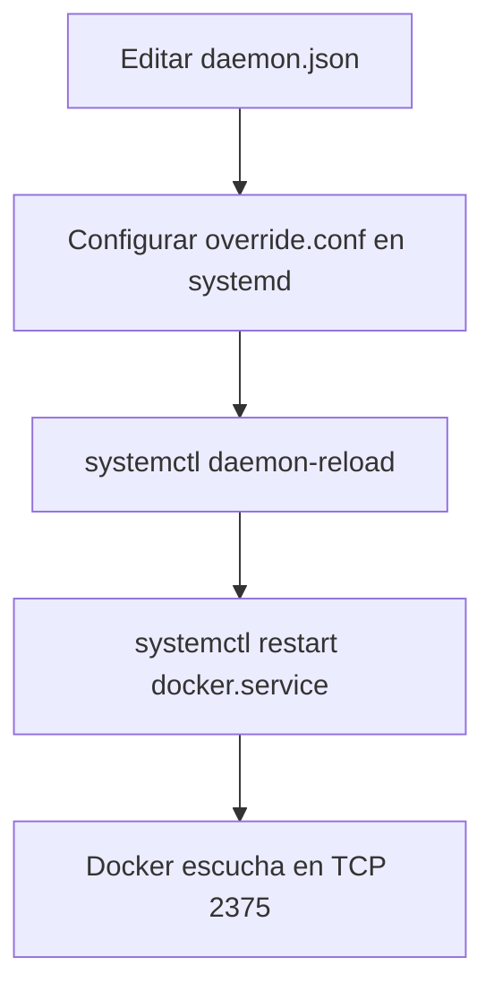

# 🔓 Habilitar el Puerto TCP 2375 para Conexión Externa a Docker

---

## 📝 Definición

> [!info]
> **Habilitar el puerto TCP 2375** en Docker permite que el demonio Docker (`dockerd`) acepte conexiones externas a través de la red, facilitando la administración remota de contenedores.  
> **Advertencia:** El puerto 2375 no utiliza cifrado ni autenticación por defecto, lo que representa un riesgo de seguridad significativo si se expone a redes no confiables.

---

## ⚙️ Pasos para Habilitar el Puerto TCP 2375

### 1. Crear o editar el archivo `daemon.json`

Ubicación: `/etc/docker/daemon.json`

```json
{
  "hosts": ["tcp://0.0.0.0:2375", "unix:///var/run/docker.sock"]
}
```

- **`tcp://0.0.0.0:2375`**: Escucha en todas las interfaces de red en el puerto 2375.
- **`unix:///var/run/docker.sock`**: Mantiene el socket local para compatibilidad.

---

### 2. Configurar systemd para Docker

Crea el archivo de override:  
`/etc/systemd/system/docker.service.d/override.conf`

```ini
[Service]
ExecStart=
ExecStart=/usr/bin/dockerd
```

- El primer `ExecStart=` vacío limpia la configuración anterior.
- El segundo define el nuevo comando para iniciar el demonio Docker.

---

### 3. Recargar la configuración de systemd

```bash
systemctl daemon-reload
```

---

### 4. Reiniciar el servicio Docker

```bash
systemctl restart docker.service
```

---

## 📊 Tabla Resumen de Pasos

| Paso | Acción | Archivo/Comando |
|------|--------|-----------------|
| 1    | Crear/editar configuración | `/etc/docker/daemon.json` |
| 2    | Configurar override systemd | `/etc/systemd/system/docker.service.d/override.conf` |
| 3    | Recargar systemd | `systemctl daemon-reload` |
| 4    | Reiniciar Docker | `systemctl restart docker.service` |

---

## 🛡️ Consideraciones de Seguridad

> [!warning]
> - **El puerto 2375 no está cifrado ni autenticado.**
> - Cualquiera con acceso a este puerto puede controlar completamente Docker (y, por extensión, el host).
> - **Nunca expongas 2375 a Internet o redes no confiables.**
> - Para producción, utiliza el puerto 2376 con TLS y autenticación de certificados.

---

## 🧩 Ejemplo de Uso

```bash
# Conectar a Docker remotamente desde otro host
docker -H tcp://<ip_del_host>:2375 info
```

---

## 🧠 Contexto y Aplicaciones

- **Laboratorios y entornos de desarrollo**: Permite administración remota sencilla.
- **Integración con herramientas de orquestación**: Algunas soluciones requieren acceso remoto al demonio Docker.
- **Automatización y CI/CD**: Facilita la gestión de contenedores desde sistemas externos.

---

## 🔗 Recursos y Conceptos Relacionados

- [Issue de seguridad en GitHub](https://github.com/moby/moby/issues/25471)
- [Docker: Control and configure Docker with systemd](https://docs.docker.com/engine/admin/systemd/#custom-docker-daemon-options)
- [[Docker]]
- [[Seguridad en Docker]]
- [[TLS en Docker]]

---

## 🧭 Diagrama de Flujo: Habilitación de Docker TCP 2375



---

> [!summary]
> Habilitar el puerto TCP 2375 en Docker permite administración remota, pero **debe hacerse solo en entornos controlados y nunca en producción sin cifrado y autenticación**.