### **쯈u칠 es `dig`?**

`dig` es una herramienta de línea de comandos en Linux que se utiliza para **realizar consultas DNS** (Domain Name System). Es una de las herramientas más potentes y flexibles para diagnosticar y resolver problemas relacionados con DNS.

---

### **Sintaxis Básica**

```bash
dig [@servidor] [nombre] [tipo] [opciones]
```

- **`@servidor`**: El servidor DNS al que deseas enviar la consulta (opcional).
- **`nombre`**: El dominio o dirección IP que quieres consultar.
- **`tipo`**: El tipo de registro DNS que deseas consultar (por ejemplo, `A`, `MX`, `NS`, etc.).
- **`opciones`**: Opciones adicionales para personalizar la consulta.

---

### **Usos Comunes**

#### 1. **Consultar Registros DNS**
   - **Ejemplo**: Consultar el registro `A` (dirección IP) de un dominio.
     ```bash
     dig example.com A
     ```

#### 2. **Consultar Servidores de Nombres (NS)**
   - **Ejemplo**: Consultar los servidores de nombres de un dominio.
     ```bash
     dig example.com NS
     ```

#### 3. **Consultar Registros de Correo (MX)**
   - **Ejemplo**: Consultar los servidores de correo de un dominio.
     ```bash
     dig example.com MX
     ```

#### 4. **Consultar Registros de Texto (TXT)**
   - **Ejemplo**: Consultar los registros de texto de un dominio.
     ```bash
     dig example.com TXT
     ```

#### 5. **Consultar un Servidor DNS Específico**
   - **Ejemplo**: Consultar un dominio usando un servidor DNS específico.
     ```bash
     dig @8.8.8.8 example.com
     ```

#### 6. **Realizar una Transferencia de Zona (AXFR)**
   - **Ejemplo**: Intentar una transferencia de zona completa.
     ```bash
     dig @ns.example.com example.com AXFR
     ```

---

### **Opciones Adicionales**

| Opción | Descripción                                                                 |
|--------|-----------------------------------------------------------------------------|
| `+short` | Muestra una salida concisa.                                                |
| `+noall +answer` | Muestra solo la sección de respuestas.                                     |
| `+trace` | Realiza un seguimiento de la consulta DNS desde la raíz.                   |
| `+nocmd` | Omite la sección de comandos en la salida.                                 |
| `+stats` | Muestra estadísticas de la consulta.                                       |
| `+multiline` | Muestra la salida en un formato más legible.                               |

---

### **Ejemplos Prácticos**

1. **Consulta Simple**:
   ```bash
   dig example.com
   ```

2. **Consulta con Salida Corta**:
   ```bash
   dig example.com +short
   ```

3. **Consulta de Registros MX**:
   ```bash
   dig example.com MX +noall +answer
   ```

4. **Consulta con Seguimiento**:
   ```bash
   dig example.com +trace
   ```

5. **Consulta de Registros TXT**:
   ```bash
   dig example.com TXT
   ```

6. **Transferencia de Zona (AXFR)**:
   ```bash
   dig @ns.example.com example.com AXFR
   ```

---

### **Estructura de la Salida de `dig`**

La salida de `dig` se divide en varias secciones:

1. **Sección de Comandos**: Muestra la consulta realizada.
2. **Sección de Respuestas**: Contiene los registros DNS solicitados.
3. **Sección de Autoridad**: Muestra los servidores DNS autoritativos.
4. **Sección Adicional**: Contiene información adicional, como direcciones IP de los servidores DNS.

---

### **Resumen**

- **`dig`**: Herramienta potente y flexible para realizar consultas DNS.
- **Usos comunes**: Consultar registros `A`, `MX`, `NS`, `TXT`, realizar transferencias de zona (AXFR).
- **Opciones clave**: `+short`, `+noall +answer`, `+trace`, `+stats`.

---

### **Diagrama de Funcionamiento de `dig`**

```mermaid
sequenceDiagram
    participant Usuario
    participant ServidorDNS

    Usuario->>ServidorDNS: Envía consulta DNS
    ServidorDNS->>Usuario: Devuelve respuesta DNS
```



---

### **Consejo Final**
¡Y eso es todo! Un apunte hermoso, claro y fácil de entender para tu Obsidian. 😊 Si necesitas más detalles o ajustes, no dudes en pedírmelo.
`dig` es una herramienta esencial para cualquier persona que trabaje con DNS. Aprende a usarla bien y te será de gran ayuda para diagnosticar y resolver problemas de red.

[[herramientas]]
[[Ataques de Transferencia de Zona (AXFR)]]