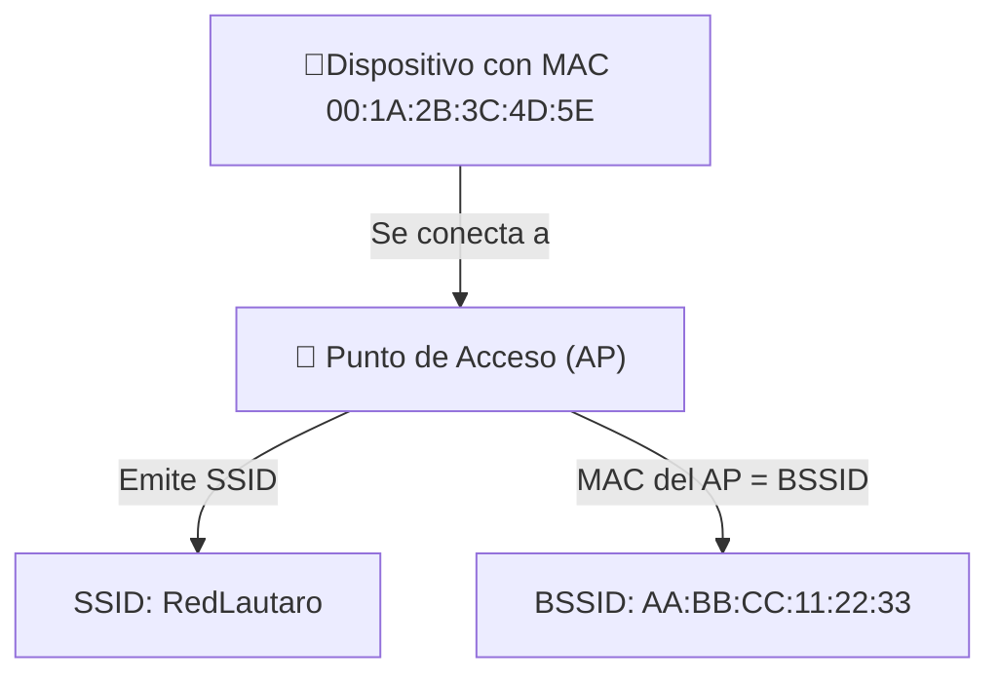

### 🧬 **MAC Address (Media Access Control Address)**

Es una dirección física única asignada a **cada interfaz de red** (tarjeta de red Wi-Fi, Ethernet, etc.) por el fabricante.

📌 **Formato**:  
6 pares de caracteres hexadecimales (48 bits), por ejemplo:  
`00:1A:2B:3C:4D:5E`

📌 **Ejemplo**:  
Tu adaptador Wi-Fi puede tener una MAC `a4:23:05:9f:1b:2e`

📌 **Características**:

- Es única a nivel mundial (aunque puede ser modificada o "spoofeada").
    
- Permite identificar el **dispositivo emisor o receptor** dentro de una red.
    

---

### 📡 **SSID (Service Set Identifier)**

Es el **nombre visible de una red Wi-Fi**.

📌 **Ejemplo**:  
`"CaféLibre"`, `"Movistar_5Ghz"`, `"RedLautaro"`

📌 **Características**:

- Puede tener hasta 32 caracteres.
    
- No es único: puede haber múltiples redes con el mismo SSID.
    
- Es lo que ves en el listado de redes Wi-Fi disponibles.
    
- Puede estar oculto (hidden SSID), aunque sigue emitiendo tráfico.
    

---

### 🏷️ **BSSID (Basic Service Set Identifier)**

Es **la MAC Address del punto de acceso (AP)** que emite el SSID.

📌 **Ejemplo**:  
Si el SSID es `"MiRed"` y lo emite un AP con MAC `aa:bb:cc:dd:ee:ff`,  
entonces el **BSSID = aa:bb:cc:dd:ee:ff`.

📌 **Características**:

- Permite distinguir entre múltiples AP que emiten el mismo SSID.
    
- Cada punto de acceso tiene su **propio BSSID** (aunque compartan SSID).
    

---

### 🔍 Resumen Comparativo

|Concepto|Qué es|Ejemplo|
|---|---|---|
|MAC Address|Identificador único de un dispositivo|`00:1A:2B:3C:4D:5E`|
|SSID|Nombre público de la red Wi-Fi|`"RedLautaro"`|
|BSSID|MAC del punto de acceso que emite el SSID|`AA:BB:CC:11:22:33`|

---

### 📈 Diagrama en Mermaid

---

Si estás haciendo pentesting Wi-Fi, capturar los paquetes _beacon_ y _probe_ te permitirá ver estos campos:

- **SSID**: para saber qué redes hay.
    
- **BSSID**: para atacar un AP específico.
    
- **MAC Address**: para identificar clientes (por ejemplo, para ataques de deautenticación).
    

