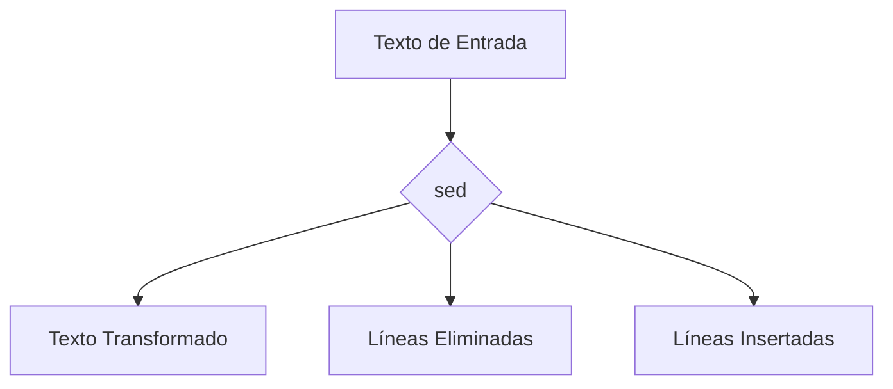

### **¿Qué es `sed`?**

`sed` (Stream Editor) es un comando de Linux que se usa para **manipular texto** en flujos de datos (streams) o archivos. Es especialmente útil para realizar **sustituciones**, **eliminaciones**, **inserciones** y otras transformaciones de texto.

---

### **Sintaxis Básica**

```bash
sed [opciones] 'comando' [archivo(s)]
```

- **`comando`**: La acción que `sed` debe realizar (por ejemplo, sustituir, eliminar, etc.).
- **`archivo(s)`**: Archivo(s) en los que aplicar el comando. Si no se especifica, `sed` trabaja con la entrada estándar (stdin).

---

### **Usos Comunes**

#### 1. **Sustituir Texto**
Reemplaza un patrón con otro texto.

- **Ejemplo**: Cambiar "hola" por "adiós" en un archivo.
  ```bash
  sed 's/hola/adiós/' archivo.txt
  ```

---

#### 2. **Sustituir Texto en Todo el Archivo**
Usa la opción `g` (global) para reemplazar todas las ocurrencias en cada línea.

- **Ejemplo**: Cambiar todas las ocurrencias de "hola" por "adiós".
  ```bash
  sed 's/hola/adiós/g' archivo.txt
  ```

---

#### 3. **Eliminar Líneas**
Elimina líneas que coinciden con un patrón.

- **Ejemplo**: Eliminar todas las líneas que contienen "error".
  ```bash
  sed '/error/d' archivo.log
  ```

---

#### 4. **Imprimir Líneas Específicas**
Usa la opción `-n` junto con `p` para imprimir solo las líneas que coinciden con un patrón.

- **Ejemplo**: Imprimir solo las líneas que contienen "hola".
  ```bash
  sed -n '/hola/p' archivo.txt
  ```

---

#### 5. **Insertar Texto**
Inserta texto antes o después de una línea específica.

- **Ejemplo**: Insertar "Nueva línea" antes de la línea 3.
  ```bash
  sed '3i Nueva línea' archivo.txt
  ```

---

#### 6. **Añadir Texto**
Añade texto después de una línea específica.

- **Ejemplo**: Añadir "Fin del archivo" después de la última línea.
  ```bash
  sed '$a Fin del archivo' archivo.txt
  ```

---

#### 7. **Modificar Líneas Específicas**
Reemplaza el contenido de una línea específica.

- **Ejemplo**: Cambiar la línea 5 por "Línea modificada".
  ```bash
  sed '5c Línea modificada' archivo.txt
  ```

---

#### 8. **Guardar Cambios en el Archivo**
Usa la opción `-i` para guardar los cambios directamente en el archivo.

- **Ejemplo**: Cambiar "hola" por "adiós" y guardar los cambios.
  ```bash
  sed -i 's/hola/adiós/g' archivo.txt
  ```

---

### **Opciones Adicionales**

| Opción | Descripción                                                                 |
|--------|-----------------------------------------------------------------------------|
| `-n`   | Suprime la salida automática (útil con `p` para imprimir líneas específicas).|
| `-i`   | Edita el archivo directamente (in-place).                                   |
| `-e`   | Permite usar múltiples comandos en una sola línea.                          |
| `-f`   | Lee comandos desde un archivo.                                              |

---

### **Ejemplos Avanzados**

1. **Sustituir Solo en Líneas Específicas**:
   ```bash
   sed '2,4s/hola/adiós/' archivo.txt  # Cambia "hola" por "adiós" en las líneas 2 a 4.
   ```

2. **Eliminar Líneas en Blanco**:
   ```bash
   sed '/^$/d' archivo.txt  # Elimina todas las líneas vacías.
   ```

3. **Sustituir con Expresiones Regulares**:
   ```bash
   sed 's/[0-9]\+/NÚMERO/' archivo.txt  # Reemplaza números por "NÚMERO".
   ```

4. **Aplicar Múltiples Comandos**:
   ```bash
   sed -e 's/hola/adiós/' -e 's/error/advertencia/' archivo.txt
   ```

5. **Imprimir Líneas que Coinciden con un Patrón**:
   ```bash
   sed -n '/error/p' archivo.log  # Imprime solo líneas con "error".
   ```

---

### **Resumen**

- **`sed`**: Comando para manipular texto en flujos de datos o archivos.
- **Usos comunes**: Sustituir texto, eliminar líneas, insertar texto, imprimir líneas específicas.
- **Opciones clave**: `-n`, `-i`, `-e`, `-f`.

---

### **Diagrama de Funcionamiento de `sed`**



---

### **Consejo Final**

`sed` es una herramienta poderosa para manipular texto. Combínalo con otros comandos como `grep`, `awk` o `tr` para tareas más complejas.

[[bash]]