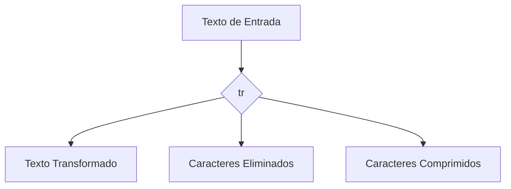

### **¿Qué es `tr`?**

`tr` (translate o transliterate) es un comando de Linux que se usa para **traducir, eliminar o comprimir caracteres** en un texto. Es una herramienta poderosa para manipular texto directamente desde la terminal.

---

### **Sintaxis Básica**

```bash
tr [opciones] conjunto1 conjunto2
```

- **`conjunto1`**: Caracteres que quieres reemplazar o eliminar.
- **`conjunto2`**: Caracteres que reemplazarán a los de `conjunto1`.

---

### **Usos Comunes**

#### 1. **Traducir Caracteres**
Reemplaza cada carácter de `conjunto1` con el correspondiente de `conjunto2`.

- **Ejemplo**: Convertir minúsculas a mayúsculas.
  ```bash
  echo "hola mundo" | tr 'a-z' 'A-Z'
  ```
  - Salida: `HOLA MUNDO`

---

#### 2. **Eliminar Caracteres**
Usa la opción `-d` para eliminar caracteres específicos.

- **Ejemplo**: Eliminar todos los números.
  ```bash
  echo "abc123def456" | tr -d '0-9'
  ```
  - Salida: `abcdef`

---

#### 3. **Comprimir Caracteres Repetidos**
Usa la opción `-s` para comprimir caracteres repetidos en uno solo.

- **Ejemplo**: Comprimir espacios múltiples en uno solo.
  ```bash
  echo "hola      mundo" | tr -s ' '
  ```
  - Salida: `hola mundo`

---

#### 4. **Complementar Conjuntos**
Usa la opción `-c` para trabajar con todos los caracteres **excepto** los especificados.

- **Ejemplo**: Eliminar todo excepto los números.
  ```bash
  echo "abc123def456" | tr -cd '0-9'
  ```
  - Salida: `123456`

---

#### 5. **Eliminar Saltos de Línea**
Puedes usar `tr` para eliminar saltos de línea (`\n`) y unir todas las líneas en una sola.

- **Ejemplo**:
  ```bash
  echo -e "hola\nmundo" | tr -d '\n'
  ```
  - Salida: `holamundo`

---

#### 6. **Reemplazar Espacios por Tabulaciones**
- **Ejemplo**:
  ```bash
  echo "hola mundo" | tr ' ' '\t'
  ```
  - Salida: `hola    mundo` (con una tabulación en lugar del espacio).

---

#### 7. **Eliminar Caracteres No Imprimibles**
Usa `tr` para eliminar caracteres no imprimibles, como `\t` (tabulación) o `\r` (retorno de carro).

- **Ejemplo**:
  ```bash
  echo -e "hola\tmundo\r" | tr -d '\t\r'
  ```
  - Salida: `holamundo`

---

#### 8. **Convertir Saltos de Línea de Windows a Unix**
Windows usa `\r\n` para saltos de línea, mientras que Unix usa `\n`. Puedes convertir archivos de Windows a Unix con `tr`.

- **Ejemplo**:
  ```bash
  tr -d '\r' < archivo_windows.txt > archivo_unix.txt
  ```

---

### **Opciones Adicionales**

| Opción | Descripción                                                                 |
|--------|-----------------------------------------------------------------------------|
| `-d`   | Elimina los caracteres especificados en `conjunto1`.                        |
| `-s`   | Comprime repeticiones de caracteres en uno solo.                            |
| `-c`   | Trabaja con todos los caracteres **excepto** los especificados.             |
| `-t`   | Trunca `conjunto1` para que tenga la misma longitud que `conjunto2`.        |

---

### **Ejemplos Avanzados**

1. **Convertir Comas en Saltos de Línea**:
   ```bash
   echo "a,b,c,d" | tr ',' '\n'
   ```
   - Salida:
     ```
     a
     b
     c
     d
     ```

2. **Eliminar Caracteres Especiales**:
   ```bash
   echo "¡Hola! ¿Cómo estás?" | tr -d '¡!¿?'
   ```
   - Salida: `Hola Cómo estás`

3. **Comprimir Espacios y Convertir a Mayúsculas**:
   ```bash
   echo "  hola   mundo  " | tr -s ' ' | tr 'a-z' 'A-Z'
   ```
   - Salida: `HOLA MUNDO`

---

### **Resumen**

- **`tr`**: Comando para traducir, eliminar o comprimir caracteres en texto.
- **Usos comunes**: Convertir mayúsculas/minúsculas, eliminar caracteres, comprimir repeticiones.
- **Opciones clave**: `-d`, `-s`, `-c`.

---

### **Diagrama de Funcionamiento de `tr`**



---

### **Consejo Final**

`tr` es una herramienta sencilla pero poderosa para manipular texto en la terminal. Combínalo con otros comandos como `grep`, `sed` o `awk` para tareas más complejas.

[[bash]]