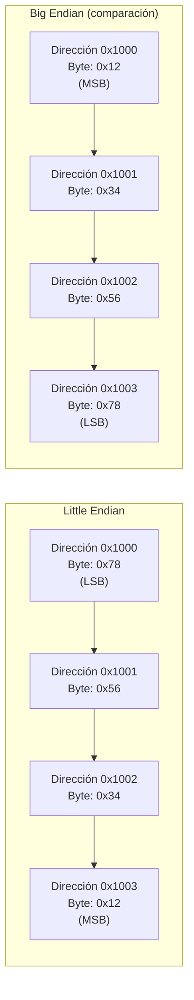
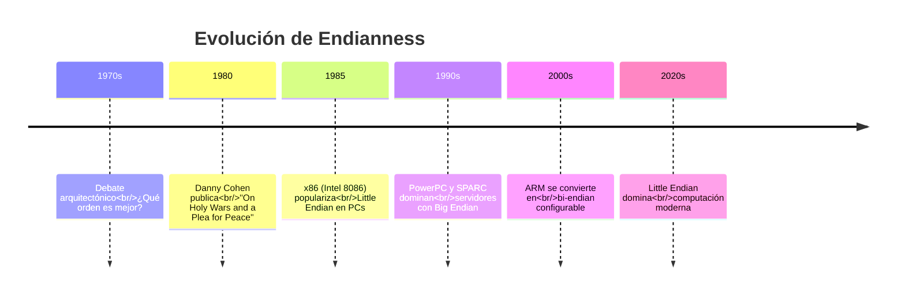

## 📖 Definición

**Little Endian** es un método de ordenamiento de bytes en memoria utilizado en arquitecturas de computadoras para representar datos de múltiples bytes (como enteros, direcciones de memoria o valores de punto flotante). En este sistema, el **byte menos significativo** (LSB - *Least Significant Byte*) se almacena en la **dirección de memoria más baja**, mientras que el **byte más significativo** (MSB - *Most Significant Byte*) se almacena en la dirección más alta.

> [!info] Concepto clave
> El término "endianness" (endianidad) describe cómo los bytes de un valor multi-byte se organizan secuencialmente en memoria. Little Endian es uno de los dos órdenes principales, siendo el otro **Big Endian**.

---

## 🔢 Funcionamiento

### Representación visual

Supongamos el valor hexadecimal `0x12345678` (32 bits, 4 bytes) almacenado en la dirección de memoria `0x1000`:



### Tabla comparativa

| Dirección | Little Endian | Big Endian | Significado |
|-----------|---------------|------------|-------------|
| 0x1000 | `78` | `12` | LSB / MSB |
| 0x1001 | `56` | `34` | Byte medio-bajo / medio-alto |
| 0x1002 | `34` | `56` | Byte medio-alto / medio-bajo |
| 0x1003 | `12` | `78` | MSB / LSB |

**Valor original**:  `0x12345678`

---

## 🎯 Para qué se usa

### Propósitos principales

| Aplicación | Descripción |
|------------|-------------|
| **Representación en memoria** | Define cómo se almacenan enteros, direcciones y flotantes en RAM |
| **Comunicación entre sistemas** | Necesario para interpretar datos en redes o archivos binarios |
| **Desarrollo de exploits** | Fundamental en [[Buffer Overflow]] y explotación de memoria |
| **Programación de sistemas** | Relevante en drivers, kernels y firmware |
| **Ingeniería inversa** | Esencial para analizar binarios y desensambladores |

### Ventajas del Little Endian

> [!tip] Eficiencia en operaciones
> - **Acceso más rápido a bytes bajos**:  En operaciones aritméticas, los procesadores suelen necesitar primero el byte menos significativo
> - **Compatibilidad con extensión de signo**: Facilita la conversión entre tipos de diferentes tamaños (ej.  de 16-bit a 32-bit)
> - **Simplicidad en aritmética multi-precisión**: Las operaciones de suma/resta pueden procesarse de izquierda a derecha en memoria

---

## 💻 Cuándo se usa

### Arquitecturas que usan Little Endian

| Arquitectura | Procesadores | Uso común |
|--------------|--------------|-----------|
| **x86 (32-bit)** | Intel 80x86, AMD | PCs de escritorio legacy |
| **x86-64 (AMD64)** | Intel Core, AMD Ryzen | PCs modernos, servidores |
| **ARM (configurable)** | ARM Cortex-A (modo LE) | Smartphones, tablets, Raspberry Pi |
| **RISC-V (configurable)** | SiFive, Alibaba T-Head | Sistemas embebidos modernos |

### Arquitecturas que usan Big Endian

| Arquitectura | Procesadores | Uso común |
|--------------|--------------|-----------|
| **Motorola 68k** | 68000, 68020 | Computadoras antiguas (Amiga, Mac clásica) |
| **PowerPC** | IBM POWER | Servidores empresariales |
| **SPARC** | Oracle SPARC | Servidores de alto rendimiento |
| **Redes (Network Byte Order)** | Protocolos TCP/IP | Estándar en comunicaciones de red |

> [!warning] Arquitecturas bi-endian
> Algunas arquitecturas como **ARM** y **MIPS** pueden operar en ambos modos (Little y Big Endian), configurables por hardware o software.

---

## 🔍 Contextos de aplicación

### 1. Buffer Overflow y explotación

En [[Buffer Overflow]], las direcciones de memoria deben escribirse en Little Endian en arquitecturas x86/x64:

**Ejemplo**:  Sobrescribir el registro EIP con la dirección `0x5f4c4d13`

```python
# Incorrecto (Big Endian)
eip = b"\x5f\x4c\x4d\x13"  # ❌ No funciona en x86

# Correcto (Little Endian)
from struct import pack
eip = pack("<L", 0x5f4c4d13)  # ✅ Resultado:  \x13\x4d\x4c\x5f
```

---

### 2. Programación de sistemas

Al leer/escribir archivos binarios o estructuras de datos en C: 

```c
#include <stdio.h>
#include <stdint.h>

int main() {
    uint32_t valor = 0x12345678;
    uint8_t *ptr = (uint8_t *)&valor;
    
    // En Little Endian (x86):
    printf("Byte 0: 0x%02x\n", ptr[0]);  // 0x78 (LSB)
    printf("Byte 1: 0x%02x\n", ptr[1]);  // 0x56
    printf("Byte 2: 0x%02x\n", ptr[2]);  // 0x34
    printf("Byte 3: 0x%02x\n", ptr[3]);  // 0x12 (MSB)
    
    return 0;
}
```

---

### 3. Comunicaciones de red

Los protocolos de red usan **Big Endian** (Network Byte Order) por estándar.  Es necesario convertir: 

```c
#include <arpa/inet.h>

uint32_t valor_host = 0x12345678;      // Little Endian en x86
uint32_t valor_red = htonl(valor_host); // Convierte a Big Endian (0x78563412 en memoria)
```

**Funciones de conversión**: 
- `htonl()`: Host TO Network Long (32-bit)
- `htons()`: Host TO Network Short (16-bit)
- `ntohl()`: Network TO Host Long
- `ntohs()`: Network TO Host Short

---

### 4. Ingeniería inversa

Al analizar binarios con herramientas como **IDA Pro**, **Ghidra** o **x64dbg**, las direcciones y valores se interpretan según el endianness de la arquitectura: 

**Ejemplo en desensamblador x86**:
```assembly
mov eax, 0x12345678    ; Instrucción en código
```

**En memoria (hexadecimal)**:
```
B8 78 56 34 12         ; B8 = opcode de MOV EAX, imm32
   └─────┬─────┘       ; Valor en Little Endian
     0x12345678
```

---

## 📊 Comparación:  Little Endian vs Big Endian

| Aspecto | Little Endian | Big Endian |
|---------|---------------|------------|
| **Byte inicial** | LSB (menos significativo) | MSB (más significativo) |
| **Lectura humana** | Contraintuitiva (inversa) | Intuitiva (natural) |
| **Eficiencia aritmética** | Mayor en procesadores modernos | Mayor en operaciones de red |
| **Uso predominante** | PCs, laptops, smartphones | Redes, sistemas legacy |
| **Ejemplo visual** | `0x12345678` → `78 56 34 12` | `0x12345678` → `12 34 56 78` |

---

## 🛠️ Detección de endianness

### Método en C

```c
#include <stdio.h>
#include <stdint.h>

int main() {
    uint32_t valor = 0x01020304;
    uint8_t *ptr = (uint8_t *)&valor;
    
    if (ptr[0] == 0x04) {
        printf("Sistema Little Endian\n");
    } else if (ptr[0] == 0x01) {
        printf("Sistema Big Endian\n");
    }
    
    return 0;
}
```

### Método en Python

```python
import sys

# Python nativo
print("Byte order:", sys.byteorder)  # 'little' o 'big'

# Con struct
from struct import pack

valor = pack("<I", 0x12345678)  # Little Endian
print(valor. hex())  # '78563412'

valor = pack(">I", 0x12345678)  # Big Endian
print(valor.hex())  # '12345678'
```

---

## 🔄 Conversión de endianness

### En Python con struct

```python
from struct import pack, unpack

# Dirección en Big Endian (formato natural)
direccion = 0x5f4c4d13

# Convertir a Little Endian (x86)
little = pack("<L", direccion)
print(little.hex())  # '134d4c5f'

# Revertir conversión
recuperado = unpack("<L", little)[0]
print(hex(recuperado))  # '0x5f4c4d13'
```

### Formatos de pack()

| Formato | Significado | Endianness |
|---------|-------------|------------|
| `<` | Little Endian | LSB primero |
| `>` | Big Endian | MSB primero |
| `!` | Network (Big Endian) | MSB primero |
| `=` | Nativo del sistema | Depende del CPU |
| `L` | Unsigned long (4 bytes) | 32-bit |
| `Q` | Unsigned long long (8 bytes) | 64-bit |

---

## 📚 Contexto histórico

> [!quote] Origen del término
> El término "endian" proviene de la novela **"Los viajes de Gulliver"** (1726) de Jonathan Swift, donde se narra una guerra entre dos naciones por decidir por qué extremo (*end*) se debe romper un huevo:  el extremo grande (*big end*) o el pequeño (*little end*).

**Cronología**: 



---

## 📖 Ejemplos prácticos

### Ejemplo 1: Dirección de memoria en exploit

```python
# Dirección JMP ESP en SLMail (Buffer Overflow)
direccion_jmp = 0x5f4c4d13

# En x86 debe invertirse: 
from struct import pack
eip = pack("<L", direccion_jmp)

print("Big Endian (natural):", hex(direccion_jmp))
print("Little Endian (x86):", eip.hex())
```

**Salida**:
```
Big Endian (natural): 0x5f4c4d13
Little Endian (x86): 134d4c5f
```

---

### Ejemplo 2: Lectura de archivo binario

```python
with open("datos.bin", "rb") as f:
    # Leer 4 bytes como entero Little Endian
    import struct
    valor_le = struct.unpack("<I", f.read(4))[0]
    
    # Leer 4 bytes como entero Big Endian
    f.seek(0)  # Volver al inicio
    valor_be = struct. unpack(">I", f. read(4))[0]
    
    print(f"Little Endian: {valor_le}")
    print(f"Big Endian: {valor_be}")
```

---

### Ejemplo 3: Comunicación cliente-servidor

```python
import socket
import struct

# Servidor (envía en Network Byte Order = Big Endian)
valor = 305419896  # 0x12345678
datos = struct.pack("! I", valor)  # Network byte order
sock.send(datos)

# Cliente (recibe y convierte)
datos_recibidos = sock.recv(4)
valor_recibido = struct.unpack("!I", datos_recibidos)[0]
print(hex(valor_recibido))  # 0x12345678
```

---

## 🎓 Resumen ejecutivo

| Aspecto | Detalle |
|---------|---------|
| **Definición** | Orden de bytes donde el LSB se almacena primero |
| **Arquitecturas** | x86, x86-64, ARM (modo LE), RISC-V (configurable) |
| **Uso principal** | Representación de enteros, direcciones, floats en memoria |
| **Aplicación en hacking** | Fundamental para [[Buffer Overflow]] y exploits |
| **Conversión en Python** | `struct.pack("<L", valor)` |
| **Opuesto** | [[Big Endian]] (MSB primero) |
| **Detección** | Verificar el byte más bajo de un entero en memoria |

---

> [!summary] Conclusión
> **Little Endian** es el estándar de facto en la computación moderna (x86/x64), esencial para comprender la organización de memoria en sistemas y el desarrollo de exploits. Su dominio requiere pensar "al revés" en comparación con la notación hexadecimal natural, pero es crítico para operaciones de bajo nivel como la explotación de vulnerabilidades y la programación de sistemas. 