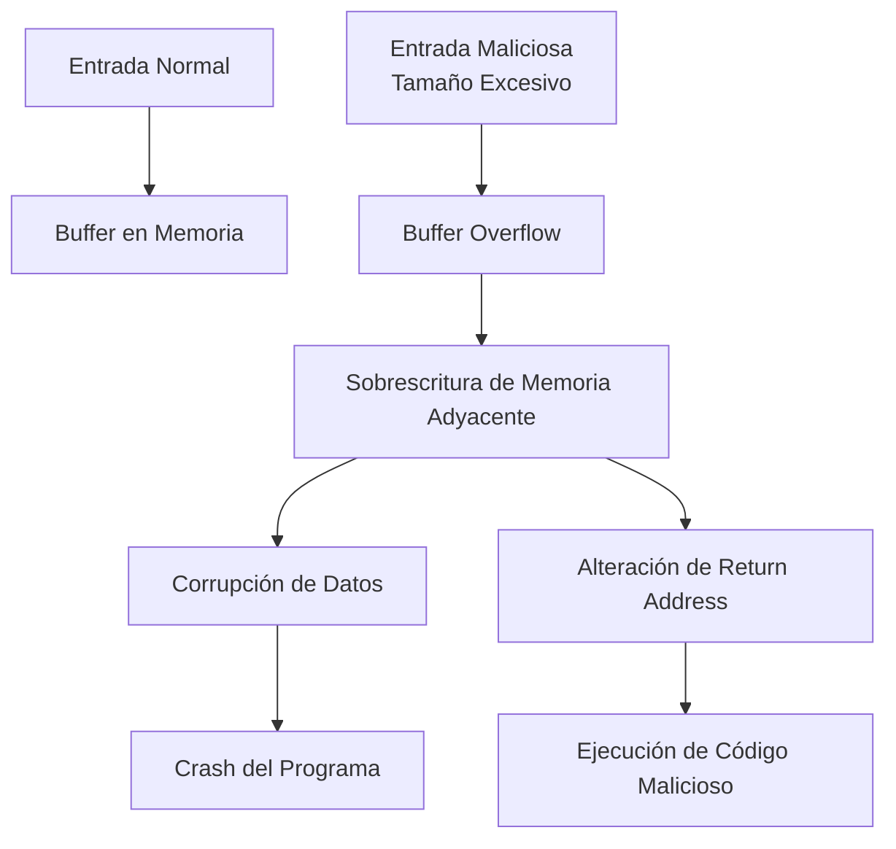
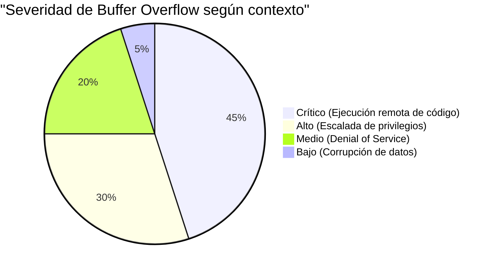
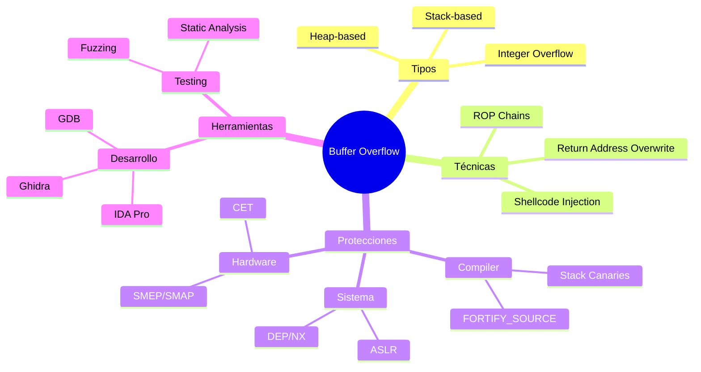

# 🔄 Buffer Overflow

---

## 📝 Definición

> [!info]  
> **Buffer Overflow** (desbordamiento de búfer) es una vulnerabilidad de seguridad que ocurre cuando un programa escribe más datos en un búfer de memoria de los que este puede contener, causando que los datos excedentes sobrescriban áreas de memoria adyacentes. Esta condición puede ser explotada para alterar el flujo de ejecución del programa o ejecutar código malicioso.

---

## 🧩 Conceptos Fundamentales

### Tipos de Buffer Overflow

- **Stack-based Buffer Overflow**: Ocurre en la pila (stack) de memoria
- **Heap-based Buffer Overflow**: Ocurre en el montón (heap) de memoria  
- **Integer Overflow**: Desbordamiento de variables enteras que puede provocar buffer overflow
- **Format String Vulnerabilities**: Relacionado con funciones de formato mal implementadas

### Componentes involucrados

- **Buffer**: Área contigua de memoria para almacenar datos
- **Stack Frame**: Estructura de memoria que contiene variables locales y direcciones de retorno
- **Return Address**: Dirección de memoria donde el programa debe continuar después de una función
- **Stack Pointer**: Puntero que indica la posición actual en la pila

---

## ⚙️ Mecanismo Técnico



### Proceso de explotación típico

1. **Identificación**: Localizar función vulnerable que no valida entrada
2. **Análisis**: Determinar tamaño del buffer y offset hasta return address
3. **Desarrollo**: Crear payload con shellcode y dirección de retorno modificada
4. **Ejecución**: Inyectar payload para controlar flujo del programa

---

## 💻 Ejemplo Ilustrativo

### Código vulnerable en C

```c
#include <stdio.h>
#include <string.h>

void vulnerable_function(char *input) {
    char buffer[64];  // Buffer de 64 bytes
    strcpy(buffer, input);  // Sin validación de tamaño
    printf("Input: %s\n", buffer);
}

int main(int argc, char *argv[]) {
    if (argc > 1) {
        vulnerable_function(argv[1]);
    }
    return 0;
}
```

### Explotación

| Entrada | Resultado |
|---------|-----------|
| `"Hola"` | Funcionamiento normal |
| `"A" * 64` | Llena el buffer completamente |
| `"A" * 80` | **Buffer overflow**: corrompe memoria adyacente |
| Payload con shellcode | **Ejecución de código malicioso** |

---

## 🛡️ Técnicas de Protección

### Protecciones a nivel de compilador

- **Stack Canaries**: Valores especiales que detectan modificaciones del stack  
- **ASLR (Address Space Layout Randomization)**: Aleatorización de direcciones de memoria
- **DEP/NX bit**: Marcado de páginas de memoria como no ejecutables
- **Stack Protection**: Flags de compilación como `-fstack-protector`

### Protecciones a nivel de sistema operativo

- **Control Flow Integrity (CFI)**: Verificación de integridad del flujo de control
- **SMEP/SMAP**: Protecciones de hardware en procesadores modernos
- **Kernel Guard**: Protecciones específicas del kernel

### Buenas prácticas de programación

| Función Insegura | Alternativa Segura | Descripción |
|------------------|-------------------|-------------|
| `strcpy()` | `strncpy()` / `strlcpy()` | Copia con límite de tamaño |
| `strcat()` | `strncat()` / `strlcat()` | Concatenación con límite |
| `gets()` | `fgets()` | Lectura con límite de buffer |
| `sprintf()` | `snprintf()` | Formateo con límite de tamaño |

---

## 🎯 Aplicaciones y Contexto

### En ciberseguridad

- **Pentesting**: Identificación de vulnerabilidades en aplicaciones
- **Exploit Development**: Desarrollo de código de explotación
- **Reverse Engineering**: Análisis de binarios para encontrar vulnerabilidades
- **Fuzzing**: Técnicas automatizadas para encontrar buffer overflows

### Sectores afectados

- **Aplicaciones de escritorio**: Software nativo en C/C++
- **Servicios de red**: Servidores web, FTP, SSH mal implementados
- **Firmware**: Dispositivos IoT y sistemas embebidos
- **Sistemas operativos**: Drivers y componentes del kernel

---

## 📊 Clasificación por Impacto



---

## 🔗 Conceptos Relacionados

- [[Stack y Heap]]
- [[Shellcode]]
- [[Return-to-libc]]
- [[ROP (Return-Oriented Programming)]]
- [[DEP y ASLR]]
- [[Fuzzing]]
- [[Static Analysis]]
- [[Dynamic Analysis]]

---

## 📚 Contexto Histórico

> [!quote] Hito histórico
> El primer buffer overflow documentado públicamente fue el **Morris Worm** en 1988, que explotó una vulnerabilidad en el servicio `fingerd` de Unix. Este incidente marcó el inicio de la era moderna de la ciberseguridad.

### Evolución de las protecciones

- **1990s**: Primeros estudios académicos sobre buffer overflow
- **2000s**: Introducción de stack canaries y DEP
- **2010s**: Adopción masiva de ASLR y CFI
- **2020s**: Protecciones de hardware y mitigaciones avanzadas

---

## 🧭 Mapa Conceptual



---

> [!summary]
> Buffer Overflow representa una de las clases de vulnerabilidades más importantes en ciberseguridad, siendo la base para numerosas técnicas de explotación. Aunque las protecciones modernas han reducido significativamente su prevalencia, sigue siendo relevante en sistemas embebidos, aplicaciones legacy y contextos donde las protecciones están deshabilitadas.