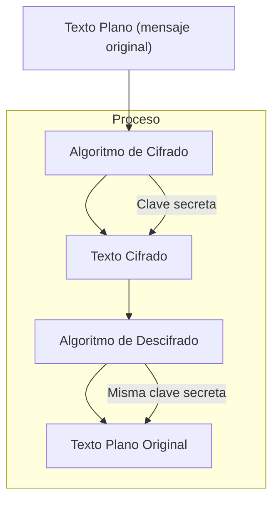
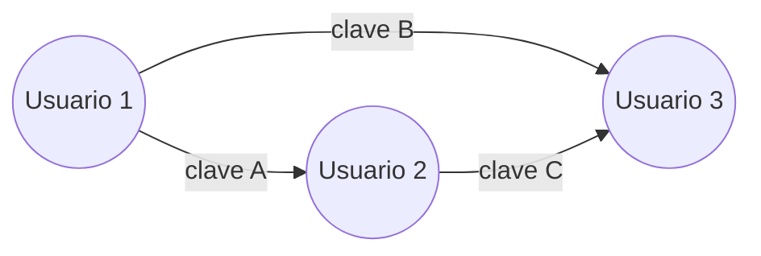

# 🔐 Cifrado Simétrico

> El **cifrado simétrico** es un método de cifrado en el cual **la misma clave** se usa tanto para cifrar como para descifrar la información.

---

## 🧠 Fundamento clave

El remitente y el receptor **comparten previamente una clave secreta**, que debe mantenerse confidencial. Esta clave se usa para **transformar el mensaje original (texto plano) en texto cifrado**, y viceversa.

---

## 🔁 ¿Cómo funciona?

---

## 🧪 Ejemplo práctico

Supongamos que queremos enviar el mensaje:  
📝 `HOLA MUNDO`  
Y que ambos (emisor y receptor) tienen la clave secreta: 🔑 `clave123`.

El algoritmo toma ese mensaje y lo transforma en algo ilegible como:  
🔐 `XZ20DK3N...`  
El receptor, con la **misma clave**, puede descifrarlo y recuperar `HOLA MUNDO`.

---

## 🛠️ Algoritmos populares

|Algoritmo|Tipo|Comentario breve|
|---|---|---|
|AES|Bloques|Muy seguro, estándar actual.|
|DES|Bloques|Obsoleto por ser inseguro.|
|3DES|Bloques|Mejor que DES, pero lento.|
|RC4|Flujo|Rápido, pero inseguro en muchas apps.|

---

## ✅ Ventajas

- Muy rápido y eficiente, ideal para grandes volúmenes de datos.
    
- Implementación más simple que la asimétrica.
    

## ❌ Desventajas

- **Distribución de clave**: hay que compartir la clave de forma segura.
    
- **No escala bien**: si hay muchos usuarios, cada par necesita una clave diferente.
    

---

## 📐 Escalabilidad del problema

> 🔴 A medida que aumentan los usuarios, también crece la cantidad de claves necesarias.

---

## 🎯 Casos de uso típicos

- Encriptación de discos y archivos (Ej: BitLocker, VeraCrypt)
    
- VPNs (a veces usan cifrado simétrico por rendimiento)
    
- Cifrado de bases de datos
    

---

[[criptografia_seguridad en redes]]