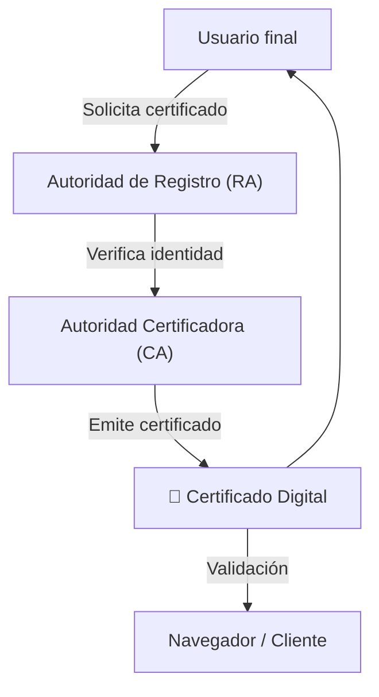
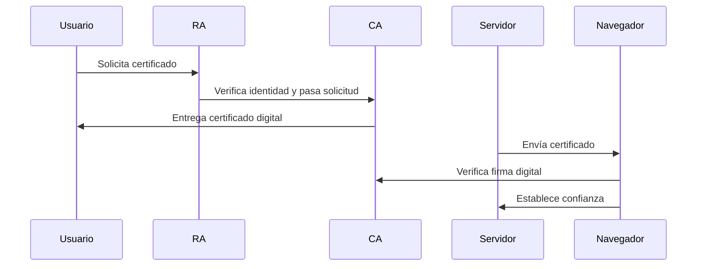

# 🏛️ Infraestructura de Clave Pública (PKI)

> La **PKI (Public Key Infrastructure)** es el **sistema de confianza** que permite usar el **cifrado asimétrico de forma segura a gran escala**, como en internet.

---

## 🧠 ¿Por qué se necesita?

Porque aunque el cifrado asimétrico es seguro, **¿cómo sabés que la clave pública que te mandaron es realmente del destinatario y no de un atacante?**

➡️ La PKI responde a eso con **certificados digitales** y **autoridades de confianza**.

---

## 🧩 Componentes clave de la PKI



---

### 🧾 Certificado digital

Es como un DNI digital para una clave pública. Contiene:

- Nombre del titular (ej: `www.banco.com`)
    
- Su clave pública
    
- Firma de la CA
    
- Fechas de validez
    
- Número de serie único
    

Se representa así:

```
-----BEGIN CERTIFICATE-----
MIIDqDCCApCgAwIBAgI...
-----END CERTIFICATE-----
```

---

### 👮 Autoridad Certificadora (CA)

Es una entidad confiable (como Let’s Encrypt, DigiCert, etc.) que **firma certificados digitales**, garantizando que la clave pública pertenece a quien dice pertenecer.

---

### 🏛️ ¿Y cómo confían los navegadores?

Todos los navegadores y sistemas operativos tienen una **lista de CAs confiables preinstalada**.

Cuando visitás una web con HTTPS:

1. El navegador recibe su certificado digital.
    
2. Verifica si fue **firmado por una CA confiable**.
    
3. Si todo es válido, muestra el 🔒.
    

---

## 🔄 Proceso resumido



---

## ✅ Ventajas de la PKI

- Escalabilidad masiva (internet entera).
    
- Confianza automática mediante CAs.
    
- Gestión del ciclo de vida de claves (expiración, revocación, renovación).
    

---

## ❌ Debilidades

- Si una CA es comprometida, puede emitir certificados falsos.
    
- Usuarios a veces ignoran advertencias de certificados vencidos o inseguros.
    

---
[[criptografia_seguridad en redes]]