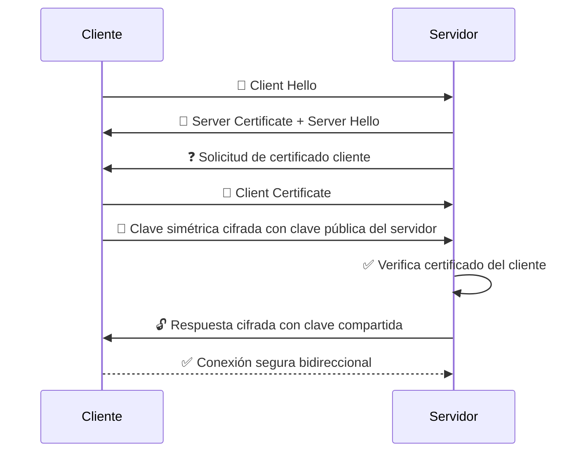
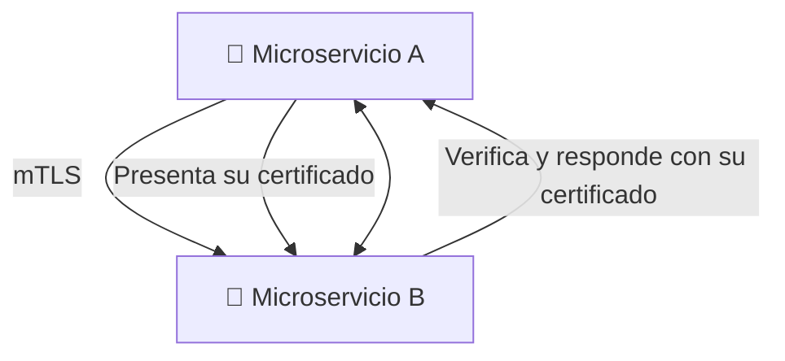

# 🤝 Mutual TLS (mTLS)

> Es una variante del protocolo TLS en la que **tanto el cliente como el servidor se autentican mutuamente** usando certificados digitales.

---

## 🔐 ¿Qué cambia respecto a TLS normal?

- En **TLS común**, solo el **servidor** muestra un certificado.
    
- En **mTLS**, **ambos lados** presentan certificados y los verifican.
    

---

## 🎯 ¿Para qué se usa?

- Comunicación segura entre **microservicios**
    
- APIs con clientes de confianza
    
- Redes privadas y entornos corporativos
    
- Autenticación fuerte de clientes (en lugar de usuario y contraseña)
    

---

## 🔄 Handshake mTLS paso a paso

---

## 📜 ¿Qué debe tener cada parte?

|Parte|Necesita|
|---|---|
|Cliente|Su propio certificado digital y clave privada|
|Servidor|Su certificado y configuración para pedir/verificar certificados de clientes|

---

## 🔐 Seguridad reforzada

Con mTLS:

- Nadie sin un certificado válido puede conectarse.
    
- La identidad del cliente es verificada criptográficamente.
    
- Se evita el uso de contraseñas o tokens vulnerables.
    

---

## 🧪 Caso de uso típico: microservicios

---

## 🛠️ Implementación

- Se necesita una **PKI interna o corporativa** para emitir los certificados.
    
- En servidores como Nginx o Apache, se configura `ssl_verify_client on`.
    
- En sistemas con Kubernetes, mTLS puede implementarse con Istio o Linkerd.
    

---

## ❌ Desafíos

- Gestión de certificados (emisión, renovación, revocación)
    
- Soporte del cliente (no todos los navegadores lo manejan fácilmente)
    
- Requiere buena configuración en ambos extremos
    

---
[[criptografia_seguridad en redes]] [[SSL-TLS]]
[[protocolos]]