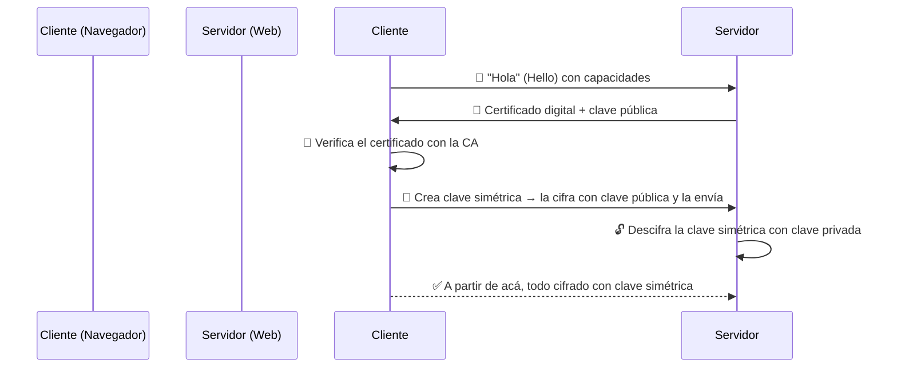
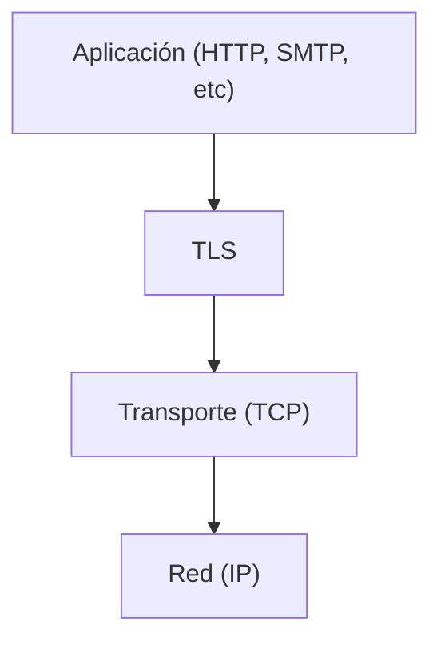

# 🌐 SSL/TLS

> SSL/TLS es el protocolo que **protege las comunicaciones en internet**, usando los conceptos que ya vimos: cifrado simétrico, asimétrico y PKI.

> Hoy en día usamos **TLS** (Transport Layer Security), ya que SSL está obsoleto. Pero el nombre “SSL” sigue usándose por costumbre.

---

## 🎯 ¿Qué problema resuelve?

Cuando entrás a un sitio con `https://` (como un banco), querés asegurarte de:

1. ✅ **Confidencialidad** – Nadie más pueda leer lo que enviás.
    
2. ✅ **Integridad** – Nadie modificó los datos en tránsito.
    
3. ✅ **Autenticidad** – Estás hablando con el sitio real, no un impostor.
    

---

## 🔐 ¿Cómo lo logra?

Usando una combinación de:

- 🔓 Cifrado **asimétrico**: para intercambiar claves con seguridad.
    
- 🔒 Cifrado **simétrico**: para cifrar todo lo demás (más rápido).
    
- 📜 Certificados digitales: para verificar la identidad del servidor.
    

---

## 🔄 Proceso resumido de conexión TLS (TLS Handshake)

---

## 🛠️ Fases del Handshake TLS

|Fase|¿Qué pasa?|
|---|---|
|`Client Hello`|Cliente envía lista de algoritmos y un número aleatorio.|
|`Server Hello`|El servidor responde con sus algoritmos elegidos y su certificado.|
|`Key Exchange`|Cliente genera una clave simétrica, la cifra con la clave pública del servidor.|
|`Session Established`|Ambas partes tienen la misma clave simétrica y la usan para cifrar datos.|

---

## 🔎 ¿Qué cifra TLS?

Después del handshake:

- Todo lo que intercambian cliente y servidor se cifra con la clave **simétrica** generada.
    
- Se usa MAC o AEAD para garantizar la **integridad**.
    

---

## 🧠 ¿Por qué usar los dos tipos de cifrado?

- ⚡ Simétrico: rápido → ideal para el tráfico general.
    
- 🔐 Asimétrico: seguro para intercambio de claves → usado al principio.
    

---

## 🧪 Ejemplo real

Cuando vas a `https://banco.com`, el navegador:

1. Recibe el certificado del servidor (`CN=banco.com`)
    
2. Verifica que esté firmado por una CA confiable (ej: Let's Encrypt)
    
3. Establece la conexión segura cifrada 🔒
    

---

## 🔧 TLS en acción (niveles de protocolo)

---

## ❌ Errores comunes

- ❗ Certificados vencidos o mal configurados.
    
- ❗ Usar TLS antiguo (como TLS 1.0 o 1.1)
    
- ❗ Usar algoritmos inseguros (como RC4 o MD5)
    

---

[[protocolos]]
[[criptografia_seguridad en redes]]