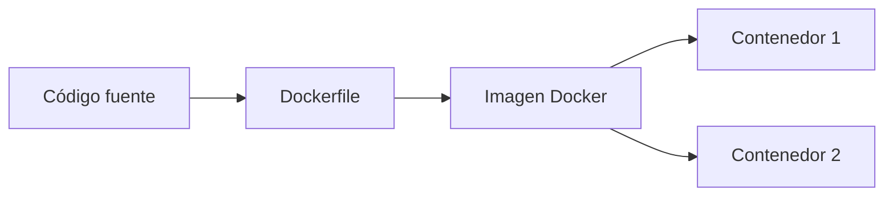

---

---
# 🐳 Docker

> Docker es una **plataforma para desarrollar, ejecutar y desplegar aplicaciones** usando contenedores. Permite que el software se ejecute **siempre igual**, sin importar dónde se instale.

---

## 🧠 ¿Qué es un contenedor?

Un **contenedor** es como una **"caja liviana"** que incluye:
- Tu aplicación
- Sus dependencias (librerías, binarios, configuraciones)
- Pero **sin un sistema operativo completo**

🔒 Aislado del resto del sistema, pero **mucho más liviano** que una máquina virtual.

---

## 🚀 ¿Para qué sirve Docker?

- 🧪 **Probar** software en cualquier máquina sin conflictos
- 📦 **Empaquetar** una aplicación con todo lo necesario
- 🚢 **Desplegar** fácilmente en servidores o en la nube
- 🔁 **Reproducir entornos**: mismo código, misma configuración, mismos resultados

---

## ⚙️ ¿Cómo funciona?

1. Creás un **Dockerfile** que describe tu app (qué base usa, cómo se instala, cómo se ejecuta).
2. Lo **construís** en una imagen (`docker build`).
3. Ejecutás esa imagen como un **contenedor** (`docker run`).

> Cada contenedor se comporta como si fuera una mini-computadora aislada.

---

## 🪄 Ventajas

- ⚡ **Rápido y ligero**
- 🔄 **Consistencia** entre desarrollo y producción
- 🧹 **Evita el "funciona en mi máquina"**
- 🌍 Muy usado en **DevOps**, **CI/CD** y **microservicios**

---

## 💡 Ejemplo básico

```bash
docker run hello-world
````

🧪 Probará que Docker funciona correctamente ejecutando un contenedor de prueba.

---

## 🧭 Visual




> 🧵 **En resumen**: Docker hace que tus apps sean **portables, consistentes y fáciles de desplegar**, todo gracias al poder de los contenedores.


---

[[Indice]]