---

---
# 🐳 Docker: Plataforma de Contenedores

> [!info] Herramienta fundamental
> **Docker** es una plataforma de código abierto que permite automatizar el despliegue de aplicaciones dentro de contenedores, proporcionando una capa adicional de abstracción y automatización de virtualización a nivel de sistema operativo.

---

## 📋 Tabla de Contenidos
- [Introducción](#introducción)
- [Arquitectura de Docker](#arquitectura-de-docker)
- [Instalación](#instalación)
- [Comandos Básicos](#comandos-básicos)
- [Gestión de Imágenes](#gestión-de-imágenes)
- [Gestión de Contenedores](#gestión-de-contenedores)
- [Redes en Docker](#redes-en-docker)
- [Volúmenes y Persistencia](#volúmenes-y-persistencia)
- [Ejemplos Prácticos](#ejemplos-prácticos)
- [Aspectos de Seguridad](#aspectos-de-seguridad)
- [Tips y Buenas Prácticas](#tips-y-buenas-prácticas)

---

## 📝 Introducción

### ¿Qué es Docker?

Docker es una plataforma que utiliza virtualización a nivel de sistema operativo para entregar software en paquetes llamados contenedores. Los contenedores están aislados entre sí y del sistema host, pero comparten el kernel del sistema operativo y, cuando es posible, las bibliotecas y recursos del sistema.

### ¿Para qué sirve?

- **Estandarización**: Elimina las diferencias entre entornos ("funciona en mi máquina")
- **Aislamiento**: Ejecuta aplicaciones en entornos aislados
- **Portabilidad**: Garantiza que el software funcione igual independientemente del entorno
- **Eficiencia**: Consume menos recursos que las máquinas virtuales tradicionales
- **Escalabilidad**: Facilita la implementación y escalado de aplicaciones
- **Facilidad de uso**: Simplifica la configuración y despliegue de aplicaciones

### Contextos de uso en ciberseguridad

```mermaid
graph TD
    A[Docker en Ciberseguridad] --> B[Laboratorios de Prueba]
    A --> C[Entornos Vulnerables]
    A --> D[Herramientas de Hacking]
    A --> E[Análisis de Malware]
    A --> F[Vector de Ataque]
    
    B --> B1[Entornos aislados y desechables]
    B --> B2[Replicación de arquitecturas]
    
    C --> C1[DVWA, Juice Shop, VulnHub]
    C --> C2[CTF y competiciones]
    
    D --> D1[Kali, Parrot en contenedores]
    D --> D2[Herramientas específicas empaquetadas]
    
    E --> E1[Sandboxing seguro]
    E --> E2[Análisis dinámico]
    
    F --> F1[Escape de contenedores]
    F --> F2[Configuraciones inseguras]
```



---

## 🏗️ Arquitectura de Docker

### Componentes principales


- **Docker Daemon (dockerd)**: Servicio en segundo plano que administra los contenedores
- **Docker Client (docker)**: Interfaz de línea de comandos para interactuar con Docker
- **Docker Registry**: Repositorio que almacena imágenes Docker (Docker Hub es el registro público por defecto)
- **Imágenes**: Plantillas de solo lectura para crear contenedores
- **Contenedores**: Instancias en ejecución de imágenes
- **Dockerfile**: Archivo de texto con instrucciones para construir una imagen

---

## 💾 Instalación

### Linux (Ubuntu/Debian)

```bash
# Actualizar paquetes
sudo apt-get update

# Instalar dependencias
sudo apt-get install apt-transport-https ca-certificates curl software-properties-common

# Añadir clave GPG oficial de Docker
curl -fsSL https://download.docker.com/linux/ubuntu/gpg | sudo apt-key add -

# Añadir repositorio de Docker
sudo add-apt-repository "deb [arch=amd64] https://download.docker.com/linux/ubuntu $(lsb_release -cs) stable"

# Actualizar paquetes e instalar Docker
sudo apt-get update
sudo apt-get install docker-ce

# Verificar instalación
sudo docker run hello-world
```

### Configuración post-instalación

```bash
# Añadir usuario al grupo docker (evita usar sudo)
sudo usermod -aG docker $USER

# Aplicar cambios de grupo (requiere reiniciar sesión)
newgrp docker

# Configurar Docker para iniciar al arranque
sudo systemctl enable docker
```

---

## 🖥️ Comandos Básicos

### Sintaxis general

```bash
docker [OPTIONS] COMMAND [ARG...]
```

### Verificación e información

```bash
# Verificar versión de Docker
docker --version
docker version

# Información detallada del sistema Docker
docker info

# Mostrar ayuda
docker help
docker COMANDO --help
```

### Estado del sistema

```bash
# Listar contenedores en ejecución
docker ps

# Listar todos los contenedores (incluyendo detenidos)
docker ps -a

# Listar imágenes
docker images

# Listar volúmenes
docker volume ls

# Listar redes
docker network ls
```

---

## 🖼️ Gestión de Imágenes

### Búsqueda y descarga

```bash
# Buscar imágenes en Docker Hub
docker search ubuntu

# Descargar (pull) una imagen
docker pull ubuntu:20.04
docker pull kalilinux/kali-rolling

# Mostrar imágenes descargadas
docker images
```

### Principales opciones para comandos de imágenes

| Comando | Descripción | Ejemplo |
|---------|-------------|---------|
| `search` | Buscar imágenes en Docker Hub | `docker search nginx` |
| `pull` | Descargar una imagen | `docker pull ubuntu:20.04` |
| `push` | Subir una imagen a un registro | `docker push username/imagen` |
| `images` | Listar imágenes disponibles | `docker images` |
| `rmi` | Eliminar una imagen | `docker rmi imagen_id` |
| `build` | Construir una imagen desde un Dockerfile | `docker build -t nombre:tag .` |
| `tag` | Etiquetar una imagen | `docker tag imagen:v1 imagen:latest` |
| `save` | Guardar imagen en archivo tar | `docker save -o imagen.tar imagen` |
| `load` | Cargar imagen desde archivo tar | `docker load -i imagen.tar` |
| `history` | Ver historial de capas de una imagen | `docker history imagen` |
| `inspect` | Ver detalles de una imagen | `docker inspect imagen` |

### Creación de imágenes con Dockerfile

```dockerfile
# Dockerfile básico para entorno de pentesting
FROM kalilinux/kali-rolling

# Metadatos
LABEL maintainer="pentester@example.com"
LABEL version="1.0"
LABEL description="Entorno de pentesting básico"

# Actualizar e instalar herramientas
RUN apt-get update && apt-get install -y \
    nmap \
    gobuster \
    hydra \
    sqlmap \
    metasploit-framework \
    && rm -rf /var/lib/apt/lists/*

# Directorio de trabajo
WORKDIR /pentest

# Comando por defecto al iniciar
CMD ["/bin/bash"]
```

```bash
# Construir la imagen desde el Dockerfile
docker build -t mi-kali-pentest:1.0 .
```

### Limpieza de imágenes

```bash
# Eliminar una imagen específica
docker rmi imagen_id

# Eliminar imágenes sin etiquetar (dangling)
docker image prune

# Eliminar todas las imágenes no utilizadas
docker image prune -a

# Eliminar imágenes con fuerza
docker rmi -f imagen_id
```

---

## 🚢 Gestión de Contenedores

### Creación y ejecución

```bash
# Crear y ejecutar un contenedor
docker run ubuntu:20.04

# Crear contenedor interactivo con terminal
docker run -it ubuntu:20.04 bash

# Crear contenedor con nombre específico
docker run --name mi-ubuntu -it ubuntu:20.04 bash

# Ejecutar en segundo plano (modo daemon)
docker run -d nginx

# Ejecutar exponiendo puertos (host:contenedor)
docker run -p 8080:80 nginx

# Montar volumen (host:contenedor)
docker run -v /ruta/local:/ruta/contenedor ubuntu
```

### Ciclo de vida

```bash
# Detener un contenedor
docker stop contenedor_id

# Iniciar un contenedor detenido
docker start contenedor_id

# Reiniciar un contenedor
docker restart contenedor_id

# Pausar un contenedor
docker pause contenedor_id

# Reanudar un contenedor pausado
docker unpause contenedor_id

# Eliminar un contenedor
docker rm contenedor_id

# Eliminar un contenedor en ejecución (forzado)
docker rm -f contenedor_id
```

### Interacción con contenedores

```bash
# Ejecutar comando en un contenedor en ejecución
docker exec -it contenedor_id bash

# Ver logs de un contenedor
docker logs contenedor_id

# Ver logs continuamente (follow)
docker logs -f contenedor_id

# Información detallada del contenedor
docker inspect contenedor_id

# Ver estadísticas de uso de recursos
docker stats contenedor_id

# Copiar archivos desde/hacia un contenedor
docker cp archivo.txt contenedor_id:/ruta/
docker cp contenedor_id:/ruta/archivo.txt ./local/
```

### Principales opciones para comandos de contenedores

| Opción | Descripción | Ejemplo |
|--------|-------------|---------|
| `-i`, `--interactive` | Modo interactivo | `docker run -i ubuntu` |
| `-t`, `--tty` | Asignar terminal | `docker run -t ubuntu` |
| `-d`, `--detach` | Ejecutar en segundo plano | `docker run -d nginx` |
| `-p`, `--publish` | Mapear puertos (host:contenedor) | `docker run -p 8080:80 nginx` |
| `-v`, `--volume` | Montar volumen | `docker run -v /local:/container ubuntu` |
| `--name` | Asignar nombre al contenedor | `docker run --name webserver nginx` |
| `--rm` | Eliminar al salir | `docker run --rm ubuntu echo "test"` |
| `-e`, `--env` | Definir variable de entorno | `docker run -e DB_HOST=mysql app` |
| `--network` | Conectar a red específica | `docker run --network mi-red nginx` |
| `--privileged` | Modo privilegiado (¡peligroso!) | `docker run --privileged kali` |
| `--user` | Especificar usuario | `docker run --user 1000 ubuntu` |
| `--cap-add` | Añadir capacidad Linux | `docker run --cap-add NET_ADMIN kali` |
| `--cap-drop` | Quitar capacidad Linux | `docker run --cap-drop ALL ubuntu` |

---

## 🌐 Redes en Docker

### Tipos de redes predefinidas

| Red | Descripción | Casos de uso |
|-----|-------------|-------------|
| `bridge` | Red privada interna (predeterminada) | Comunicación entre contenedores en mismo host |
| `host` | Usa directamente la red del host | Rendimiento máximo, sin aislamiento de red |
| `none` | Sin acceso a red | Máximo aislamiento, contenedores que no requieren red |

### Gestión de redes

```bash
# Listar redes
docker network ls

# Crear una red personalizada
docker network create mi-red

# Crear red con configuración específica
docker network create --subnet=172.18.0.0/16 mi-red

# Conectar un contenedor a una red
docker network connect mi-red contenedor_id

# Desconectar un contenedor de una red
docker network disconnect mi-red contenedor_id

# Inspeccionar una red
docker network inspect mi-red

# Eliminar una red
docker network rm mi-red

# Eliminar redes no utilizadas
docker network prune
```

### Crear contenedores en una red específica

```bash
# Crear contenedor en red específica
docker run --network mi-red -it ubuntu bash

# Crear contenedor con IP estática
docker run --network mi-red --ip 172.18.0.10 -it ubuntu bash
```

---

## 📦 Volúmenes y Persistencia

### Tipos de almacenamiento

1. **Volúmenes**: Gestionados por Docker, independientes del ciclo de vida del contenedor
2. **Bind mounts**: Directorio del host montado en el contenedor
3. **tmpfs mounts**: Almacenamiento en memoria (RAM)

### Gestión de volúmenes

```bash
# Listar volúmenes
docker volume ls

# Crear volumen
docker volume create mi-volumen

# Inspeccionar volumen
docker volume inspect mi-volumen

# Eliminar volumen
docker volume rm mi-volumen

# Eliminar volúmenes sin usar
docker volume prune
```

### Uso de volúmenes con contenedores

```bash
# Contenedor con volumen Docker
docker run -v mi-volumen:/datos -it ubuntu bash

# Contenedor con bind mount (directorio del host)
docker run -v /ruta/local:/datos -it ubuntu bash

# Contenedor con montaje de solo lectura
docker run -v /ruta/local:/datos:ro -it ubuntu bash

# Contenedor con almacenamiento tmpfs
docker run --tmpfs /datos -it ubuntu bash
```

---

## 💻 Ejemplos Prácticos

### Ejemplo 1: Laboratorio de pentesting con Kali Linux

```bash
# Crear red para el laboratorio
docker network create pentest-lab

# Crear volumen persistente para resultados
docker volume create pentest-data

# Ejecutar Kali Linux con herramientas de pentesting
docker run --name kali-pentest \
    -v pentest-data:/root/results \
    --network pentest-lab \
    -p 8022:22 \
    --cap-add NET_ADMIN \
    -it kalilinux/kali-rolling bash

# Desde dentro del contenedor, actualizar e instalar herramientas
apt update && apt -y install nmap metasploit-framework hydra sqlmap
```

> [!info] Explicación
> Este ejemplo crea un entorno de pentesting con Kali Linux:
> 1. Crea una red dedicada `pentest-lab` para aislar el tráfico
> 2. Establece un volumen `pentest-data` para guardar resultados de manera persistente
> 3. Ejecuta un contenedor Kali con:
>    - Mapeo del puerto SSH (22) al 8022 del host
>    - Capacidades de red avanzadas (`NET_ADMIN`)
>    - Terminal interactiva
> 4. Instala herramientas comunes de pentesting
>
> Puedes acceder a los datos guardados entre sesiones gracias al volumen persistente.

### Ejemplo 2: Despliegue de aplicación vulnerable para pruebas

```bash
# Crear red para el entorno de pruebas
docker network create --subnet=172.20.0.0/16 vuln-net

# Desplegar base de datos MySQL
docker run --name mysql-db \
    --network vuln-net \
    --ip 172.20.0.10 \
    -e MYSQL_ROOT_PASSWORD=insecure_password \
    -e MYSQL_DATABASE=dvwa \
    -d mysql:5.7

# Desplegar DVWA (Damn Vulnerable Web Application)
docker run --name dvwa \
    --network vuln-net \
    --ip 172.20.0.20 \
    -p 8080:80 \
    -e MYSQL_USER=root \
    -e MYSQL_PASSWORD=insecure_password \
    -e MYSQL_DBNAME=dvwa \
    -e MYSQL_HOST=mysql-db \
    -d vulnerables/web-dvwa
```

> [!info] Explicación
> Este ejemplo crea un entorno de laboratorio con una aplicación web vulnerable:
> 1. Configura una red aislada con un rango IP específico
> 2. Despliega un contenedor MySQL con:
>    - IP estática para fácil referencia
>    - Base de datos pre-configurada para DVWA
>    - Contraseña insegura (solo para pruebas)
> 3. Despliega DVWA (aplicación web intencionalmente vulnerable) con:
>    - Conexión a la base de datos MySQL
>    - Puerto web expuesto en 8080
>
> La aplicación estará disponible en http://localhost:8080 para realizar pruebas de penetración.

### Ejemplo 3: Análisis forense de un archivo sospechoso

```bash
# Crear volumen para evidencias
docker volume create evidencias-forense

# Montar archivo sospechoso en contenedor aislado
docker run --name analisis-forense \
    -v evidencias-forense:/evidencias \
    -v /ruta/al/archivo/sospechoso.exe:/muestra/sospechoso.exe:ro \
    --network none \
    -it ubuntu:20.04 bash

# Dentro del contenedor, instalar herramientas y analizar
apt-get update
apt-get install -y file hexdump strings
file /muestra/sospechoso.exe
strings /muestra/sospechoso.exe | grep -i "http"
hexdump -C /muestra/sospechoso.exe | head -50
```

> [!info] Explicación
> Este ejemplo muestra cómo analizar un archivo potencialmente malicioso de forma segura:
> 1. Crea un volumen para almacenar evidencias y resultados
> 2. Monta el archivo sospechoso en modo solo lectura (`:ro`) para preservar la integridad
> 3. Desconecta completamente el contenedor de la red (`--network none`) para evitar conexiones maliciosas
> 4. Proporciona un entorno interactivo para análisis manual
> 5. Instala herramientas básicas de análisis forense
> 6. Realiza análisis inicial del archivo:
>    - Identifica el tipo de archivo
>    - Busca URLs y conexiones potenciales
>    - Examina los primeros bytes en hexadecimal
>
> Esta técnica permite analizar archivos peligrosos sin exponer el sistema host.

---

## 🔒 Aspectos de Seguridad

### Vectores de ataque comunes

```mermaid
graph TD
    A[Vectores de Ataque en Docker] --> B[Escape de Contenedor]
    A --> C[Configuración Insegura]
    A --> D[Imágenes Maliciosas]
    A --> E[Secretos Expuestos]
    
    B --> B1[Contenedores privilegiados]
    B --> B2[Montaje de socket Docker]
    B --> B3[Capabilities peligrosas]
    
    C --> C1[API de Docker sin protección]
    C --> C2[Contenedores como root]
    C --> C3[Recursos sin límites]
    
    D --> D1[Malware en imágenes públicas]
    D --> D2[Backdoors en capas ocultas]
    
    E --> E1[Credenciales en variables de entorno]
    E --> E2[Secretos en Dockerfiles]
```



### Evaluación de seguridad

```bash
# Escanear imagen en busca de vulnerabilidades (usando Trivy)
docker run --rm -v /var/run/docker.sock:/var/run/docker.sock aquasec/trivy image ubuntu:20.04

# Verificar si un contenedor está en modo privilegiado
docker inspect --format='{{.HostConfig.Privileged}}' contenedor_id

# Buscar montaje del socket de Docker (peligroso)
docker inspect --format='{{range .Mounts}}{{if eq .Source "/var/run/docker.sock"}}⚠️ RIESGO: Socket Docker montado{{end}}{{end}}' contenedor_id

# Comprobar si contenedor se ejecuta como root (predeterminado)
docker inspect --format='{{.Config.User}}' contenedor_id
```

### Buenas prácticas de seguridad

> [!warning] Consideraciones de seguridad importantes
> - Nunca ejecutar contenedores con `--privileged` a menos que sea absolutamente necesario
> - Evitar montar el socket Docker (`/var/run/docker.sock`) en contenedores
> - No usar la imagen `latest`, preferir versiones específicas y verificadas
> - Escanear imágenes antes de usarlas en producción
> - Limitar recursos (CPU, memoria) para prevenir ataques DoS
> - Ejecutar contenedores como usuario no root cuando sea posible

```bash
# Ejecutar contenedor con usuario no root
docker run --user 1000:1000 -it ubuntu bash

# Limitar recursos
docker run --memory=256m --cpus=0.5 -it ubuntu bash

# Eliminar todas las capabilities y añadir solo las necesarias
docker run --cap-drop=ALL --cap-add=NET_BIND_SERVICE nginx

# Montar sistema de archivos como solo lectura
docker run --read-only -it ubuntu bash
```

---

## 💡 Tips y Buenas Prácticas

### Optimización y mantenimiento

```bash
# Ver espacio usado por Docker
docker system df

# Limpiar recursos no utilizados
docker system prune

# Limpiar todo (incluyendo volúmenes)
docker system prune -a --volumes

# Monitorear contenedores
docker stats

# Limitar logs para evitar llenar el disco
docker run --log-driver=json-file --log-opt max-size=10m --log-opt max-file=3 nginx
```

### Dockerfile eficiente

```dockerfile
# ❌ Mal ejemplo (muchas capas, archivos temporales)
FROM ubuntu:20.04
RUN apt-get update
RUN apt-get install -y python3
RUN apt-get install -y python3-pip
RUN pip install requests
COPY . /app
CMD ["python3", "/app/script.py"]

# ✅ Buen ejemplo (capas optimizadas, limpieza)
FROM python:3.9-slim
WORKDIR /app
COPY requirements.txt .
RUN pip install --no-cache-dir -r requirements.txt
COPY . .
USER nobody
CMD ["python3", "script.py"]
```

### Problemas comunes y soluciones

| Problema | Posible causa | Solución |
|----------|---------------|----------|
| `Cannot connect to the Docker daemon` | Servicio no iniciado o permisos | `sudo systemctl start docker` o añadir usuario a grupo docker |
| `port is already allocated` | Puerto ya en uso | Usar otro puerto o liberar el puerto ocupado |
| `no space left on device` | Disco lleno | Ejecutar `docker system prune` |
| Contenedor se detiene inmediatamente | No hay proceso en primer plano | Usar CMD apropiado o iniciar en modo interactivo |
| Rendimiento lento | Demasiados contenedores o recursos limitados | Limitar contenedores, aumentar recursos asignados |
| `pull access denied` | Imagen privada o no existe | Verificar nombre/etiqueta o autenticarse con `docker login` |

### Consejos para entornos de pentesting

> [!tip] Optimización para seguridad
> - Mantén imágenes pequeñas y actualizadas (Alpine o slim)
> - Usa volúmenes para persistir datos entre sesiones
> - Crea una red dedicada para cada prueba/cliente
> - Automatiza la creación de laboratorios con Docker Compose
> - Documenta tus configuraciones para futura referencia
> - Etiqueta claramente las imágenes por proyecto o cliente

```bash
# Crear alias útiles para pentesting
echo 'alias kali-docker="docker run --rm -it --network host -v $(pwd):/data kalilinux/kali-rolling bash"' >> ~/.bashrc

# Script para limpiar después de un proyecto
cat > cleanup.sh << 'EOF'
#!/bin/bash
PROJECT=$1
docker rm -f $(docker ps -a --filter name=$PROJECT -q)
docker volume rm $(docker volume ls --filter name=$PROJECT -q)
docker network rm $(docker network ls --filter name=$PROJECT -q)
EOF
chmod +x cleanup.sh
```

---

## 📊 Escenarios de uso comunes en ciberseguridad

| Escenario | Comando Docker |
|-----------|----------------|
| Entorno Kali rápido | `docker run --rm -it kalilinux/kali-rolling` |
| Servidor web vulnerable | `docker run -d -p 8080:80 vulnerables/web-dvwa` |
| Laboratorio de exploits | `docker run --rm -it -v $(pwd):/root/exploits metasploitframework/metasploit-framework` |
| Análisis de red | `docker run --rm --net=host instrumentisto/nmap -sS -sV 192.168.1.0/24` |
| CTF persistente | `docker run -d -v ctf-data:/root --name my-ctf -it ubuntu:20.04` |
| Cracking de contraseñas | `docker run --rm -it -v $(pwd):/hashcat hashcat/hashcat -m 0 -a 0 hashes.txt wordlist.txt` |

> [!success] Ventajas de Docker en ciberseguridad
> - **Aislamiento**: Separa herramientas y pruebas del sistema principal
> - **Reproducibilidad**: Garantiza entornos consistentes para pruebas
> - **Portabilidad**: Lleva tus herramientas a cualquier sistema con Docker
> - **Desechabilidad**: Crea y destruye entornos rápidamente sin residuos
> - **Escalabilidad**: Ejecuta múltiples instancias para pruebas paralelas
> - **Documentación**: Dockerfile y Compose como documentación ejecutable

---

## 🔍 Recursos adicionales

- [Documentación oficial de Docker](https://docs.docker.com/)
- [Docker Hub](https://hub.docker.com/) - Registro oficial de imágenes
- [Docker Security Cheat Sheet (OWASP)](https://cheatsheetseries.owasp.org/cheatsheets/Docker_Security_Cheat_Sheet.html)
- [CIS Docker Benchmark](https://www.cisecurity.org/benchmark/docker)