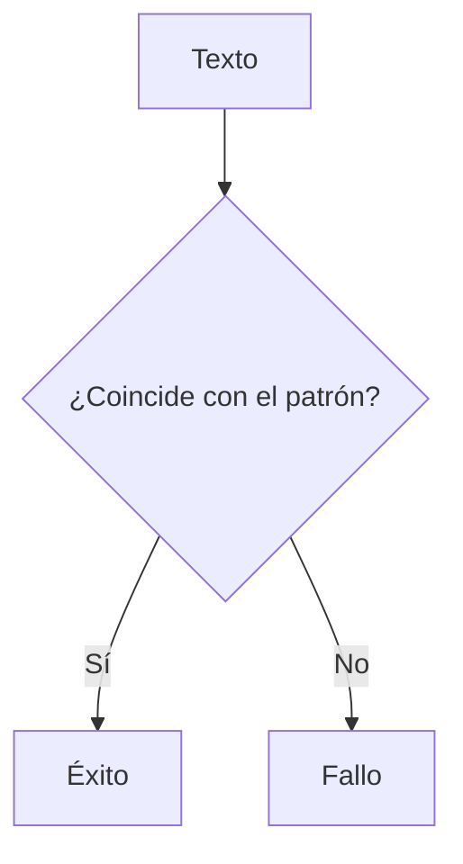

### **¿Qué es Regex?**

Regex es un lenguaje para describir patrones en cadenas de texto. Se usa para buscar, validar o extraer información específica de un texto.

---

### **Simbología Básica**

| Símbolo | Descripción                                                              |                                 |
| ------- | ------------------------------------------------------------------------ | ------------------------------- |
| `.`     | Cualquier carácter (excepto salto de línea).                             |                                 |
| `\d`    | Cualquier dígito (0-9).                                                  |                                 |
| `\w`    | Cualquier carácter alfanumérico (letras, números y guión bajo `_`).      |                                 |
| `\s`    | Cualquier espacio en blanco (espacio, tabulación, salto de línea, etc.). |                                 |
| `^`     | Inicio de una cadena.                                                    |                                 |
| `$`     | Fin de una cadena.                                                       |                                 |
| `[]`    | Define un conjunto de caracteres permitidos.                             |                                 |
| `       | `                                                                        | Operador "OR" (esto o aquello). |
| `()`    | Agrupa expresiones para aplicar cuantificadores o capturar texto.        |                                 |

---

### **Cuantificadores**

| Símbolo | Descripción                                                                 |
|---------|-----------------------------------------------------------------------------|
| `*`     | 0 o más repeticiones del patrón anterior.                                  |
| `+`     | 1 o más repeticiones del patrón anterior.                                  |
| `?`     | 0 o 1 repetición del patrón anterior (hace que el patrón sea opcional).    |
| `{n}`   | Exactamente `n` repeticiones del patrón anterior.                          |
| `{n,}`  | Al menos `n` repeticiones del patrón anterior.                             |
| `{n,m}` | Entre `n` y `m` repeticiones del patrón anterior.                          |

---

### **Uso del Signo `?`**

El signo `?` tiene dos usos principales en regex:

1. **Cuantificador**:  
   Hace que el patrón anterior sea **opcional** (0 o 1 repetición).  
   - Ejemplo: `colou?r` coincide con `color` y `colour`.

2. **Modificador**:  
   Cambia el comportamiento de los cuantificadores `*`, `+` y `?` para que sean **no greedy** (no codiciosos).  
   - Ejemplo: `<.*?>` coincide con la etiqueta más corta posible en `<div><p></p></div>`.

---

### **Ejemplos Prácticos**

1. **Validar un número de teléfono**:  
   ```regex
   ^\d{3}-\d{3}-\d{4}$
   ```
   - Coincide con: `123-456-7890`.

2. **Buscar una palabra opcional**:  
   ```regex
   Hola( Mundo)?!
   ```
   - Coincide con: `Hola!` y `Hola Mundo!`.

3. **Extraer un nombre de dominio**:  
   ```regex
   https?://(www\.)?([\w-]+)\.\w+
   ```
   - Coincide con: `http://google.com` y `https://www.ejemplo.com`.

---

### **Cómo Aprender Regex**

4. **Práctica**: Usa herramientas como [regex101.com](https://regex101.com) para probar tus expresiones.
5. **Divide y vencerás**: Aprende los símbolos y cuantificadores uno por uno.
6. **Ejemplos**: Analiza ejemplos comunes (emails, URLs, etc.) para entender cómo se construyen.

---

### **Resumen**

- **Regex**: Es un lenguaje para describir patrones en texto.
- **`?`**: Hace que un patrón sea opcional o cambia un cuantificador a no greedy.
- **Uso común**: Validar datos, buscar texto y extraer información.

---

### **Diagrama de Regex**



---

### **Consejo Final**

Practica con ejemplos reales y usa herramientas interactivas para dominar regex. ¡Es una habilidad que te será útil en programación, análisis de datos y más!

[[glosario]]