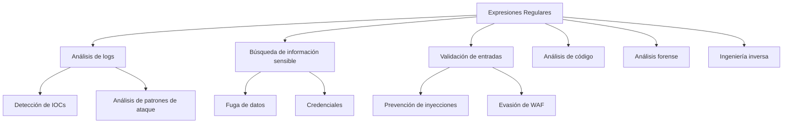
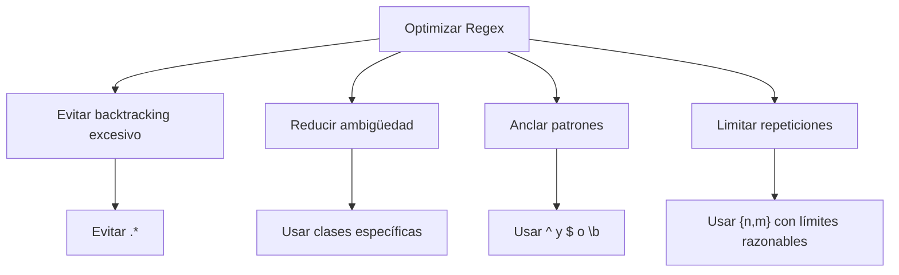

# 🔍 Expresiones Regulares (Regex) en Ciberseguridad

> [!quote] Definición
> Las **expresiones regulares** (regex) son secuencias de caracteres que forman un patrón de búsqueda. Actúan como un lenguaje específico para describir y encontrar patrones en texto, permitiendo operaciones avanzadas de búsqueda, validación y manipulación de datos.

---

## 📋 Tabla de Contenidos
- [Introducción](#introducción)
- [Sintaxis Básica](#sintaxis-básica)
- [Elementos Fundamentales](#elementos-fundamentales)
- [Casos de Uso en Ciberseguridad](#casos-de-uso-en-ciberseguridad)
- [Ejemplos Prácticos](#ejemplos-prácticos)
- [Tips y Buenas Prácticas](#tips-y-buenas-prácticas)
- [Herramientas y Recursos](#herramientas-y-recursos)

---

## 📝 Introducción

### ¿Qué son las expresiones regulares?

Las expresiones regulares son patrones de búsqueda formados por caracteres que tienen un significado especial. Permiten buscar, validar y manipular texto de manera precisa y flexible.

### ¿Para qué sirven?

- **Búsqueda avanzada**: Encontrar patrones complejos en texto
- **Validación**: Verificar si una cadena cumple con un formato específico
- **Extracción**: Obtener porciones específicas de texto
- **Reemplazo**: Sustituir texto basado en patrones
- **Análisis**: Identificar estructuras en grandes volúmenes de datos

### Contextos de uso en ciberseguridad



---

## 🔤 Sintaxis Básica

### Metacaracteres principales

| Metacarácter | Descripción | Ejemplo |
|--------------|-------------|---------|
| `.` | Cualquier carácter excepto nueva línea | `a.c` → abc, adc, a3c |
| `^` | Inicio de línea | `^hola` → líneas que empiezan con "hola" |
| `$` | Fin de línea | `mundo$` → líneas que terminan con "mundo" |
| `*` | 0 o más repeticiones | `a*b` → b, ab, aab, aaab |
| `+` | 1 o más repeticiones | `a+b` → ab, aab, aaab |
| `?` | 0 o 1 repetición | `a?b` → b, ab |
| `\` | Escapa metacaracteres | `\.` → busca el carácter punto literal |
| `\|` | Alternancia (OR) | `cat\|dog` → "cat" o "dog" |
| `[]` | Clase de caracteres | `[abc]` → a, b o c |
| `[^]` | Negación en clase | `[^abc]` → cualquier carácter excepto a, b, c |
| `()` | Agrupación | `(abc)+` → abc, abcabc, abcabcabc |

> [!note] Implementaciones de regex
> Existen diferentes "sabores" de expresiones regulares (PCRE, BRE, ERE, etc.) con ligeras variaciones en sintaxis. Este apunte se enfoca principalmente en PCRE (Perl Compatible Regular Expressions), que es el más utilizado en herramientas modernas.

---

## 🧩 Elementos Fundamentales

### Clases de caracteres

| Expresión | Significado | Equivalente |
|-----------|-------------|-------------|
| `\d` | Dígito | `[0-9]` |
| `\w` | Carácter de palabra | `[a-zA-Z0-9_]` |
| `\s` | Espacio en blanco | `[ \t\n\r\f\v]` |
| `\D` | No dígito | `[^0-9]` |
| `\W` | No carácter de palabra | `[^a-zA-Z0-9_]` |
| `\S` | No espacio en blanco | `[^ \t\n\r\f\v]` |

### Cuantificadores

| Cuantificador | Significado |
|---------------|-------------|
| `{n}` | Exactamente n veces |
| `{n,}` | Al menos n veces |
| `{n,m}` | Entre n y m veces |
| `*` | 0 o más veces (equivale a `{0,}`) |
| `+` | 1 o más veces (equivale a `{1,}`) |
| `?` | 0 o 1 vez (equivale a `{0,1}`) |

> [!tip] Cuantificadores codiciosos vs. perezosos
> Por defecto, los cuantificadores son **codiciosos** (intentan capturar lo máximo posible). Añade `?` después del cuantificador para hacerlo **perezoso** (captura lo mínimo posible):
> - `.*` (codicioso) vs `.*?` (perezoso)
> - `\d+` (codicioso) vs `\d+?` (perezoso)

### Grupos y capturas

| Expresión | Descripción |
|-----------|-------------|
| `(...)` | Grupo de captura |
| `(?:...)` | Grupo sin captura |
| `(?<name>...)` | Grupo con nombre (PCRE) |
| `\1, \2, ...` | Referencia a grupo capturado |
| `\k<name>` | Referencia a grupo con nombre |

### Aserciones

| Aserción | Descripción |
|----------|-------------|
| `^` | Inicio de línea |
| `$` | Fin de línea |
| `\b` | Límite de palabra |
| `\B` | No límite de palabra |
| `(?=...)` | Lookahead positivo |
| `(?!...)` | Lookahead negativo |
| `(?<=...)` | Lookbehind positivo (longitud fija) |
| `(?<!...)` | Lookbehind negativo (longitud fija) |

---

## 🔐 Casos de Uso en Ciberseguridad

### 1. Búsqueda de información sensible

> [!example] Patrones comunes para datos sensibles
> ```
> # Direcciones IPv4
> \b(?:[0-9]{1,3}\.){3}[0-9]{1,3}\b
> 
> # Direcciones de correo electrónico
> \b[A-Za-z0-9._%+-]+@[A-Za-z0-9.-]+\.[A-Za-z]{2,}\b
> 
> # Tarjetas de crédito (formato simple)
> \b(?:\d{4}[-\s]?){3}\d{4}\b
> 
> # Tokens API/secretos (formato general)
> \b[A-Za-z0-9_\-]{32,45}\b
> 
> # Claves SSH privadas
> -----BEGIN (?:RSA|DSA|EC|OPENSSH) PRIVATE KEY-----
> ```

### 2. Análisis de logs y detección de amenazas

```
# Intentos de SQL Injection
\b(union\s+all\s+select|select\s+.*\s+from|insert\s+into|update\s+.*\s+set|delete\s+from)\b

# Ataques XSS básicos
<script.*?>.*?</script>|javascript:.*?[(]

# Intentos de Command Injection
[;&|`]\s*(?:cat|wget|curl|bash|nc|netcat|python|perl|ruby|php)\b

# Intentos de Path Traversal
(?:\.\./|\.\.\\){2,}
```

### 3. Validación de entradas y WAF evasion

```
# Detección de evasión de WAF (obfuscación básica)
(?i)(?:<\s*s\s*c\s*r\s*i\s*p\s*t|j\s*a\s*v\s*a\s*s\s*c\s*r\s*i\s*p\s*t)

# Detección de codificación URL sospechosa
%(?:2[2367]|3[89]|5[cde]|7[0-9a-f])
```

---

## 💻 Ejemplos Prácticos

### Ejemplo 1: Extracción de IPs desde logs

```bash
# Extraer todas las direcciones IPv4 de un log
grep -E -o "\b([0-9]{1,3}\.){3}[0-9]{1,3}\b" access.log | sort | uniq -c | sort -nr
```

> [!info] Explicación
> - `grep -E -o`: Usar expresiones regulares extendidas y mostrar solo la parte coincidente
> - `\b([0-9]{1,3}\.){3}[0-9]{1,3}\b`: Patrón para IPv4 (con límites de palabra)
> - `sort | uniq -c | sort -nr`: Ordenar, contar ocurrencias únicas y ordenar numéricamente en reversa

**Resultado típico:**
```
132 192.168.1.254
98 10.0.0.1
45 172.16.0.5
```

### Ejemplo 2: Búsqueda de información sensible en código fuente

```bash
# Buscar posibles credenciales en un repositorio
grep -r -E "(password|secret|credential|token|key)s?\s*(=|:)\s*['\"](.*?)['\"]" --include="*.{php,js,py,conf,ini,yaml,xml}" /ruta/proyecto
```

> [!info] Explicación
> - `grep -r -E`: Búsqueda recursiva con regex extendidas
> - El patrón busca palabras clave relacionadas con credenciales seguidas de = o : y texto entre comillas
> - `--include`: Limita la búsqueda a ciertos tipos de archivos

### Ejemplo 3: Análisis forense básico (extracción de correos)

```bash
# Extraer correos electrónicos desde un dump
grep -E -o "\b[A-Za-z0-9._%+-]+@[A-Za-z0-9.-]+\.[A-Za-z]{2,}\b" dump.txt > correos_encontrados.txt

# Filtrar solo dominios corporativos específicos
grep -E "@(empresa1|empresa2|target)\.com" correos_encontrados.txt
```

> [!info] Explicación
> - La primera expresión extrae correos con formato estándar
> - La segunda filtra por dominios específicos usando alternancia

### Ejemplo 4: Depuración de headers HTTP en Burp Suite (Search function)

```regex
^(Cookie|Authorization|X-API-Key):.*$
```

> [!info] Explicación
> Usar este patrón en la función de búsqueda de Burp Suite para encontrar cabeceras HTTP relacionadas con la autenticación:
> - `^`: Asegura que la coincidencia está al inicio de línea
> - `(Cookie|Authorization|X-API-Key)`: Alternancia para encontrar estas cabeceras específicas
> - `:.*$`: Coincide con el contenido de la cabecera hasta el final de línea

---

## 💡 Tips y Buenas Prácticas

### Optimización de rendimiento



> [!warning] Evitar expresiones catastróficas
> Ciertas expresiones pueden causar backtracking exponencial, llevando a ataques DoS:
> - `(a+)+` contra "aaaaaaaaaaaaaaaaaaaaaaaaaX"
> - `([a-z]+)*` contra strings largos
> - Validación de correos demasiado compleja

### Buenas prácticas

1. **Comenzar simple y refinar gradualmente**
   - Construir y probar la expresión por partes
   - Agregar complejidad solo cuando sea necesario

2. **Usar límites y anclajes**
   - `\b`, `^`, `$` para limitar dónde ocurren las coincidencias
   - Evitar coincidencias parciales no deseadas

3. **Documentar expresiones complejas**
   - Usar comentarios (si el motor lo permite): `(?#esto es un comentario)`
   - Descomponer en partes más pequeñas y nombradas

4. **Probar con casos límite**
   - Casos vacíos
   - Entrada muy larga
   - Caracteres especiales y Unicode

> [!tip] Fragmentar expresiones complejas
> En lugar de una regex gigante, considera usar múltiples regex más pequeñas o combinar con procesamiento programático.

### Errores comunes

| Error | Problema | Solución |
|-------|----------|----------|
| Metacaracteres sin escapar | `"How much is $50?"` → `$` es un anclaje | Escapar con `\`: `\$50` |
| Clases de caracteres mal formadas | `[a-Z]` no es lo mismo que `[a-zA-Z]` | Revisar la tabla ASCII, usar clases correctas |
| Cuantificadores mal ubicados | `abc*` coincide con "ab" seguido de 0+ "c" | Usar grupos: `(abc)*` para repetir todo |
| Backtracking excesivo | Patrones como `.*.*` o `(a+)*` | Simplificar patrones, usar cuantificadores no codiciosos |
| Ignorar multilinea/banderas | `/patrón/` vs `/patrón/m` vs `/patrón/s` | Usar modificadores apropiados según el contexto |

---

## 🧰 Herramientas y Recursos

### Herramientas para testear regex

| Herramienta | Tipo | Características |
|-------------|------|-----------------|
| [Regex101](https://regex101.com/) | Online | Explicación detallada, múltiples sabores, debugger visual |
| [RegExr](https://regexr.com/) | Online | Cheat sheet integrada, comunidad de patrones |
| [Debuggex](https://www.debuggex.com/) | Online | Visualización de diagrama de autómata |
| `grep -E` | CLI | Estándar en sistemas Unix/Linux |
| `ripgrep` (rg) | CLI | Alternativa moderna y rápida a grep |
| Python `re` | Librería | Módulo estándar de Python |

### Uso en herramientas de pentesting

| Herramienta | Contexto de uso |
|-------------|-----------------|
| Burp Suite | Función "Search" con regex, reglas de Scanner |
| Wireshark | Filtros de visualización y captura |
| Nmap | Scripts NSE con patrones regex |
| Metasploit | Módulos de post-explotación |
| ZAP | Reglas de escaneo y filtrado |

### Flags/modificadores comunes

| Flag | Descripción | Ejemplo |
|------|-------------|---------|
| `i` | Ignora mayúsculas/minúsculas | `/pattern/i` |
| `m` | Multilinea (^ y $ coinciden con inicio/fin de línea) | `/pattern/m` |
| `s` | Punto coincide con cualquier carácter incluyendo nueva línea | `/pattern/s` |
| `g` | Global (encuentra todas las coincidencias) | `/pattern/g` |
| `x` | Ignora espacios en blanco en el patrón (permite comentar) | `/pattern/x` |

---

> [!success] Patrones de uso frecuente en ciberseguridad
> ```
> # UUID
> [0-9a-f]{8}-[0-9a-f]{4}-[0-9a-f]{4}-[0-9a-f]{4}-[0-9a-f]{12}
> 
> # Hash MD5
> \b[a-f0-9]{32}\b
> 
> # Hash SHA-1
> \b[a-f0-9]{40}\b
> 
> # Hash SHA-256
> \b[a-f0-9]{64}\b
> 
> # URL
> https?://(?:[-\w.]|(?:%[\da-fA-F]{2}))+[/\w\.-]*(?:\?[/\w\.-=&]*)?
> 
> # Dominio
> \b(?:[a-z0-9](?:[a-z0-9-]{0,61}[a-z0-9])?\.)+[a-z0-9][a-z0-9-]{0,61}[a-z0-9]\b
> ```

---

## 📚 Referencias y recursos adicionales

- [Guía de regex de Mozilla Developer Network](https://developer.mozilla.org/es/docs/Web/JavaScript/Guide/Regular_Expressions)
- [Cheat sheet de expresiones regulares](https://www.regular-expressions.info/refquick.html)
- [Regex para pentesting](https://github.com/swisskyrepo/PayloadsAllTheThings)
- [Libro: Mastering Regular Expressions (Jeffrey Friedl)](https://www.oreilly.com/library/view/mastering-regular-expressions/0596528124/)