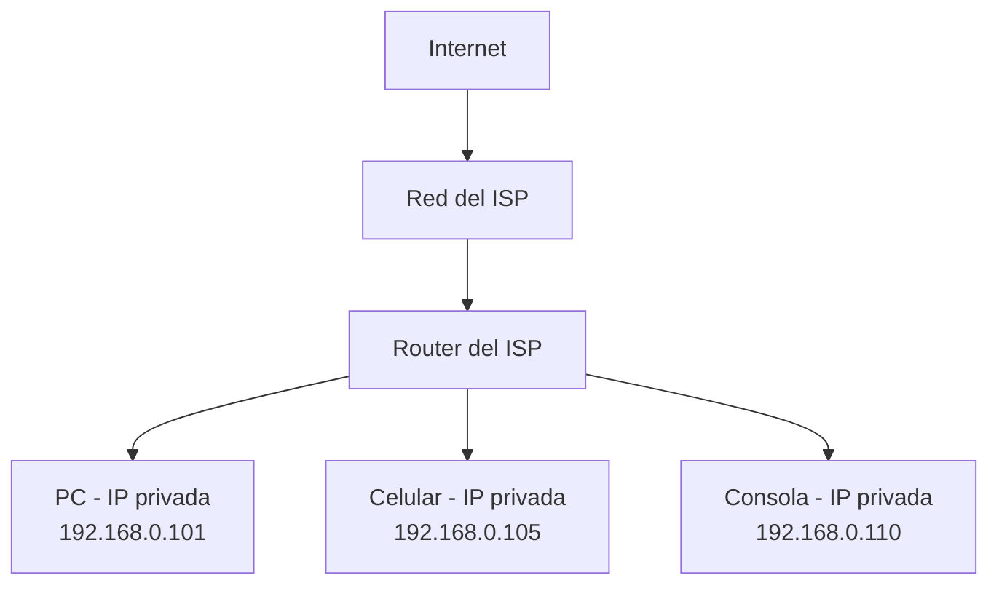
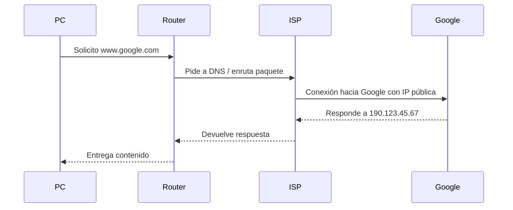

# 🌐 Conexión a Internet: ISP + Router + IP Pública

---

## 📘 1. ¿Qué es un ISP?

- **ISP** = _Internet Service Provider_
    
- En español: **Proveedor de Servicios de Internet**
    
- Es la empresa que te conecta a Internet.
    

### Ejemplos:

- Fibertel / Personal
    
- Movistar
    
- Claro
    
- Telecentro
    
- IPLAN
    

---

## 🧠 2. ¿Qué hace el ISP?

✅ El ISP te da:

- Acceso a Internet
    
- Una **IP pública** (puede ser fija o dinámica)
    
- Un **router o módem** en tu casa
    
- Infraestructura para que tus dispositivos lleguen a Internet
    

---

## 📶 3. ¿Qué es el Router del ISP?

Es el equipo físico que te deja **crear tu red local** y conectarte a Internet.

### Funciones principales:

|Función|Descripción|
|---|---|
|Módem|Traduce la señal de fibra, coaxial o ADSL a datos|
|Router|Crea tu red local (LAN), reparte IPs internas|
|NAT|Traduce IP privadas a públicas para salir a Internet|
|Firewall|Protege tu red de conexiones externas no autorizadas|
|Wi-Fi|Permite que tus dispositivos se conecten inalámbricamente|

---

## 🌍 4. Esquema de conexión a Internet

---

## 🔎 5. ¿Qué es una IP pública?

- Es la dirección **única y global** que el ISP te asigna para conectarte a Internet.
    
- Ejemplo: `190.123.45.67`
    
- Identifica tu **punto de entrada/salida en Internet**
    

> 🧠 Si tenés una IP pública asignada directamente al router, podés recibir conexiones desde cualquier parte del mundo (con los puertos abiertos).

---

## 🧱 6. ¿Cómo sale un dispositivo a Internet?

---

## ⚠️ 7. ¿Qué pasa si no tenés IP pública directa?

- Estás **detrás de CG-NAT** (Carrier Grade NAT)
    
- Compartís la IP pública con muchos otros clientes del ISP
    
- No podés recibir conexiones entrantes directamente (como SSH)
    
- Necesitás: port forwarding, túnel (ngrok, tailscale), o VPN
    

---

## 📌 8. Resumen clave

|Concepto|Explicación|
|---|---|
|**ISP**|Empresa que te da conexión a Internet|
|**IP pública**|Dirección única que te identifica globalmente|
|**Router del ISP**|Equipo que conecta tu red local al ISP|
|**NAT**|Traducción de IPs privadas a públicas|
|**Wi-Fi local**|Comunicación dentro de tu casa, invisible desde fuera|

---

[[glosario]]