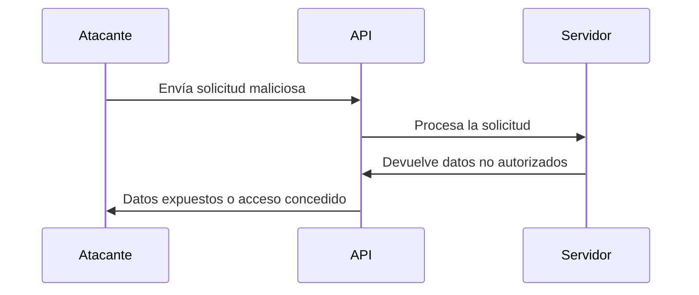

### **¿Qué es el Abuso de APIs?**

El abuso de APIs ocurre cuando un atacante explota vulnerabilidades o malas configuraciones en una **Interfaz de Programación de Aplicaciones (API)** para obtener acceso no autorizado, robar datos, o causar daños en el sistema.

---

### **¿Por qué son Vulnerables las APIs?**

1. **Falta de Autenticación**: APIs que no requieren autenticación o usan métodos débiles.
2. **Exposición Excesiva**: APIs que devuelven más datos de los necesarios.
3. **Falta de Validación**: No se validan correctamente las entradas de usuario.
4. **Tasa de Límite No Configurada**: No hay límites en la cantidad de solicitudes que un usuario puede hacer.
5. **Documentación Pública**: Documentación detallada que facilita a los atacantes encontrar vulnerabilidades.

---

### **Técnicas Comunes de Abuso de APIs**

#### 1. **Inyección de Datos**
   - **Descripción**: Enviar datos maliciosos en las solicitudes para manipular la API.
   - **Ejemplo**: Inyectar código SQL en un parámetro de búsqueda.
     ```bash
     GET /api/users?search=admin' OR '1'='1
     ```

#### 2. **Ataques de Fuerza Bruta**
   - **Descripción**: Intentar adivinar credenciales o tokens mediante múltiples solicitudes.
   - **Ejemplo**: Probar múltiples contraseñas en un endpoint de login.
     ```bash
     POST /api/login
     {"username": "admin", "password": "password123"}
     ```

#### 3. **Exposición de Datos Sensibles**
   - **Descripción**: APIs que devuelven más información de la necesaria.
   - **Ejemplo**: Un endpoint que devuelve todos los datos de usuario, incluyendo contraseñas.
     ```bash
     GET /api/users
     ```

#### 4. **Ataques de Tasa de Límite**
   - **Descripción**: Realizar un gran número de solicitudes en un corto período de tiempo para saturar el servidor.
   - **Ejemplo**: Usar un script para enviar miles de solicitudes por segundo.
     ```bash
     for i in {1..1000}; do curl -X GET https://api.example.com/data; done
     ```

#### 5. **Manipulación de Parámetros**
   - **Descripción**: Cambiar los parámetros de la solicitud para acceder a datos no autorizados.
   - **Ejemplo**: Cambiar el ID de usuario en una solicitud para acceder a otro usuario.
     ```bash
     GET /api/users/123 → GET /api/users/456
     ```

#### 6. **Uso de Tokens Comprometidos**
   - **Descripción**: Usar tokens de autenticación robados o filtrados.
   - **Ejemplo**: Usar un token JWT robado para acceder a la API.
     ```bash
     GET /api/data
     Authorization: Bearer <token_robado>
     ```

---

### **Ejemplo Práctico**

- **Escenario**: Una API de comercio electrónico tiene un endpoint que devuelve información de pedidos.
- **Ataque**: Un atacante manipula el parámetro `order_id` para acceder a pedidos de otros usuarios.
  ```bash
  GET /api/orders/123 → GET /api/orders/456
  ```

---

### **¿Cómo Prevenir el Abuso de APIs?**

1. **Autenticación y Autorización**:  
   Usa métodos robustos como OAuth 2.0 y asegúrate de que los usuarios solo puedan acceder a los datos que les corresponden.

2. **Validación de Entradas**:  
   Valida y sanitiza todas las entradas para evitar inyecciones.

3. **Límites de Tasa**:  
   Implementa límites en la cantidad de solicitudes que un usuario puede hacer en un período de tiempo.

4. **Minimización de Datos**:  
   Devuelve solo los datos necesarios en las respuestas de la API.

5. **Monitoreo y Logging**:  
   Monitorea el uso de la API y registra actividades sospechosas.

6. **Uso de HTTPS**:  
   Asegura todas las comunicaciones con HTTPS para evitar la interceptación de datos.

7. **Documentación Controlada**:  
   Limita el acceso a la documentación de la API y no expongas detalles sensibles.

---

### **Resumen**

- **Abuso de APIs**: Explotación de vulnerabilidades en APIs para acceder a datos no autorizados o causar daños.
- **Técnicas comunes**: Inyección de datos, fuerza bruta, exposición de datos, ataques de tasa de límite, manipulación de parámetros.
- **Prevención**: Autenticación robusta, validación de entradas, límites de tasa, minimización de datos.

---

### **Diagrama de Abuso de APIs**



---

### **Consejo Final**

Protege tus APIs como protegerías cualquier otra puerta de entrada a tu sistema. Implementa medidas de seguridad robustas y monitorea constantemente el uso de tus APIs.

---
[[OWASP]]